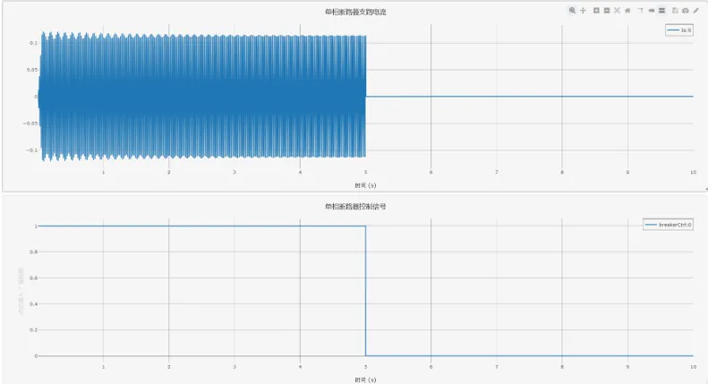

## 元件定义

该元件用以建模单相断路器。

## 元件说明

### 属性

CloudPSS 元件包含统一的**属性**选项，其配置方法详见 [参数卡](docs/documents/software/10-xstudio/20-simstudio/40-workbench/20-function-zone/30-design-tab/30-param-panel/index.md) 页面。

### 参数

import Parameters from './_parameters.md'

<Parameters/>

### 引脚

import Pins from './_pins.md'

<Pins/>

## 案例
单相断路器元件建模为一个可变电阻，在单相断路器断开时，电阻阻值为 `Breaker OPEN Resistance`；在单相断路器闭合时，电阻阻值为 `Breaker Close Resistance`。单相断路器的控制通过在 `Breaker Control Signal Name` 输入断路器控制信号名，其控制逻辑为：低电平信号（0）为断开 `Open`，高电平信号（1）为闭合 `Close`。控制信号可使用**控制 - 信号发生器**元件产生。

以下以 RLC 电路的电磁暂态仿真为例，使用阶跃信号发生器控制单相断路器，阶跃信号发生器的初始值为 1，终值为 0，阶跃时间为 5。在电磁暂态仿真结果中可以看出单相断路器在 5s 时刻断开。

## 常见问题

