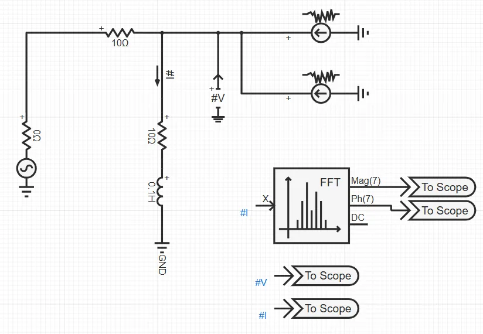
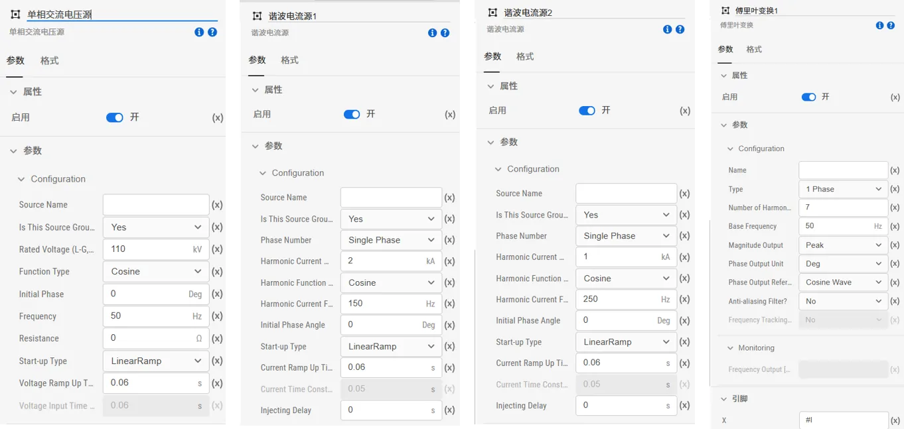
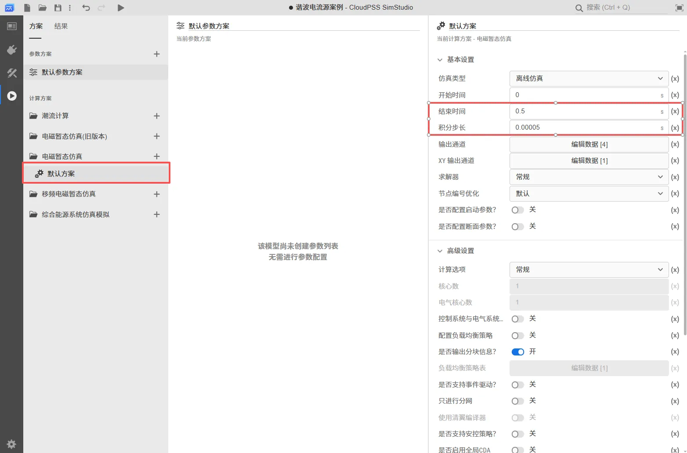
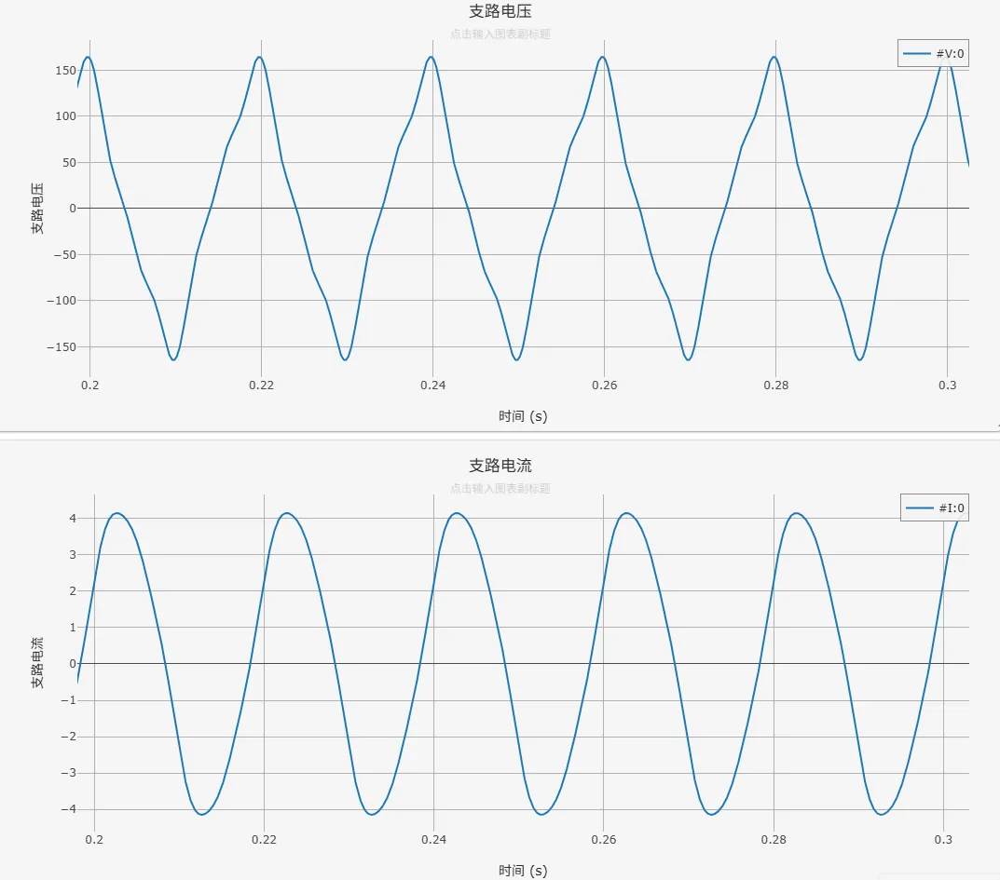
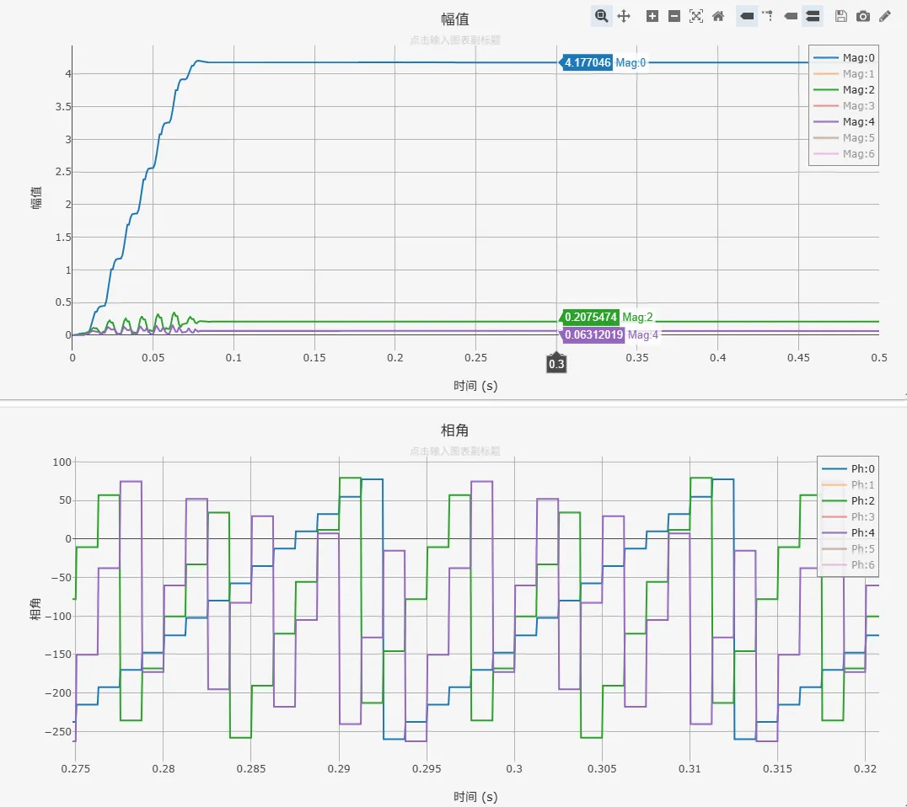

## 元件定义
该元件用以建模一个固定频率、固定幅值的谐波电流注入源（单相或三相）。

## 元件说明

### 属性

CloudPSS 元件包含统一的**属性**选项，其配置方法详见 [参数卡](docs/documents/software/10-xstudio/20-simstudio/40-workbench/20-function-zone/30-design-tab/30-param-panel/index.md) 页面。

### 参数

import Parameters from './_parameters.md'

<Parameters/>

### 引脚

import Pins from './_pins.md'

<Pins/>

## 案例
本案例演示了如何在 SimStudio 中构建一个简单的交流系统，并通过**谐波电流源**元件注入特定次数的谐波电流，观察系统中电压、电流的波形变化及谐波分布情况。通过此案例，用户可以学习**谐波电流源**的基本使用方法。

系统的拓扑如下图，在一个简单单相交流系统的基础上，添加了两个**谐波电流源**，用以模拟第 3 次（150 Hz，基频为 50 Hz）和第 5 次（250 Hz）谐波电流注入。使用电压表和电流表测量支路电压和支路电流，采用**傅里叶变换**（FFT）元件分析支路电流中的谐波成分。

    

**设置参数**
- 点击**单相交流电压源**，设置相电压有效值为 110kV，函数类型为 Cosine，频率为 50Hz，启动时间为 0.06s。
- 分别点击**电阻**与**电感**元件，设置电阻值为 10Ω，电感值为 0.1H。
- 点击**谐波电流源 1**，设置谐波电流源 1 的谐波电流幅值为 2kA，函数类型为 Cosine，频率为 150Hz，启动时间为 0.06s，谐波电流注入延迟时间为 0s。
- 点击**谐波电流源 2**，设置谐波电流源 2 的谐波电流幅值为 1kA，函数类型为 Cosine，频率为 250Hz，启动时间为 0.06s，谐波电流注入延迟时间为 0s。
- 点击**傅里叶变换元件**，设置谐波数量为 7，频率基值为 50Hz，幅值输出为 Peak，相位输出单位为 Deg，引脚 X 填写 #I。

    

**添加量测元件**
- 在左侧**模型**栏中点击**量测**选择**电压表**和**电流表**元件拖拽至工作空间，按照上述的系统拓扑图进行连接。填写该电压表测得电压信号的名称为 #V，电流表测得电流信号的名称为 #I。

**添加输出通道**
- 在左侧**模型**栏中点击**输出**选择**输出通道**元件拖拽至工作空间，其中两个**输出通道**元件分别连接到**傅里叶变换元件**的 Mag 和 Ph 引脚，设置通道数量 `Dim` 为 7；另外两个**输出通道**元件的输入端口 `Input` 分别填写 #V 和 #I，通道数量 `Dim` 为 1。

**仿真运行**
- 点击左侧**运行标签页**，分别配置仿真的**参数方案**和**计算方案**。采用平台预置**参数方案**，无需对其进行配置，在**计算方案**中选择电磁暂态仿真方案设置仿真结束时间为 0.5s，积分步长为 0.00005s，如下图所示：

    

- 点击**输出通道 - 编辑数据**，配置示波器输出通道如下图所示：

    

- 点击启动任务开始仿真，运行仿真后，从支路电压和支路电流波形可观察到明显的畸变，包含基波、3 次和 5 次谐波特征。查看傅里叶变换元件输出的幅值与相位，可以看出 3 次(150Hz)和 5 次(250Hz)谐波分量的存在。

    

    

案例文件下载：[谐波电流源案例](./谐波电流源案例.cmdl)
## 常见问题

