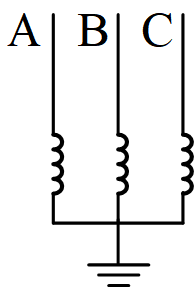
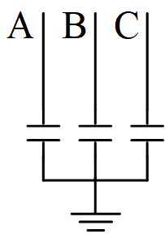

## 元件定义

该元件用以建模三相并联电容/电抗器（单线图）。

## 元件说明

### 属性

CloudPSS 元件包含统一的**属性**选项，其配置方法详见 [参数卡](docs/documents/software/10-xstudio/20-simstudio/40-workbench/20-function-zone/30-design-tab/30-param-panel/index.md) 页面。

### 等效电路

当`Input Capacity`（投入容量）为正值时，元件表现为电抗器，等效电路如下：

当`Input Capacity`（投入容量）为负值时，元件表现为电容器，等效电路如下：

### 功率量测方向

该元件的无功功率量测方向定义为下网方向，其正负与无功类型的对应关系为：感性无功为正，容性无功为负，与`Input Capacity`（投入容量）的设定逻辑保持一致。

### 参数

import Parameters from './_parameters.md'

<Parameters/>

### 引脚

import Pins from './_pins.md'

<Pins/>

## 案例

## 常见问题

