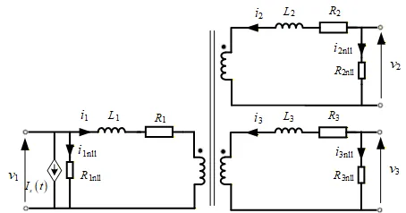

## 元件定义

该元件用以建模三相三绕组变压器（单线图，中性点内置）。

## 元件说明

### 属性

CloudPSS 元件包含统一的**属性**选项，其配置方法详见 [参数卡](docs/documents/software/10-xstudio/20-simstudio/40-workbench/20-function-zone/30-design-tab/30-param-panel/index.md) 页面。

### 参数

import Parameters from './_parameters.md'

<Parameters/>

### 引脚

import Pins from './_pins.md'

<Pins/>

### 使用说明

1. 三绕组变压器的建模原理图如下所示。
   

2. 变压器的漏阻漏抗和励磁电导等参数均采用标幺值输入，标幺制系统所采用的基准功率为三个绕组的最大容量，即：
    
    $S_{bsse}$=max($S_{1N}$,$S_{2N}$,$S_{3N}$)

## 案例

## 常见问题

