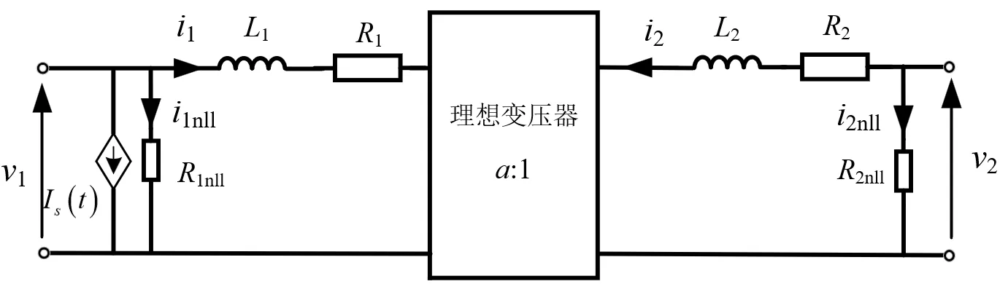

## 元件定义

该元件用以建模三相三绕组变压器（单线图，中性点内置）。

## 元件说明

### 属性

CloudPSS 元件包含统一的**属性**选项，其配置方法详见 [参数卡](docs/documents/software/10-xstudio/20-simstudio/40-workbench/20-function-zone/30-design-tab/30-param-panel/index.md) 页面。

### 参数

import Parameters from './_parameters.md'

<Parameters/>

### 引脚

import Pins from './_pins.md'

<Pins/>

### 使用说明

1. 三绕组变压器的建模原理图如下所示。
   

2. 变压器的漏阻漏抗和励磁电导等参数均采用标幺值输入，标幺制系统所采用的基准功率为三个绕组的最大容量，即：
    
    $S_{bsse}$=max($S_{1N}$,$S_{2N}$,$S_{3N}$)

### 基础变压器模型
**互感耦合模型**  
变压器最基本的数学模型来源于磁耦合绕组的互感关系。如下图所示，对于两个通过同一磁路耦合的绕组，其端口电压与电流之间的关系可由互感电感矩阵表示。

忽略铁耗与绕组电阻时，该关系可写为：

$$
\begin{bmatrix}
v_1 \\
v_2
\end{bmatrix}
=
\frac{d}{dt}
\begin{bmatrix}
L_{11} & L_{12} \\
L_{21} & L_{22}
\end{bmatrix}
\begin{bmatrix}
i_1 \\
i_2
\end{bmatrix}
$$

其中 $L_{11}$ 与 $L_{22}$ 分别为两个绕组的自感，$L_{12}=L_{21}$ 为绕组之间的互感。

为了在电磁暂态分析中由端口电压求解绕组电流，需要将上述关系改写为电流导数的形式，即对互感电感矩阵求逆：

$$
\frac{d}{dt}
\begin{bmatrix}
i_1 \\
i_2
\end{bmatrix}
=
\mathbf{L}^{-1}
\begin{bmatrix}
v_1 \\
v_2
\end{bmatrix}
\tag{1}
$$

互感电感矩阵的行列式为：

$$
\Delta = L_{11} L_{22} - L_{12}^2
\tag{2}
$$

通常引入耦合系数 $K$，定义为：

$$
K = \frac{L_{12}}{\sqrt{L_{11} L_{22}}}
\tag{3}
$$

则行列式可写为：

$$
\Delta = L_{11} L_{22} (1 - K^2)
\tag{4}
$$

由此可见，当两个绕组紧密耦合、共用磁路时，耦合系数 $K$ 接近于 1，互感矩阵的行列式趋近于零，其逆矩阵中的元素将迅速增大。这种情况下，互感矩阵呈现明显的数值病态特征，在数值求解中容易导致数值不稳定。

**理想变压器模型**  
为避免互感矩阵求逆带来的数值问题，可将变压器建模为一种不显式包含励磁支路、仅由漏抗与匝比关系构成的理想变压器模型，如下图所示。

以两绕组理想变压器为例，设匝比为 $a$，并以绕组 1 为参考侧，将绕组之间的等效漏感定义为从绕组 1 端口测得的漏感 $L$（$L=L_1+a^2L_2$）。在这种建模形式下，绕组电流导数与端口电压之间可直接表示为：

$$
\frac{d}{dt}
\begin{bmatrix}
i_1 \\
i_2
\end{bmatrix}
=
\frac{1}{L}
\begin{bmatrix}
1 & -a \\
-a & a^2
\end{bmatrix}
\begin{bmatrix}
v_1 \\
v_2
\end{bmatrix}
\tag{6}
$$

式 (6) 可由短路试验等效电路推导得到：在一侧短路、另一侧施加电压的条件下，绕组电流变化完全由漏感决定，而理想变压器仅用于维持两侧电压与电流之间的比例关系。

**基础变压器模型**  
在理想变压器模型的基础上进一步引入绕组损耗、铁芯损耗和铁芯饱和特性，从而形成基础变压器模型。如下图所示：

以两绕组变压器为例，$R_1$、$R_2$ 用于模拟铜损耗；$R_{1nll}$、$R_{2nll}$ 用于模拟空载损耗；$I_s(t)$为注入电流源，用于模拟变压器的饱和特性。

### 变压器饱和特性建模  

变压器铁芯饱和源于铁磁材料磁化特性的非线性。当磁通处于较低水平时，铁芯磁化特性近似线性，所需的励磁电流较小；而当磁通逐渐接近材料的饱和值后，继续增加磁通将需要显著增大的励磁电流，铁芯由此进入饱和状态。

在电磁暂态仿真中，铁芯饱和可等效为一个非线性的励磁电感。实际模型中并不直接采用可变电感来表示这一非线性，而是通过在指定绕组端口并联一个注入电流源 $I_s(t)$ 来等效整个铁芯的磁化过程。该方法避免了由于电感值变化而在每个时间步重构系统矩阵的问题，从而具有良好的数值稳定性和计算效率。

饱和建模首先需要选定一个指定绕组，通常选为靠近铁芯的一侧绕组。设该绕组端口电压为 $V_1(t)$，铁芯的磁化磁链由该端口电压积分得到：

$$
\lambda_S(t) = \int V_1(t)\,dt
\tag{7}
$$

注入电流源  $I_s$ 的电流由磁链 $\lambda_S$ 决定，其计算公式为：

$$
I_s
=
\frac{\sqrt{(\lambda_S-\lambda_K)^2+4DL_A}+\lambda_S-\lambda_K}{2L_A}
-\frac{D}{\lambda_K}
\tag{8}
$$

其中参数 $D$ 由下式确定：

$$
D=\frac{-B-\sqrt{B^2-4AC}}{2A}
\tag{9}
$$

系数 $A$、$B$、$C$ 分别定义为：

$$
A=\frac{L_A}{\lambda_K^2},\qquad
B=\frac{L_A I_M-\lambda_M}{\lambda_K},\qquad
C=I_M\,(L_A I_M-\lambda_M+\lambda_K)
\tag{10}
$$

上述参数中，$L_A$ 为空气磁路电感，用于描述铁芯在深度饱和区的渐近线性特性，通常取值为等值漏电感的两倍；$\lambda_M$ 为额定磁链，由额定电压和频率计算得到：

$$
\lambda_M=\frac{V_M}{2\pi f}
\tag{11}
$$

拐点磁链 $\lambda_K$ 由拐点系数 $K$ （典型取值为1.15~1.25）与额定磁链确定，即：

$$
\lambda_K = K\lambda_M
$$

参数 $I_M$ 为额定磁链对应的励磁电流。通过上述参数，可以构造一条在低磁链区近似线性、在高磁链区逐渐过渡到空气磁路的非线性磁化特性。如下图所示：

综上所述，由式 (8) 计算得到的励磁电流 $I_s$ 被直接注入到指定绕组端口，从而在电路层面等效铁芯在当前磁化状态下所需的励磁电流。随着磁链的变化，注入电流源能够自动反映铁芯由非饱和区向饱和区的过渡过程。

## 案例

## 常见问题

