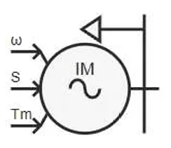
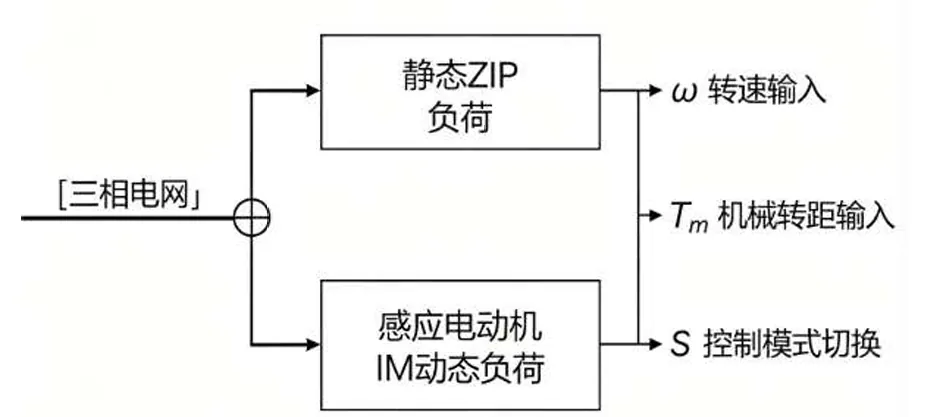

:::tip
本元件为一次电气元件，**直接接入三相交流主电路**。元件内部可根据模型类型选择仅使用静态负荷，或采用静态负荷与感应电动机动态负荷并联的综合负荷结构，用于描述节点负荷在电压扰动、频率偏移和故障暂态过程中的综合响应。
:::

## 元件定义

综合负荷模型用于模拟同一负荷节点下多类用电设备的等效响应特性。模型支持两种工作方式：一是仅包含静态负荷支路，用于描述照明、电热、电子设备等电压/频率相关负荷；二是采用静态负荷与感应电动机（IM）动态负荷并联的综合结构，用于进一步描述工业电机、风机、水泵等转动类负荷的惯性、转差和机械转矩特性。

与单一恒功率或恒阻抗负荷相比，综合负荷模型能够反映负荷功率随端电压、系统频率和电动机运行状态变化的特性，因此更适合用于故障暂态、电压稳定和电机负荷占比较高场景下的电磁暂态仿真。

## 元件说明

### 工作原理

元件整体可视为静态负荷支路与感应电动机动态支路并联接入三相电网。静态支路根据端电压和频率修正吸收功率；感应电动机支路根据电气参数、转差率、机械转矩和转子运动方程计算定子侧吸收功率。核心结构如下：

### 1. 静态负荷分量

静态负荷采用扩展 ZIP 形式。令：

$$
k_V=\frac{V}{V_N}
$$

其中，$V$ 为元件端电压有效值，$V_N$ 为额定线电压有效值。静态负荷有功、无功功率按下式计算：

$$
\begin{cases}
P=P_N\left[A_P\left(\frac{V}{V_N}\right)^{N_P}+B_P\left(\frac{V}{V_N}\right)+C_P\right]\left(1+K_{PF}\Delta f\right)\\
Q=Q_N\left[A_Q\left(\frac{V}{V_N}\right)^{N_Q}+B_Q\left(\frac{V}{V_N}\right)
+C_Q\right]\left(1+K_{QF}\Delta f\right)\end{cases}
$$

其中：
$P_N$ 和 $Q_N$ 分别表示静态负荷支路的有功、无功功率基准值。
$$
C_P=1-A_P-B_P
$$

$$
C_Q=1-A_Q-B_Q
$$

参数含义如下：

- $P_{N}$、$Q_{N}$：静态负荷支路在额定电压、额定频率附近的有功、无功功率基准值；
- $A_P$、$A_Q$：电压指数项系数，对应参数 `ApL`、`AqL`；
- $B_P$、$B_Q$：一次电压项系数，对应参数 `BpL`、`BqL`；
- $C_P$、$C_Q$：常数功率项系数，由 $A_P+B_P+C_P=1$ 和 $A_Q+B_Q+C_Q=1$ 自动确定；
- $N_P$：有功功率电压指数，对应参数 `NP`；
- $N_Q$：无功功率电压指数，对应参数 `NQ`；
- $K_{PF}$、$K_{QF}$：有功、无功功率频率修正系数，对应参数 `KPF`、`KQF`；
- $\Delta f$：频率偏差量，表示实际频率相对额定频率的偏移。
其中，$N_P$ 和 $N_Q$ 分别为有功、无功功率的电压指数。二者只作用于电压静特性中的第一项：

$$
A_P\left(\frac{V}{V_N}\right)^{N_P}
$$

和

$$
A_Q\left(\frac{V}{V_N}\right)^{N_Q}
$$

因此，`NP` 不会作用于整个有功功率表达式，也不会作用于 $B_P(V/V_N)$ 或 $C_P$；`NQ` 同理，只作用于无功功率表达式中的 $A_Q(V/V_N)^{N_Q}$ 项。
:::info
`NP` 和 `NQ` 不是对整个静态负荷功率表达式取指数，而是分别作用于 $A_P k_V^{N_P}$ 和 $A_Q k_V^{N_Q}$ 两个电压指数项。

因此：
当 `NP=2`、`NQ=2` 时，$A_P$、$A_Q$ 项表现为电压平方项，此时公式与常见二次 ZIP 负荷形式一致；当 `NP` 或 `NQ` 取其他值时，模型为带可调电压指数的扩展 ZIP 静态负荷模型。
- 当 `NP=1` 时，有功中的 `ApL` 项退化为一次电压项，并与 `BpL` 项共同构成线性电压相关分量；
- 当 `NP=0` 时，有功中的 `ApL` 项退化为常数项，并与 $C_P$ 共同构成功率常数分量；
- 当 `ApL=0` 时，`NP` 对有功静态负荷无影响。

`NQ` 对无功静态负荷的作用方式完全相同：当 `AqL=0` 时，`NQ` 对无功静态负荷无影响。
:::

此时，$A$ 项可理解为恒阻抗分量，$B$ 项可理解为恒电流分量，$C$ 项可理解为恒功率分量。
#### 2. 感应电动机IM动态分量
动态分量模拟三相感应电动机的机电暂态特性，核心状态方程：
##### （1）转差率定义
$$S=\frac{\omega_1-\omega}{\omega_1}$$
- $\omega_1$：电网同步角速度
- $\omega$：电机转子机械角速度
- $S$：电机转差率，额定工况下通常为0.01~0.05

##### （2）转子运动方程
$$J\frac{d\omega}{dt}=T_e-T_m$$
- $J$：电机转动惯量
- $T_e$：电机电磁转矩
- $T_m$：机械负载转矩（可通过外部信号端口输入）

##### （3）电磁转矩公式
$$T_e=\frac{3U^2 R_r S}{\omega_1\left[(R_s+R_r/S)^2+(\omega_1 L_{s\sigma}+\omega_1 L_{r\sigma})^2\right]}$$
- $R_s,R_r$：定、转子电阻
- $L_{s\sigma},L_{r\sigma}$：定、转子漏感

#### 3. 综合负荷总功率
并网点总有功、无功功率为静态分量与动态分量叠加：
$$
\begin{cases}
P_{\Sigma}=P+P_{IM}\\
Q_{\Sigma}=Q+Q_{IM}
\end{cases}
$$
- $P$,$Q$ 为静态负荷支路按电压和频率修正后的实际有功、无功功率；$P_{IM},Q_{IM}$为感应电动机定子侧吸收的有功、无功功率

### 属性
**CloudPSS** 元件包含统一的**属性**选项，其配置方法详见 [参数卡](/docs/documents/software/20-emtlab/110-component-library/10-basic/10-electrical/40-three-phase-ac-components/140-SyntheticLoad/_parameters.md) 页面。

### 参数

import Parameters from './_parameters.md'

<Parameters/>

### 引脚
import Pins from './_pins.md'

<Pins/>

#### 使用说明
1.  **接线规则**
    本元件为三相一次负荷元件，三相引脚直接接入交流主电路即可；

2.  **参数配置步骤**
    1.  设置额定电压、额定频率等基础参数，与系统电压等级匹配；
    2.  配置静态ZIP负荷占比：工业配网推荐$a_P=0.3,b_P=0.3,c_P=0.4$，居民配网推荐$a_P=0.5,b_P=0.2,c_P=0.3$；
    3.  配置感应电动机参数：转动惯量、额定转差率根据负荷类型调整，风机水泵类转差率取0.03~0.05，通用工业电机取0.02；
    4.  调整静态/动态负荷占比：工业场景电机占比60%~70%，居民场景电机占比30%~40%。

## 常见问题

**静态负荷和动态负荷的占比如何设置？**
: 工业场景：感应电机占比60%~70%，静态负荷占比30%~40%；居民场景：感应电机占比30%~40%，静态负荷占比60%~70%；商业场景两者各占50%左右。

**ZIP系数如何取值？**
: 通用配网默认取a=0.3,b=0.3,c=0.4；纯阻性负荷a=1,b=0,c=0；恒功率负荷a=0,b=0,c=1。

**什么时候需要用综合负荷模型，什么时候用静态负荷？**
: 稳态潮流计算、正常工况仿真用静态负荷即可；故障暂态、电压稳定分析、电机负荷占比较高的工业场景，必须使用综合负荷模型，否则会出现较大仿真偏差。