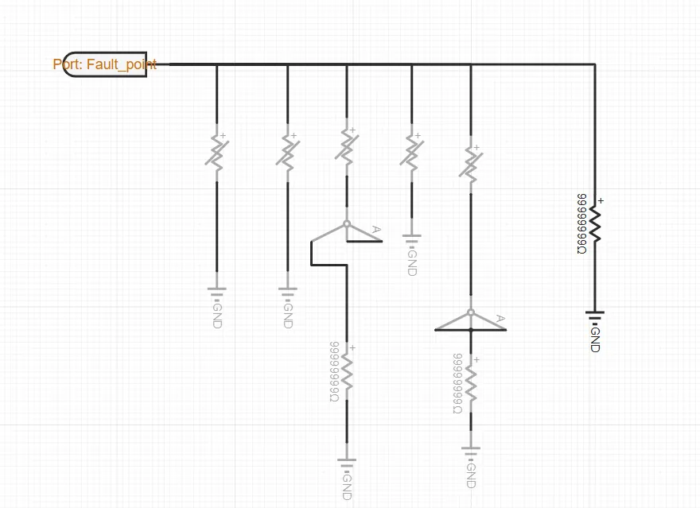
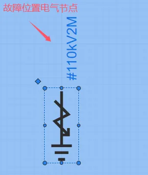

## 元件定义

该元件用以设置典型短路故障:单相短路故障(AG)、两相短路(AB)、三相短路(ABC)、两相短路接地(ABG)、三相短路接地(ABCG)。

## 元件说明

### 属性

CloudPSS 元件包含统一的**属性**选项，其配置方法详见 [参数卡](docs/documents/software/10-xstudio/20-simstudio/40-workbench/20-function-zone/30-design-tab/30-param-panel/index.md) 页面。

### 参数

import Parameters from './_parameters.md'

<Parameters/>

### 引脚

import Pins from './_pins.md'

<Pins/>

## 案例

例如，在某10kV母线电气节点位置接入短路故障模块，模拟母线典型故障类型。

## 常见问题

