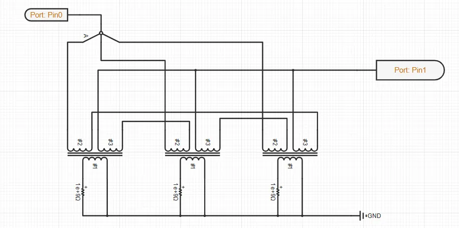
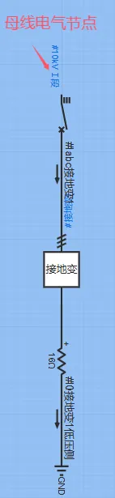

## 元件定义
该元件用以将电路的中性点与地隔离，形成一个稳定的中性点。

## 元件说明

### 属性

CloudPSS 元件包含统一的**属性**选项，其配置方法详见 [参数卡](docs/documents/software/10-xstudio/20-simstudio/40-workbench/20-function-zone/30-design-tab/30-param-panel/index.md) 页面。

### 参数

import Parameters from './_parameters.md'

<Parameters/>

### 引脚

import Pins from './_pins.md'

<Pins/>

## 案例

例如，在某10kV母线电气节点位置接入接地变压器，为中性点不接地系统提供人为的中性点，便于采用消弧线圈或者小电阻的接地方式。

## 常见问题

