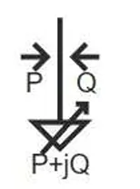
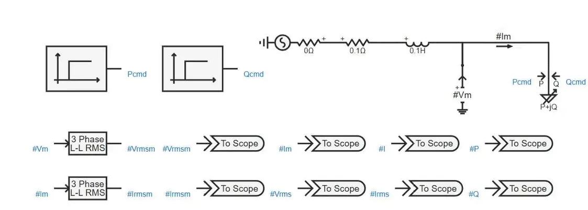
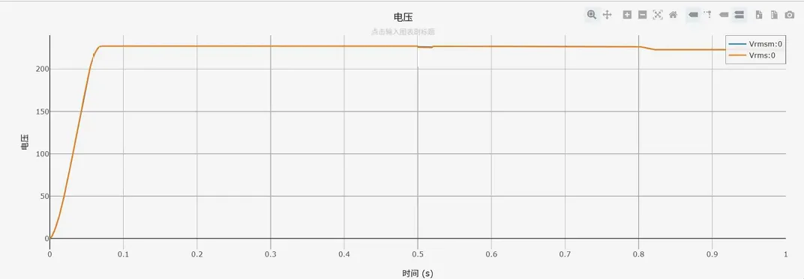
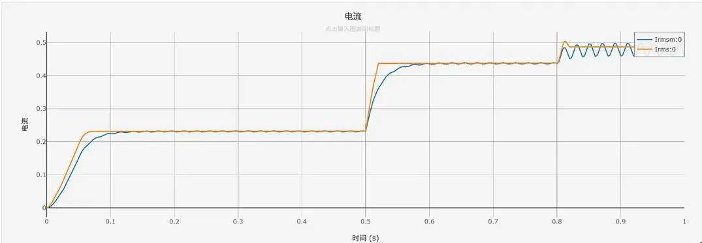
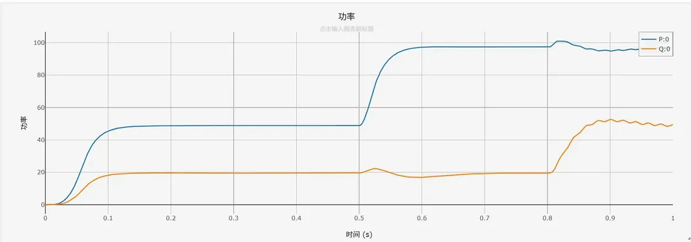

:::tip
本元件为一次电气元件，**直接接入三相交流主电路**，作为负荷消耗功率，同时支持外部信号链路实现功率动态调控，不会干扰原有电气回路的运行状态。
:::

## 元件定义
三相可控静态负载是带外部调控接口的指数型静态负荷元件，可通过外部模拟信号实时修改负载的有功，无功功率基准值，同时保留完整的电压静特性，频率静特性，兼顾普通静态负载的物理特性与可控负荷的动态调节能力。

## 元件说明

### 工作原理

元件通过功率控制引脚接收外部模拟指令信号，直接输入有功、无功功率指令值，按照指数型静态负载的标准公式计算实际消耗的有功、无功功率，元件内置功率计算规则如下：

$$
P = P_{cmd} \cdot \left( \frac{V}{V_N} \right)^{N_P} \cdot \left( 1 + K_{PF} \cdot \Delta f \right)
$$

$$
Q = Q_{cmd} \cdot \left( \frac{V}{V_N} \right)^{N_Q} \cdot \left( 1 + K_{QF} \cdot \Delta f \right)
$$

其中 $P_{cmd}$ 和 $Q_{cmd}$ 为外部输入的功率指令值，由控制端口直接输入。

外部控制端口说明：

1.  **`Active Power Ctrl [MW]`（有功控制端口）**：直接输入有功功率指令信号 $P_{cmd}$

2.  **`Reactive Power Ctrl [MVar]`（无功控制端口）**：直接输入无功功率指令信号 $Q_{cmd}$

### 运行规则说明

:::warning

与普通静态负载固定功率不同，**本元件支持通过外部信号输入标幺值功率指令**，运行规则如下：

- 控制端口输入的是**标幺值功率信号**，不是有名值，也不是直接修改内部额定功率参数；

:::
### 属性
**CloudPSS** 元件包含统一的**属性**选项，其配置方法详见 [参数卡](/docs/documents/software/20-emtlab/110-component-library/10-basic/10-electrical/40-three-phase-ac-components/20-_newCtrlLoad_3p/_parameters.md) 页面。

### 参数

import Parameters from './_parameters.md'

<Parameters/>

### 引脚
import Pins from './_pins.md'

<Pins/>

#### 使用说明
1.  **主电路连接规则**
    本元件为一次负荷元件，电气引脚直接接入三相交流主电路，作为负荷消耗功率；

2.  **控制信号连接规则**
    有功控制端口，无功控制端口为信号链路引脚，无需接入主电路，仅接收上游信号元件输出的模拟量指令，单位分别为MW，MVar。

3.  **静特性参数配置**
    - $N_P=0，N_Q=0$：恒功率特性，实际功率与控制指令完全相等，不受电压波动影响；
    - $N_P=1，N_Q=1$：恒电流特性，功率与节点电压成正比；
    - $N_P=2，N_Q=2$：恒阻抗特性，功率与节点电压平方成正比。

4.  **监测引脚使用**
    元件内置三相电流，有功功率，无功功率监测输出引脚，可直接接入输出通道或控制模块，无需额外外接量测元件。

## 案例
下图展示了三相可控静态负载在电磁暂态仿真中的标准接线方式：

**示例说明**：
1.  一次侧搭建三相测试电路，交流电压源串联阻感线路模拟配电网阻抗；
2.  三相可控静态负载接入主电路作为调控对象；
3.  2路阶跃信号发生器分别输出有功，无功功率指令，接入元件控制端口；
4.  外置RMS量测模块采集负载端电压，电流，元件内置监测引脚输出功率信号，共同进行波形观测。

### 核心参数配置
| 参数名 | 设定值 | 单位 | 说明 |
|--------|--------|------|------|
| Rated Voltage (L-L, RMS) | 230 | kV | 负载额定线电压 $V_N$ |
| Rated Frequency | 50 | Hz | 额定频率 $f_N$ |
| Initial Active Power (3 Phase) | 50 | MW | 初始有功基准 $P_N$ |
| Initial Reactive Power (3 Phase) | 20 | MVar | 初始无功基准 $Q_N$ |
| Voltage Index for P | 2 | - | 有功电压指数 $N_P$（恒阻抗特性） |
| Voltage Index for Q | 2 | - | 无功电压指数 $N_Q$ |
| Freq Index for P | 0 | - | 有功频率系数 $K_{PF}$ |
| Freq Index for Q | 0 | - | 无功频率系数 $K_{QF}$ |

#### 控制指令时序
| 时间段 | 有功指令 $P_{cmd}$ | 无功指令 $Q_{cmd}$ |
|--------|--------------------|--------------------|
| 0 ~ 0.5 s | 50 MW | 20 MVar |
| 0.5 ~ 0.8 s | 97 MW | 22 MVar |
| 0.8 ~ 1.0 s | 100 MW | 50 MVar |

### 仿真输出波形
#### （1）电压响应波形

**波形说明**：
负载端电压有效值在仿真启动后快速上升至额定值附近，整体保持平稳；功率阶跃时因线路阻抗压降，电压出现微小跌落，随后快速恢复稳定，符合阻感线路的电压降落物理特性，并且经RMS测量结果与三相可控静态负责的内置监测引脚输出结果相同。

#### （2）电流响应波形

**波形说明**：
电流有效值随功率指令同步阶跃变化，0~0.5s稳态值约0.23kA，0.5s第一次阶跃后上升至约0.44kA，0.8s后缓慢稳定在约0.48kA；外置RMS模块因滤波算法存在小幅动态波动，负载内置有效值过渡更平滑，两者稳态数值完全一致。

#### （3）功率响应波形

**波形说明**：
有功功率，无功功率精准跟随外部指令阶跃变化，稳态下实际功率与指令值高度吻合；动态过程因线路电感的储能特性，功率平滑过渡，无超幅振荡，符合电磁暂态仿真的物理规律。

## 常见问题

**控制信号的单位是什么？**
: 有功控制端口单位为MW，无功控制端口单位为MVar，输入信号的数值直接对应功率基准值的大小。

**控制信号接入后，初始功率参数是否还有效？**
: 无效。控制信号优先级高于初始功率参数，接入控制信号后，初始功率设定自动被外部指令覆盖。

**为什么电压波动时实际功率与控制指令不一致？**
: 这是指数型负载的正常静特性。元件默认保留电压静特性，实际功率会随节点电压按指数规律修正；如需实现完全恒功率控制，将电压指数 $N_P，N_Q$ 设为0即可。
