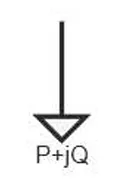

:::tip
本元件为一次电气元件，**直接接入三相交流主电路**，作为负荷消耗有功与无功功率，无需外部控制信号即可独立运行。
:::

## 元件定义

静态负荷采用扩展 ZIP 形式，令：

$k_V = \frac{V}{V_N}$

有功功率按下式计算：

$P = P_N \left[A_P k_V^{N_P} + B_P k_V + C_P\right]\left(1 + K_{PF}\Delta f\right)$

无功功率按下式计算：

$Q = Q_N \left[A_Q k_V^{N_Q} + B_Q k_V + C_Q\right]\left(1 + K_{QF}\Delta f\right)$

其中：

$C_P = 1 - A_P - B_P$

$C_Q = 1 - A_Q - B_Q$

$N_P$ 为有功功率电压指数，对应参数 `NP`；$N_Q$ 为无功功率电压指数，对应参数 `NQ`。$A_P$、$B_P$、$C_P$ 分别表示有功侧指数项、一次电压项和常数项系数；$A_Q$、$B_Q$、$C_Q$ 分别表示无功侧指数项、一次电压项和常数项系数。

## 元件说明

### 工作原理
元件基于指数型静态负荷数学模型，以额定电压，额定频率下的额定功率为基准，根据节点实际电压，系统频率实时计算实际消耗的有功与无功功率。

#### 三种典型负荷模型配置
通过修改 **Voltage Index for P** 与 **Voltage Index for Q** 两个参数，可实现电力系统三类标准静态负荷特性：

1.  **恒功率负荷（NP=0，NQ=0）**
    - 特性：功率与电压无关，仅与额定值偏差相关
    - 物理意义：无论节点电压如何波动，负荷消耗的有功，无功功率保持恒定
    - 应用场景：电动机，电子设备等恒功率运行设备

2.  **恒电流负荷（NP=1，NQ=1）**
    - 特性：功率与电压成正比
    - 物理意义：电流保持不变，功率随电压线性变化
    - 应用场景：照明负荷，整流设备等

3.  **恒阻抗负荷（NP=2，NQ=2）**
    - 特性：功率与电压平方成正比
    - 物理意义：阻抗保持不变，符合欧姆定律
    - 应用场景：电阻炉，白炽灯等纯阻性负荷

### 属性
CloudPSS 元件包含统一的**属性**选项，其配置方法详见 [参数卡](docs/documents/software/10-xstudio/20-simstudio/40-workbench/20-function-zone/30-design-tab/30-param-panel/index.md) 页面。

### 参数

import Parameters from './_parameters.md'

<Parameters/>

### 引脚
import Pins from './_pins.md'

<Pins/>

#### 使用说明
1.  **接线规则**
    本元件为三相一次负荷元件，`Pin +` 为三相接线端，直接接入三相交流主电路即可。
2.  **负荷模型配置步骤**
    1.  根据仿真场景确定负荷类型，设置对应的电压指数 `Voltage Index for P` 与 `Voltage Index for Q`；
    2.  设置额定电压 `Rated Voltage`，额定有功功率 `Rated Active Power`，额定无功功率 `Rated Reactive Power`；
    3.  频率系数 `Freq Index for P/Q` 默认设为 0，仅需模拟频率敏感负荷时修改。
3.  **监测引脚**
    元件内置三相电流向量，RMS电流，有功功率，无功功率监测输出，可直接接入输出通道进行观测，无需额外串接量测元件。

## 常见问题

**如何切换恒功率/恒电流/恒阻抗负荷？**
: 修改 `Voltage Index for P` 和 `Voltage Index for Q` 即可：设为 0 为恒功率，设为 1 为恒电流，设为 2 为恒阻抗。
