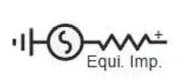

:::tip
本元件为一次电气电源元件，直接接入三相交流主电路，自带等值内阻抗，可等效模拟上级电网的戴维南等值模型，支持接地/不接地两种中性点配置。
:::

## 元件定义
该元件用以建模三相戴维南等值电压源（单线图），由理想正弦电压源串联等值阻抗构成，可模拟电网接入点，系统等值电源，无穷大母线等典型电力系统场景，支持正序，负序，零序全序网参数配置，适用于潮流计算与电磁暂态仿真。

## 元件说明

### 工作原理

元件基于戴维南等值电路原理，由**理想三相正弦电压源串联等值内阻抗**构成，采用诺顿等效形式实现电磁暂态仿真计算。

#### 1. 电压源数学模型

理想电压源输出三相对称正弦波形，各相电压瞬时值表达式为：

$$
\begin{cases}
e_a(t) = E_m \cdot \sin(\omega t + \theta_0) \\
e_b(t) = E_m \cdot \sin(\omega t + \theta_0 + \dfrac{4\pi}{3}) \\
e_c(t) = E_m \cdot \sin(\omega t + \theta_0 + \dfrac{2\pi}{3})
\end{cases}
$$

其中：
- $E_m$：电源内部电动势的相电压峰值，由额定电压与潮流初始化共同确定
- $\omega = 2\pi f$：角频率，由额定频率参数确定
- $\theta_0$：A相电压初始相角，由潮流计算结果确定
- 三相相位互差 120°，正序对称输出

#### 2. 启动方式

元件支持两种软启动模式，避免合闸瞬间产生暂态冲击：

| 启动模式 | initType | 数学表达式 | 特点 |
|----------|----------|------------|------|
| **线性斜坡** | 0 | $ratio(t) = \min(t / t_{ramp}, 1)$ | 电压幅值从0线性上升至额定值，上升时间由 `RampingTime` 控制 |
| **指数斜坡** | 1 | $ratio(t) = 1 - e^{-t / t_{ramp}}$ | 电压幅值按指数规律渐进上升，更平滑，无超调 |

当斜坡时间设为0或负值时，电压直接全额输出，无软启动过程。

#### 3. 等值内阻抗

电压源内部串联等值阻抗，支持正序、负序、零序独立参数配置，在 **012 序分量坐标系**下分别计算，再通过序变换矩阵 T 转换到 abc 三相坐标系：

$$
\mathbf{Z_{abc}} = \mathbf{T} \cdot \mathbf{Z_{012}} \cdot \mathbf{T^{-1}}
$$

其中 $\mathbf{Z_{012}} = \text{diag}(Z_0, Z_1, Z_2)$ 为序分量阻抗对角矩阵。

阻抗支持三种输入模式，均可自动换算为最终的 R、X 值参与计算：
- **电阻电抗直接输入**：直接输入各序 R、X
- **阻抗幅值+相角输入**：输入 |Z| 和 φ，分解为 R = |Z|cosφ、X = |Z|sinφ
- **短路电流输入**：输入短路电流 I_k 和功率因数角，反推阻抗

未开启负序、零序单独配置时，负序和零序阻抗默认与正序一致。

#### 4. 潮流初始化

元件端口的电压幅值、相角等稳态参数**通过潮流计算得到**，并根据初始功率反推电源内部电动势，保证暂态仿真从稳态工况开始启动。

潮流计算输入参数（Power Flow Data）：

| 参数 | 含义 | 说明 |
|------|------|------|
| **Bus Type** | 母线类型 | 可选择 PQ Bus / PV Bus / Slack Bus 等 |
| **Injected Active Power** | 注入有功功率 | 母线注入的有功功率设定值，单位 MW |
| **Injected Reactive Power** | 注入无功功率 | 母线注入的无功功率设定值，单位 MVar |
| **Bus Voltage Magnitude** | 母线电压幅值 | 潮流计算得到的电压幅值标幺值 |
| **Bus Voltage Angle** | 母线电压相角 | 潮流计算得到的电压相角，单位 ° |

潮流计算完成后，将得到的端口电压幅值与相角作为电压源的初始值，保证暂态仿真从稳态工况开始启动，避免暂态冲击。

#### 5. 端口电压电流关系

元件端口输出电压受内阻抗压降影响，满足：

$$
\mathbf{V_{port}} = \mathbf{E} - \mathbf{Z_{eq}} \cdot \mathbf{I_{port}}
$$

空载时端口电流为零，端口电压等于电源内部电动势；带载时端口电压随电流增大而降低，符合实际电网的戴维南等效特性。
### 属性
CloudPSS 元件包含统一的**属性**选项，其配置方法详见 [参数卡](docs/documents/software/10-xstudio/20-simstudio/40-workbench/20-function-zone/30-design-tab/30-param-panel/index.md) 页面。

### 参数
import Parameters from './_parameters.md'

<Parameters/>

### 引脚
import Pins from './_pins.md'

<Pins/>

#### 使用说明
1.  **接线规则**
    元件 `Pin +` 为三相正端，接入主电路；`Pin -` 为负端，仅当中性点设置为不接地时有效，接地模式下负端内部自动接地。
2.  **参数配置步骤**
    1.  设置额定电压，频率，中性点接地方式等基础参数；
    2.  选择等值阻抗的输入方式，填入对应参数；
    3.  配置启动方式，Linear Ramp 模式下可设置启动时间实现软启动，避免合闸冲击。
3.  **监测引脚**
    元件内置电压向量，电流向量，电压/电流有效值，有功/无功功率监测输出，可直接接入输出通道观测，无需额外外接量测元件。

## 常见问题

**三种阻抗输入方式有什么区别，如何选择？**
: 已知设备实测电阻，电抗值选直接输入模式；已知阻抗幅值与阻抗角选幅值相角模式；已知系统短路电流水平选短路电流模式，三种方式最终计算结果等效。

**负序，零序参数必须单独设置吗？**
: 不是。默认关闭负零序输入时，负序，零序阻抗与正序一致；仅在需要模拟不对称故障，三相不平衡场景时，才需要单独配置负序，零序参数。

**Linear Ramp启动方式有什么作用？**
: 线性斜坡启动模式下，电压幅值从0线性上升至额定值，可模拟电源软启动过程，避免直接合闸产生的励磁涌流，暂态冲击，适合稳态仿真场景。

