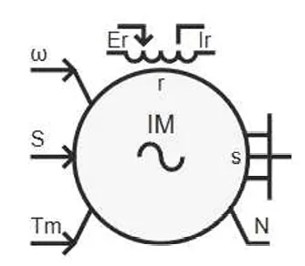

:::tip
本元件为一次电气旋转电机元件，直接接入三相交流主电路，采用相域模型精确模拟定子、转子的电磁暂态过程，支持绕线式转子结构，可外接转子电阻或变频装置。
:::

## 元件定义

绕线式感应电机是基于相域建模的三相异步电机元件，在 abc 三相静止坐标系下直接求解定子与转子的电压方程、磁链方程与电磁转矩方程，无需进行 dq 坐标变换。元件支持绕线式转子结构，转子绕组可通过滑环外接电阻或电力电子装置，适用于绕线式异步电机调速、双馈风力发电、串级调速等系统的电磁暂态仿真。

## 元件说明

### 工作原理

元件采用相域（Phase Domain）建模方法，在 abc 三相静止坐标系下直接建立电机的数学模型，包含电压方程、磁链方程、电磁转矩方程和运动方程四部分。

#### 1. 符号规定

- 定子三相绕组：a、b、c，相电阻 $R_s$，相电感 $L_s$
- 转子三相绕组：ar、br、cr，相电阻 $R_r$，相电感 $L_r$
- 转子位置角：$\theta_r$（转子 a 相与定子 a 相的夹角）
- 极对数：$n_p$
- 转动惯量：$J$
- 机械角速度：$\omega_m$

#### 2. 电压方程

定子侧与转子侧的电压方程均采用电阻压降 + 磁链微分的矩阵形式：

$$
\begin{bmatrix}
v_{sa} \\ v_{sb} \\ v_{sc}
\end{bmatrix}
=
\begin{bmatrix}
R_s & 0 & 0 \\
0 & R_s & 0 \\
0 & 0 & R_s
\end{bmatrix}
\begin{bmatrix}
i_{sa} \\ i_{sb} \\ i_{sc}
\end{bmatrix}
+
\frac{d}{dt}
\begin{bmatrix}
\psi_{sa} \\ \psi_{sb} \\ \psi_{sc}
\end{bmatrix}
$$

$$
\begin{bmatrix}
v_{ra} \\ v_{rb} \\ v_{rc}
\end{bmatrix}
=
\begin{bmatrix}
R_r & 0 & 0 \\
0 & R_r & 0 \\
0 & 0 & R_r
\end{bmatrix}
\begin{bmatrix}
i_{ra} \\ i_{rb} \\ i_{rc}
\end{bmatrix}
+
\frac{d}{dt}
\begin{bmatrix}
\psi_{ra} \\ \psi_{rb} \\ \psi_{rc}
\end{bmatrix}
$$

其中 $\psi_s$ 为定子磁链向量，$\psi_r$ 为转子磁链向量。

#### 3. 磁链方程

磁链与电流的关系采用分块矩阵形式表示，包含定子自感、转子自感和定转子互感三部分：

$$
\begin{bmatrix}
\boldsymbol{\psi_s} \\
\boldsymbol{\psi_r}
\end{bmatrix}
=
\begin{bmatrix}
\mathbf{L_{SS}} & \mathbf{L_{SR}}(\theta_r) \\
\mathbf{L_{SR}}^T(\theta_r) & \mathbf{L_{RR}}
\end{bmatrix}
\begin{bmatrix}
\mathbf{i_s} \\
\mathbf{i_r}
\end{bmatrix}
$$

其中：
- $\mathbf{L_{SS}}$：定子电感矩阵（3×3），包含定子自感与定子相间互感，为常数矩阵
- $\mathbf{L_{RR}}$：转子电感矩阵（3×3），包含转子自感与转子相间互感，为常数矩阵
- $\mathbf{L_{SR}}(\theta_r)$：定转子互感矩阵（3×3），随转子位置角 $\theta_r$ 变化，是时变矩阵

定转子互感矩阵的各元素随转子位置按余弦规律变化：

$$
L_{SR,ij} = M_{sr} \cos\left(\theta_r + \frac{2\pi}{3}(k_i - k_j)\right)
$$

其中 $M_{sr}$ 为定转子同轴绕组的最大互感，$k_i$、$k_j$ 为各相的相位编号。

#### 4. 电磁转矩方程

电磁转矩通过磁场储能对转子位置角求导得到，形式为：

$$
T_e = \frac{1}{2} n_p \mathbf{i}^T \frac{\partial \mathbf{L}}{\partial \theta_r} \mathbf{i}
$$

展开后可表示为定转子电流与互感偏导数的乘积形式：

$$
T_e = n_p \mathbf{i_s}^T \cdot \frac{\partial \mathbf{L_{SR}}}{\partial \theta_r} \cdot \mathbf{i_r}
$$

电磁转矩与机械转矩的差值决定了转子的角加速度：

$$
J \frac{d\omega_m}{dt} = T_e - T_m - B\omega_m
$$

其中 $T_m$ 为机械负载转矩，$B$ 为阻尼系数。

#### 5. 离散化形式

电磁暂态仿真中，磁链微分方程采用梯形法进行离散化，支持两种计算模式：

- **普通模式**：每步更新电感矩阵，适用于一般精度要求的仿真
- **ConstGMat 模式**：电导矩阵保持恒定，仅更新历史电流源，计算速度更快，适用于大规模系统仿真

离散化后将电机等效为诺顿电流源并联电导的形式，与外部电路接口求解。

### 属性

**CloudPSS** 元件包含统一的**属性**选项，其配置方法详见 [参数卡](/docs/documents/software/20-emtlab/110-component-library/10-basic/10-electrical/50-rotating-machines/20-WoundRotorIMRouter/_parameters.md) 页面。

### 参数

import Parameters from './_parameters.md'

<Parameters/>

### 引脚

import Pins from './_pins.md'

<Pins/>

#### 使用说明

1.  **主电路连接规则**

    定子侧三相引脚直接接入三相交流主电路；转子侧三相引脚可外接电阻、变频器或短路，根据仿真场景灵活配置。

2.  **参数配置步骤**

    1.  设置额定电压、额定频率、额定功率等基础参数；
    2.  配置定子电阻、转子电阻、定子漏感、转子漏感、励磁电感等电磁参数；
    3.  设置极对数、转动惯量、阻尼系数等机械参数；
    4.  根据仿真需求选择离散化模式（普通模式 / ConstGMat 模式）。

3.  **监测引脚使用**

    元件内置定子三相电流、转子三相电流、电磁转矩、转速、转子角度等监测输出，可直接接入输出通道观测，无需额外外接量测元件。

## 常见问题

**绕线式感应电机与笼型感应电机有什么区别？**

: 绕线式电机的转子绕组通过滑环引出，可外接电阻或变频装置，便于调速和启动控制；笼型电机转子为短路鼠笼结构，结构简单、可靠性高，但调速性能相对有限。

**相域模型和 dq 模型有什么不同？**

: 相域模型直接在 abc 三相静止坐标系下求解，物理意义直观，适合分析不对称故障、电力电子接口等复杂工况；dq 模型在旋转坐标系下求解，方程更简洁，适合控制系统设计与稳态分析。

**转子侧引脚可以开路吗？**

: 不可以。绕线式感应电机的转子绕组必须形成闭合回路才能正常工作，可外接电阻、短路或连接变流器，不能开路运行。

**ConstGMat 模式有什么优势？**

: ConstGMat 模式下电导矩阵保持恒定，每步只需更新历史电流源，计算速度更快，适合大规模电力电子系统或多电机系统的仿真。