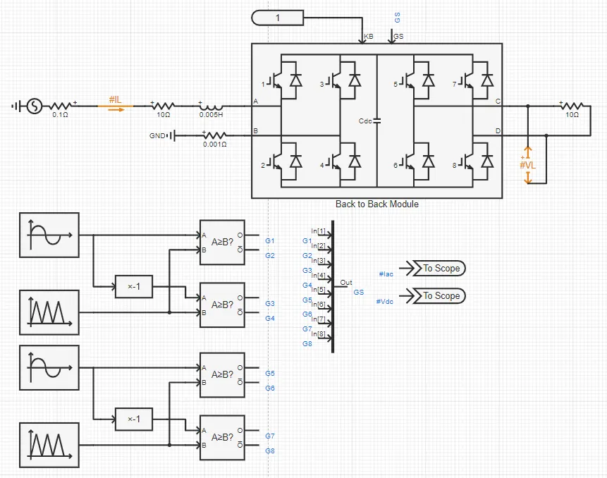

## 元件定义

该元件为背靠背 H 桥电路模块的快速化仿真模型，其与详细电磁暂态模型的精度相当。该元件可用于构建 AC/AC 变流器拓扑等

## 元件说明

### 属性

CloudPSS 元件包含统一的**属性**选项，其配置方法详见 [参数卡](docs/documents/software/10-xstudio/20-simstudio/40-workbench/20-function-zone/30-design-tab/30-param-panel/index.md) 页面。

### 参数

import Parameters from './_parameters.md'

<Parameters/>

### 引脚

import Pins from './_pins.md'

<Pins/>

### 使用说明

下图示出了背靠背 H 桥模块的单元测试算例，算例详见 [单相背靠背变流器](https://cloudpss.net/model/CloudPSS/B2BModule)。

开关 S1\~S4 及开关 S5\~S8 的脉冲信号分别由两组正弦脉宽调制逻辑实现，开关频率为 5KHz。两组脉宽调制器产生的 8 路 PWM 信号，经过**多路信号合并**元件合成为一个 8\*1 维的输出信号，送至背靠背 H 桥模块的 GS 端。前级 S1\~S4 进行整流，直流电容电压为 100Hz 脉动直流，电感电流为准正弦波形。后级 S5\~S8 进行逆变，电阻负载侧为准正弦波形。

## 案例

## 常见问题
