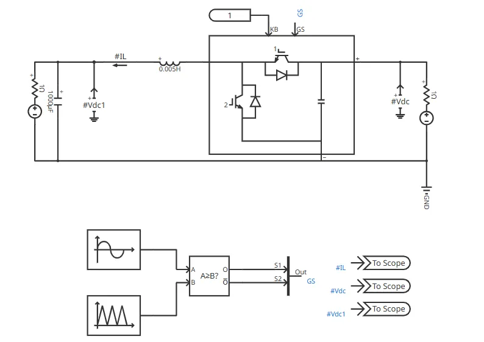

## 元件定义

该元件用于建模半桥电路模块（双向 DC/DC）。通过对 S1 或 S2 的开关信号置零，可将其配置为 BOOST 或 BUCK 电路。该元件采用快速电磁暂态模型，可在保持与详细电磁暂态模型精度相当的同时，极大提升仿真效率，适用于大规模电力电子网络建模仿真。

## 元件说明

### 属性

CloudPSS 元件包含统一的**属性**选项，其配置方法详见 [参数卡](docs/documents/software/10-xstudio/20-simstudio/40-workbench/20-function-zone/30-design-tab/30-param-panel/index.md) 页面。

### 参数

import Parameters from './_parameters.md'

<Parameters/>

### 引脚

import Pins from './_pins.md'

<Pins/>

### 使用说明

下图示出了半桥模块的单元测试算例，算例详见 [双向 DC/DC 变流器](https://cloudpss.net/model/CloudPSS/HalfBridgeModule)。

该算例从电源侧往输出 RL 负载看，为一个双向 DC/DC 电路（降压）。开关信号由50Hz正弦波与三角载波比较产生，经过**多路信号合并**元件合成为一个 2\*1 维的输出信号，送至半桥模块的 GS 端。由于 PWM 占空比信号按照正弦分布，因此负载电阻 R 上的电压为 50Hz 准正弦变化的直流。

## 案例

## 常见问题
