## 元件定义

RLC矩阵是一种采用矩阵形式描述多支路电阻、电感及电容特性的电气网络元件。每条支路内部的电阻、电感、电容为串联连接，支路间可存在耦合关系。元件支持不输入矩阵参数、阻抗矩阵、导纳矩阵三种输入模式，可灵活模拟对称/不对称、耦合/非耦合的多支路RLC网络，广泛应用于复杂电力系统的等值建模与仿真分析。

## 元件说明

### 工作原理

元件由多条RLC串联支路构成，采用**支路矩阵形式**描述各支路的电气特性。支路阻抗矩阵：

$$
\mathbf{V_{branch}} = \mathbf{Z} \cdot \mathbf{I_{branch}}
$$

其中 $\mathbf{V_{branch}}$ 为支路电压降向量，$\mathbf{I_{branch}}$ 为支路电流向量。

$$
\mathbf{Z} = \mathbf{R} + j\omega \mathbf{L} + \frac{1}{j\omega} \mathbf{C}^{-1}
$$

### 输入类型详解

元件支持电阻、电感、电容分别独立配置输入类型，每种参数均提供三种输入模式：

| 参数 | 输入类型 | 含义 | 输入内容 | 
|:--- |:--- |:--- |:--- |
| **R Type** | None | 无电阻 | 无需输入数据 | 
| | Input R | 电阻矩阵 |  $\mathbf{R}$ | 
| | Input inv(R) | 电阻矩阵逆矩阵 |  $\mathbf{R}^{-1}$ |
| **L Type** | None | 无电感 | 无需输入数据 | 
| | Input ZL | 电感感抗矩阵 |  $\mathbf{Z_L}$ | 
| | Input inv(ZL) | 电感感抗矩阵逆矩阵 |  $ \mathbf{Z_L}^{-1}$ | 
| **C Type** | None | 无电容 | 无需输入数据 | 
| | Input BC | 电容电纳矩阵 |  $\mathbf{B_C}$ | 
| | Input inv(BC) | 电容电纳矩阵逆矩阵 |  $\mathbf{B_C}^{-1}$ | 

用户可以根据已知参数自行选择输入模式，并参考下面的参数说明部分。

### 属性

**CloudPSS** 元件包含统一的**属性**选项，其配置方法详见 [参数卡](/docs/documents/software/10-xstudio/20-simstudio/40-workbench/20-function-zone/30-design-tab/30-param-panel/index.md) 页面。

### 参数

import Parameters from './_parameters.md'

<Parameters/>

### 引脚

import Pins from './_pins.md'

<Pins/>

### 使用说明

RLC 矩阵元件的**参数输入方式**有以下两种：

1. **“值”模式：通过“编辑数据”逐项录入**

    点击待编辑参数、变量或引脚的赋值输入框右侧，当显示 **(x)** 时，当前为 **“值”模式** 输入框。

    在元件参数面板中点击**编辑数据**，进入表格编辑界面后，按先行后列的顺序输入矩阵元素。输入矩阵的行数和列数应与 **Branches** 设置一致。**Branches=3** 时，`R`、`ZL` 或 `BC` 应输入为 $3\times3$ 矩阵；**Branches=1** 时，仅需输入一个支路参数值。

    例如，填入一个 $3\times3$ 矩阵：

    $$ 
    R_{\mathrm{branch}}=\begin{bmatrix}1&2&3\\4&5&6\\7&8&9\end{bmatrix}
    $$

    可在参数编辑界面添加 3 行，对应矩阵的 3 行；再分别进入每一行，添加 3 个元素，对应该行的 3 列。具体操作步骤如下：

    点击元件参数面板中 `R` 赋值输入框中的**编辑数据**，进入行参数赋值页面后，点击插入行按钮，插入对应矩阵的 3 行，并双击第一行，准备输入第一行的 3 列参数。

    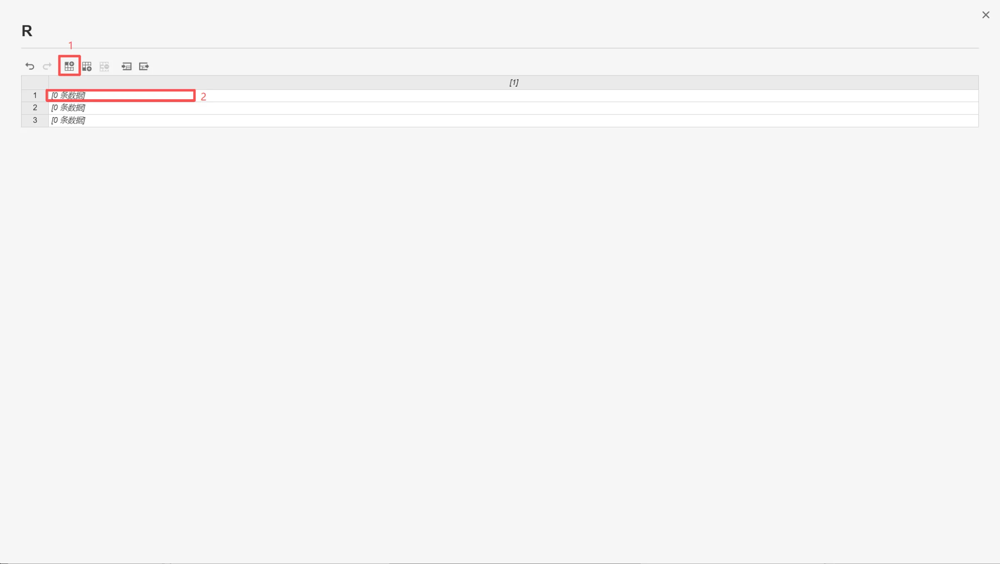

    点击插入行按钮，插入 3 个元素，对应矩阵第一行的 3 列。

    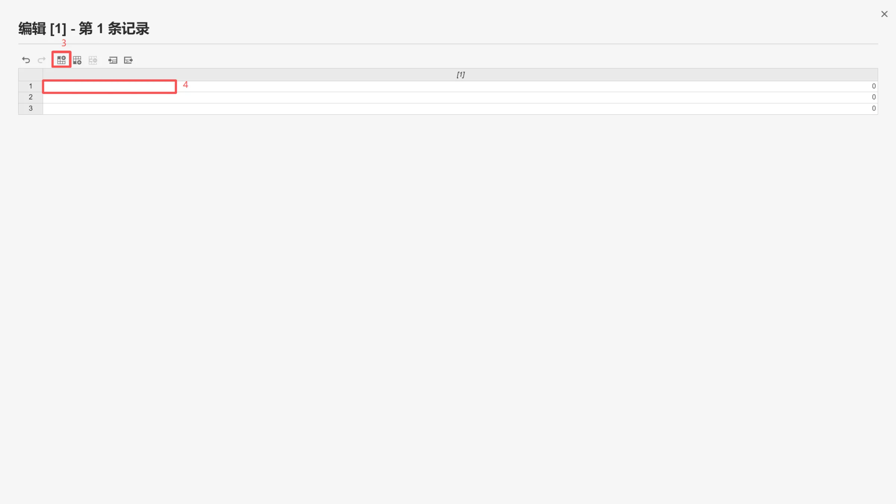

    依次输入数字 1、2、3，关闭该页面，返回上级页面。

    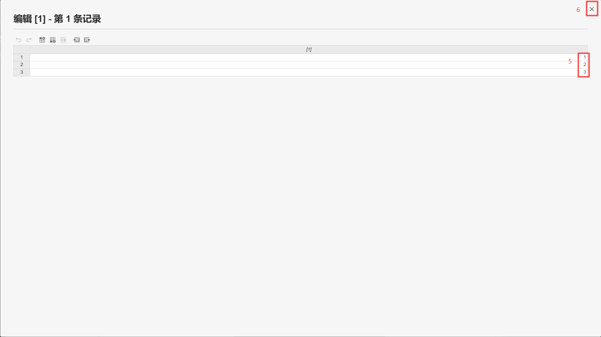

    重复上述步骤，输入矩阵后续两行的参数，完成 $3\times3$ 矩阵的编辑。

2. **“表达式”模式**

    点击待编辑参数的赋值输入框右侧 **(x)** 后，当显示 **$f_x$** 时，当前为 **“表达式”模式** 输入框。

    **1）直接在赋值输入框输入矩阵参数**

    具体操作步骤如下：

    点击待编辑参数的赋值输入框右侧 **(x)**，切换至 **$f_x$** 显示状态，进入 **“表达式”模式**，并点击赋值输入框。

    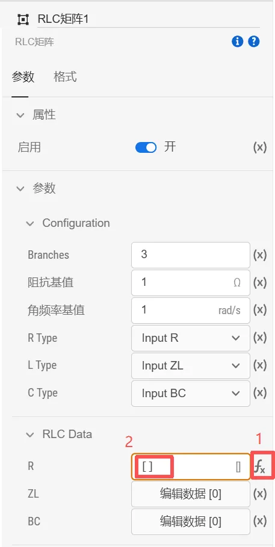

    选中输入框后按下 <kbd>Ctrl</kbd> 键，呼出扩展编辑框，参考下面的示例输入 $3\times3$ 矩阵的所有元素，完成矩阵参数编辑。

    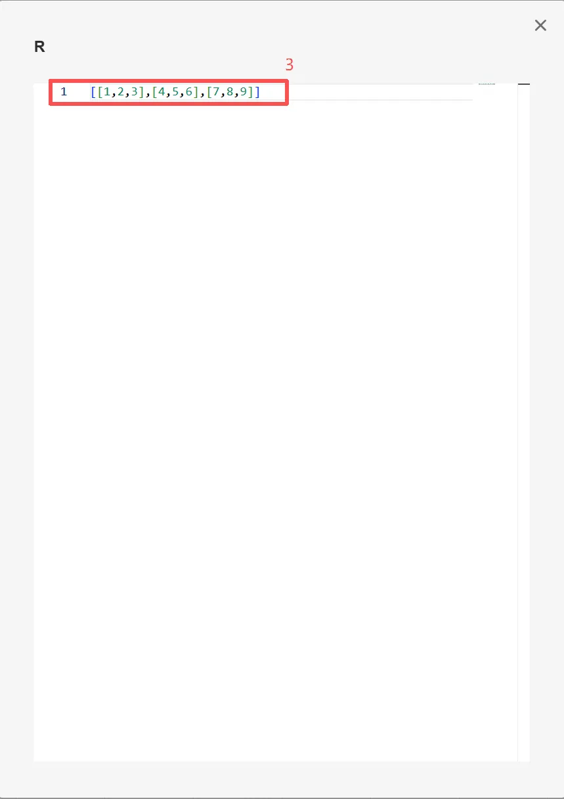

    **2）调用全局变量和全局参数**

    例如，若需要输入三支路电阻矩阵：

    $$ 
    R_{\mathrm{branch}}=\begin{bmatrix}R_s&R_m&R_m\\R_m&R_s&R_m\\R_m&R_m&R_s\end{bmatrix} 
    $$

    具体操作步骤如下：

    在当前模型的接口标签页定义所需的全局参数 $R_0$ 和 $R_1$，定义方法参见 [定义元件/模块参数列表](https://kb.cloudpss.net/documents/software/xstudio/simstudio/modeling/module-packaging/define-module-param-list/) 帮助页。

    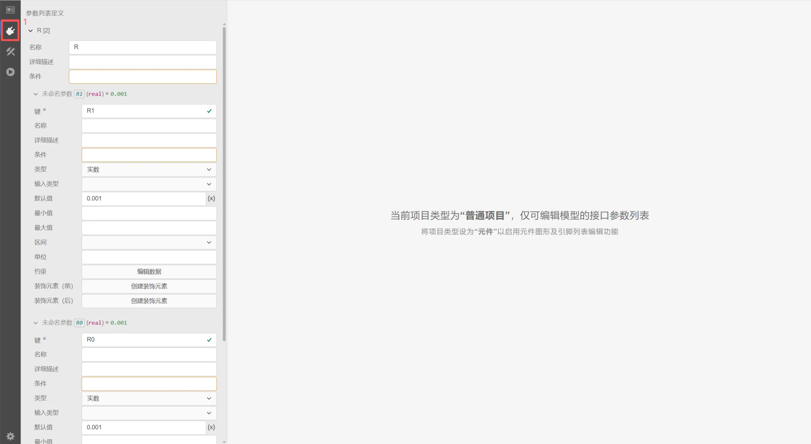

    进入当前模型的实现标签页 - 图纸 - 全局变量卡，添加全局变量。点击待编辑参数的赋值输入框右侧 **(x)** 后，当显示 **$f_x$** 时，进入 **“表达式”模式**，按下 <kbd>Ctrl</kbd> 键呼出扩展编辑框，定义所需的全局变量 $R_m$、$R_s$、$R_{\mathrm{branch}}$。

    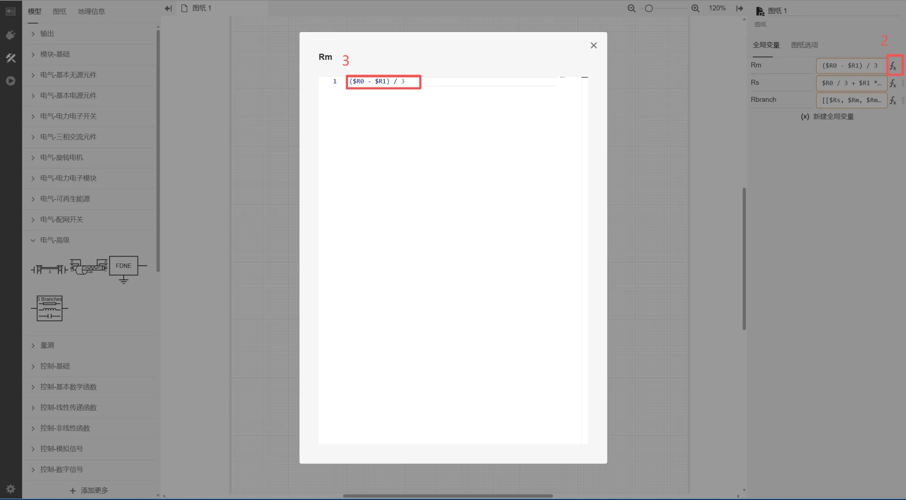

    
    按照同样的方法输入 $R_s$,$R_{\mathrm{branch}}$ 的值：
    
    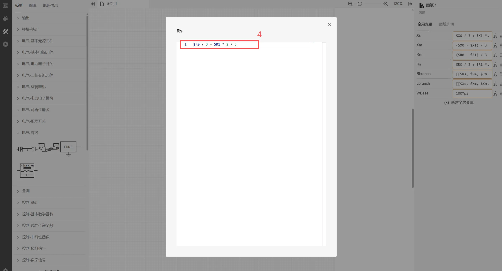

    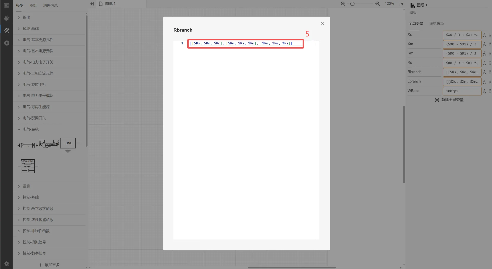

    完成矩阵参数的编辑输入。

    :::tip
    “值”模式下输入完成后，可切换到“表达式”模式，进行检查。
    :::
  

## 案例

### 案例1：单支路RL负载仿真案例

本案例演示如何使用RLC矩阵元件模拟一条串联RL支路，无需单独添加电阻和电感元件。

下图为一阶RLC矩阵仿真案例的电路拓扑：

#### 参数配置

元件参数配置如下：

> 注意：这里为了展示矩阵数据切换成$f_x$形式，实际仿真不用此操作。

#### 仿真输出波形

运行仿真后，得到支路电压和电流波形如下：

可以看到，RLC矩阵可以有效模拟RL支路的阻抗特性，证明RLC元件的可靠性。

### 案例2：三阶RLC矩阵仿真案例

下图为三阶RLC矩阵仿真案例的电路拓扑，用来模拟三相传输线的阻抗特性：

其中，全局变量参数具体如下所示：

$$
Xs = X0 / 3 + X1 * 2 / 3
$$

$$
Xm = (X0 - X1) / 3
$$

$$
Rm = (R0 - R1) / 3
$$

$$
Rs = R0 / 3 + R1 * 2 / 3
$$

$$
Rbranch = [[Rs,Rm,Rm], [Rm,Rs,Rm], [Rm,Rm,Rs]]
$$

$$
Lbranch = [[Xs,Xm,Xm], [Xm,Xs,Xm], [Xm,Xm,Xs]]
$$

#### 参数配置

元件参数配置如下：

其中，传输线额定频率设置为50Hz。

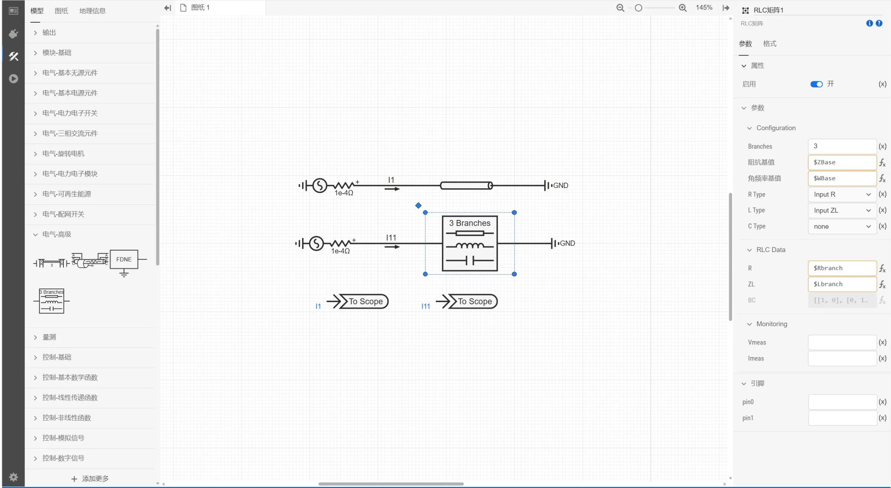

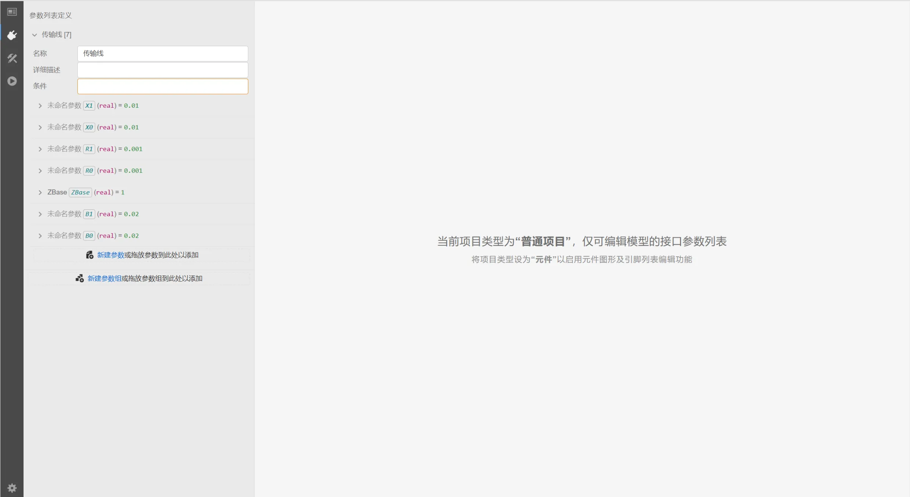

#### 仿真输出波形

运行仿真后，得到支路电压和电流波形如下：

## 常见问题

**如何模拟耦合支路？**

: 在矩阵中输入非零非对角线元素即可模拟支路间的耦合。

**有名值和标幺值如何切换？**

: 通过调整「阻抗基值」参数实现：当阻抗基值=1时，输入的是有名值；当阻抗基值=系统基准阻抗时，输入的是标幺值。
