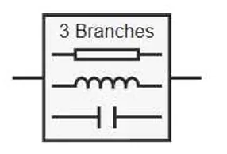
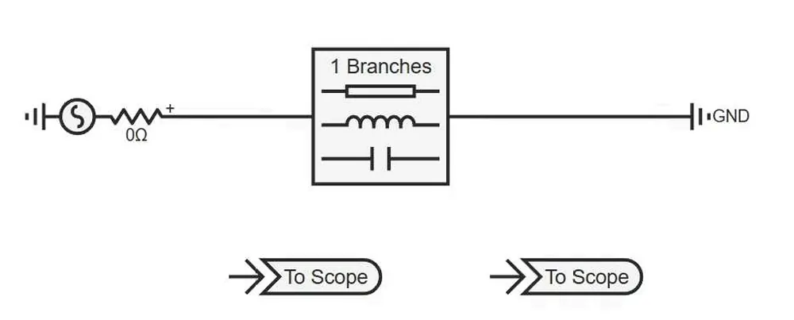
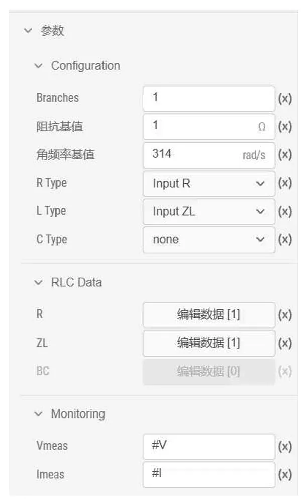
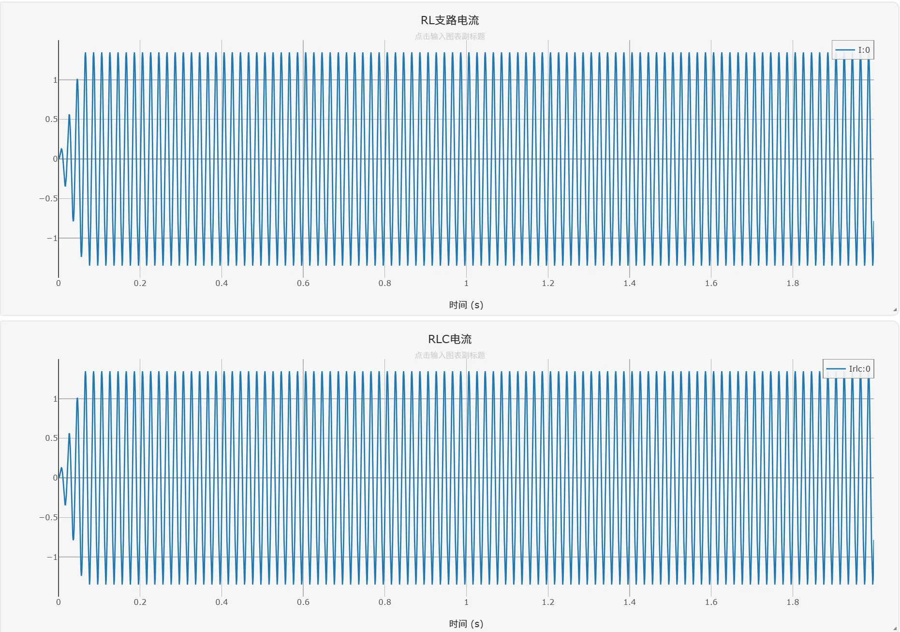
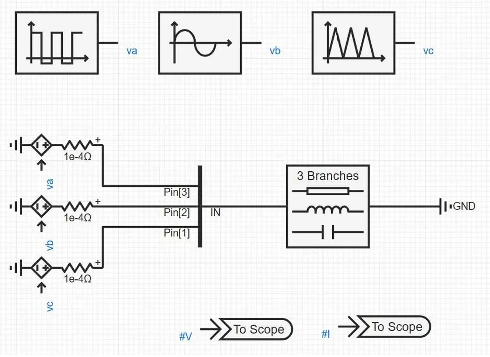
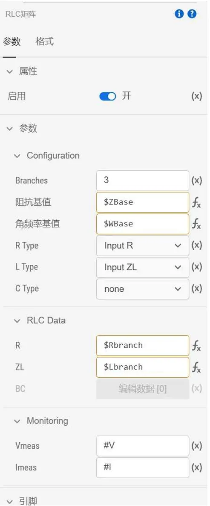
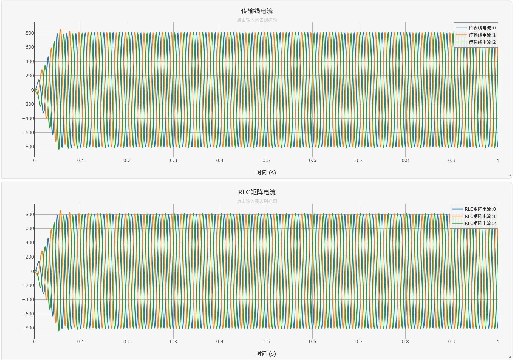
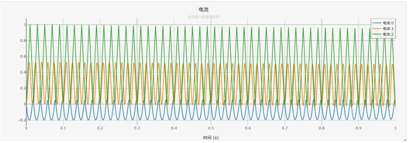

:::tip
本元件为一次电气元件，直接接入主电路，可同时模拟多条并联的RLC支路，无需逐个添加独立的电阻、电感、电容元件。
:::

## 元件定义

RLC矩阵是理想集中参数多支路网络元件，采用支路矩阵形式统一配置多条并联的串联RLC支路参数。每条支路内部的电阻、电感、电容为串联连接，支路总阻抗为各元件阻抗矩阵之和；支路间可存在耦合关系，通过矩阵非对角元素描述互阻抗或互感参数。元件支持无、阻抗矩阵、导纳矩阵三种输入模式，可灵活模拟对称/不对称、耦合/非耦合的多支路RLC网络，广泛应用于复杂电力系统的等值建模与仿真分析。

## 元件说明

### 工作原理

元件由多条RLC串联支路构成，采用**支路矩阵形式**描述各支路的电气特性。每条支路内部的电阻、电感、电容为串联连接，支路阻抗矩阵由各元件的阻抗矩阵叠加而成：

$$
\mathbf{V_{branch}} = \mathbf{Z} \cdot \mathbf{I_{branch}}
$$

其中 $\mathbf{V_{branch}}$ 为支路电压降向量，$\mathbf{I_{branch}}$ 为支路电流向量。

$$
\mathbf{Z} = \mathbf{R} + j\omega \mathbf{L} + \frac{1}{j\omega} \mathbf{C}^{-1}
$$

### 输入类型详解

元件支持电阻、电感、电容分别独立配置输入类型，每种参数均提供三种输入模式：

| 参数 | 输入类型 | 含义 | 输入内容 | 适用场景 |
|:--- |:--- |:--- |:--- |:--- |
| **R Type** | None | 无电阻 | 无需输入数据 | 纯电感/纯电容支路 |
| | Input R | 电阻矩阵 | 支路电阻值矩阵 $\mathbf{R}$ | 已知支路电阻值的场景 |
| | Input G | 电导矩阵（逆矩阵） | 支路电导值矩阵 $\mathbf{G}=\mathbf{R}^{-1}$ | 已知导纳参数的网络建模 |
| **L Type** | None | 无电感 | 无需输入数据 | 纯电阻/纯电容支路 |
| | Input ZL | 感抗矩阵 | 支路感抗值矩阵 $\mathbf{Z_L}=\omega \mathbf{L}$ | 已知支路电感值的场景 |
| | Input YL | 感纳矩阵（逆矩阵） | 支路感纳值矩阵 $\mathbf{Y_L}=(\omega \mathbf{L})^{-1}$ | 已知导纳参数的网络建模 |
| **C Type** | None | 无电容 | 无需输入数据 | 纯电阻/纯电感支路 |
| | Input BC | 容纳矩阵 | 支路容纳值矩阵 $\mathbf{B_C}=\omega \mathbf{C}$ | 已知支路电容值的场景 |
| | Input XC | 容抗矩阵（逆矩阵） | 支路容抗值矩阵 $\mathbf{X_C}=(\omega \mathbf{C})^{-1}$ | 已知阻抗参数的网络建模 |

### 基值说明

- **阻抗基值 ZBase**：当 ZBase=1 时，输入的是有名值（单位：$\Omega$）；否则输入的是标幺值，基值为 ZBase。

- **角频率基值 WBase**：当 WBase=1 时，L 输入电感值（单位：H），C 输入电容值（单位：F）；否则输入的是感抗/容纳值，基值为 WBase。

- 当系统频率为 50 Hz 时，角频率基值为 $100\pi \approx 314.16$ rad/s。

### 属性

**CloudPSS** 元件包含统一的**属性**选项，其配置方法详见 [参数卡](/docs/documents/software/20-emtlab/110-component-library/10-basic/10-electrical/80-advanced/40-RLCMatrix/_parameters.md) 页面。

### 参数

import Parameters from './_parameters.md'

<Parameters/>

### 引脚

import Pins from './_pins.md'

<Pins/>

#### 使用说明

1.  **接线规则**

    本元件为双引脚多支路电气元件，`pin0` 为支路公共输入端，`pin1` 为支路公共输出端。所有并联支路的一端连接到 `pin0`，另一端连接到 `pin1`，形成多条并联的RLC支路。

2.  **支路数量配置**

    `Branches` 参数设置并联支路的总数，引脚维度会自动变为 `Branches × 1`；电阻、电感、电容矩阵的行数和列数必须与 `Branches` 数量一致；非耦合支路中矩阵为对角矩阵，对角线元素为各支路的参数值；耦合支路中矩阵为非对角矩阵，非对角线元素表示支路间的耦合参数。

3.  **矩阵编辑方法**

    点击「编辑数据」按钮打开矩阵编辑器；

    输入矩阵元素，每行对应一条支路，每列对应一个节点；

    支持对角矩阵快速填充，非耦合支路只需输入对角线元素。

4.  **输入类型选择建议**

    优先选择与已知参数一致的输入类型，避免手动计算逆矩阵；简单支路建模时，使用 Input R、Input ZL、Input BC，直接输入元件参数值；复杂网络等值建模时，使用 Input G、Input YL、Input XC，直接输入导纳/阻抗矩阵参数。

## 案例

### 案例1：单支路RL负载仿真案例

本案例演示如何使用RLC矩阵元件模拟一条串联RL支路，无需单独添加电阻和电感元件。

#### 电路接线

下图为单支路RL负载仿真案例的电路拓扑：

**接线说明**：

1.  交流电压源输出端连接到RLC矩阵的`pin0`引脚；
2.  RLC矩阵的`pin1`引脚连接到系统参考地；
3.  通过元件内置的虚拟监测引脚`Vmeas`和`Imeas`，直接输出支路电压和电流信号至输出通道。

#### 参数配置

元件参数配置如下：

#### 仿真输出波形

运行仿真后，得到支路电压和电流波形如下：

### 案例2：三阶RLC矩阵仿真案例

下图为三阶RLC矩阵仿真案例的电路拓扑：

**接线说明**：

1.  三个受控电压源通过多相分线器连接到RLC矩阵的`pin0`引脚；
2.  RLC矩阵的`pin1`引脚连接到系统参考地；
3.  通过元件内置的虚拟监测引脚`Vmeas`和`Imeas`，直接输出支路电压和电流信号至输出通道。

#### 参数配置

元件参数配置如下：

本案例中RLC矩阵的配置，通过设置全局变量和模型参数来实现。

#### 仿真输出波形

运行仿真后，得到支路电压和电流波形如下：

## 常见问题

**为什么矩阵编辑器提示维度不匹配？**

: 电阻、电感、电容矩阵的行数和列数必须与 `Branches` 参数设置的支路数量一致。例如，当 `Branches=3` 时，矩阵必须是 3×3 的方阵。

**如何模拟耦合支路？**

: 在矩阵中输入非对角线元素即可模拟支路间的耦合。例如，2条耦合支路的电阻矩阵为 `[[10, 2], [2, 10]]`，表示两条支路的自电阻为10 Ω，互电阻为2 Ω。

**有名值和标幺值如何切换？**

: 通过调整「阻抗基值」参数实现：当阻抗基值=1时，输入的是有名值；当阻抗基值=系统基准阻抗时，输入的是标幺值。

**什么时候应该使用逆矩阵输入模式？**

: 当已知网络的导纳参数而非阻抗参数时，直接使用逆矩阵输入模式，避免手动计算矩阵的逆，减少计算误差。