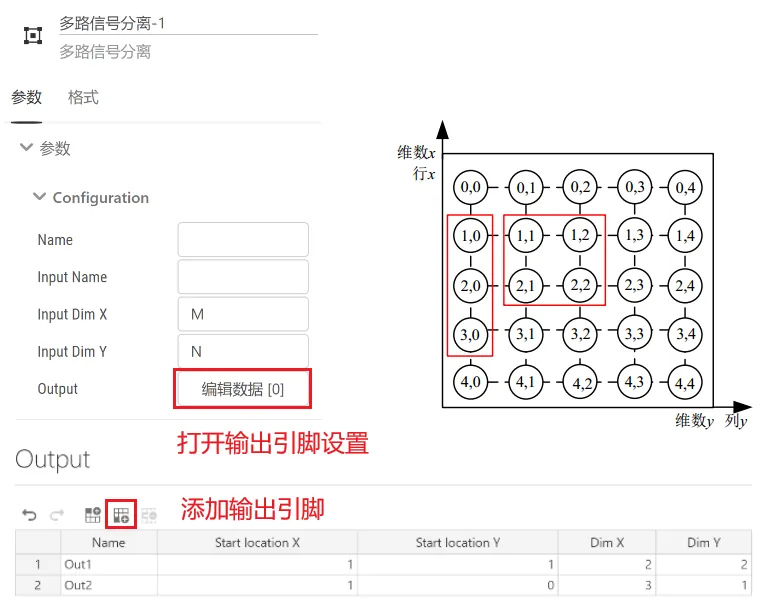

## 元件定义

该元件实现将单路多维输入信号拆分为多路输出信号，每路输出信号可以为多维。

## 元件说明

### 属性

CloudPSS 元件包含统一的**属性**选项，其配置方法详见 [参数卡](docs/documents/software/10-xstudio/20-simstudio/40-workbench/20-function-zone/30-design-tab/30-param-panel/index.md) 页面。

### 参数

import Parameters from './_parameters.md'

<Parameters/>

### 引脚

import Pins from './_pins.md'

<Pins/>

### 使用说明

**多路信号分离工作原理**

假设仿真过程中生成了一个 M*N 维 (M 行 N 列）的信号，如图所示。可利用多路信号分离元件对该信号进行拆分。

例如，需要分别获得以坐标 (1,1) 起始的 2\*2 维的信号以及以坐标 (1,0) 起始的 3\*1 维信号，此时先拖拽多路信号分离元件至工作空间，单击该元件进行参数设定，填写输入引脚的名称及维数。接着点击编辑数据，添加输出引脚，并填写输出引脚的名称、起始坐标以及维数。元件参数设置与输出引脚设置如下图所示。此时输出引脚 Out1 为一个 2\*2 维的信号，输出引脚 Out2 为一个 3*1 维的信号。

**输入输出维数需要匹配，如在上例中原始 M\*N 维信号至少为 4\*3 维。**

## 案例

## 常见问题
