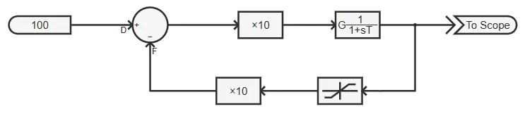

## 元件定义

该元件用以实现代数环解环功能。

## 元件说明

### 属性

CloudPSS 元件包含统一的**属性**选项，其配置方法详见 [参数卡](docs/documents/software/10-xstudio/20-simstudio/40-workbench/20-function-zone/30-design-tab/30-param-panel/index.md) 页面。

### 参数

import Parameters from './_parameters.md'

<Parameters/>

### 引脚

import Pins from './_pins.md'

<Pins/>

### 使用说明

该元件用以在出现控制环（代数环）的仿真算例中，通过加入一步延时的方法解开环，以使仿真能继续进行。 

通常，当搭建好一个含有反馈环的系统后（如图），点击开始仿真，系统信息会报多个**警告**。

**`[warning]`** There are loop nodes in system!You can use Component 'LoopNode' to specify the loop nodes and the initial value, or the program will choose random loop nodes.  
**`[warning]`** Node 1 in component 限幅器-1 will be chosen as loop node with initial value 0.  
**`[warning]`** Node 2 in component 加法器/减法器-1 will be chosen as loop node with initial value 0.

此时，CloudPSS 通过内置的延时解环算法，在**限幅器-1** 元件和**加法器/减法器-1** 元件处各加入了一个延时，此时系统的反馈环被打开，从而可以正常仿真。

但自动的解环算法往往不是最优的。因此，建议用户采用本元件进行解环。例如，对上图所示的控制环，可在输出位置加入一步延时，即可解开反馈环。还可为解环后反馈路径设定一个初值，以降低解环带来的误差。

## 案例

## 常见问题
