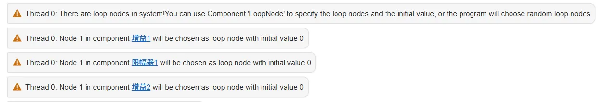
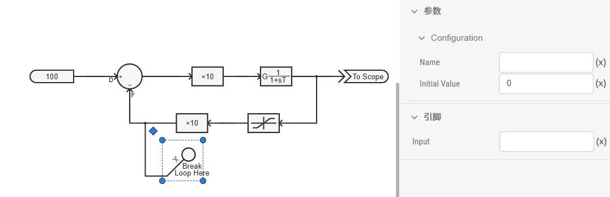

## 元件定义

该元件用以实现代数环解环功能。

## 元件说明

### 属性

CloudPSS 元件包含统一的**属性**选项，其配置方法详见 [参数卡](docs/documents/software/10-xstudio/20-simstudio/40-workbench/20-function-zone/30-design-tab/30-param-panel/index.md) 页面。

### 参数

import Parameters from './_parameters.md'

<Parameters/>

### 引脚

import Pins from './_pins.md'

<Pins/>

### 使用说明

该元件用于存在控制环（代数环）的仿真中，通过引入一步延时来解环，使仿真能够继续运行。 

通常，搭建含反馈环的系统后（如下图），点击开始仿真，系统会报出多个**警告**。

CloudPSS 会通过内置的延时解环算法，在**增益1**、**限幅器1**和**增益2**处各插入一个延时，从而打开反馈环路，使仿真正常进行。

但自动解环算法可能并非最优解，因此建议用户手动添加**代数环解环点**进行解环。例如，对图示控制环，可在**加法器/减法器**的 F 端口添加**代数环解环点**。用户还可为解环后的反馈路径设置初始值，以减少解环引入的误差。

## 案例

## 常见问题
