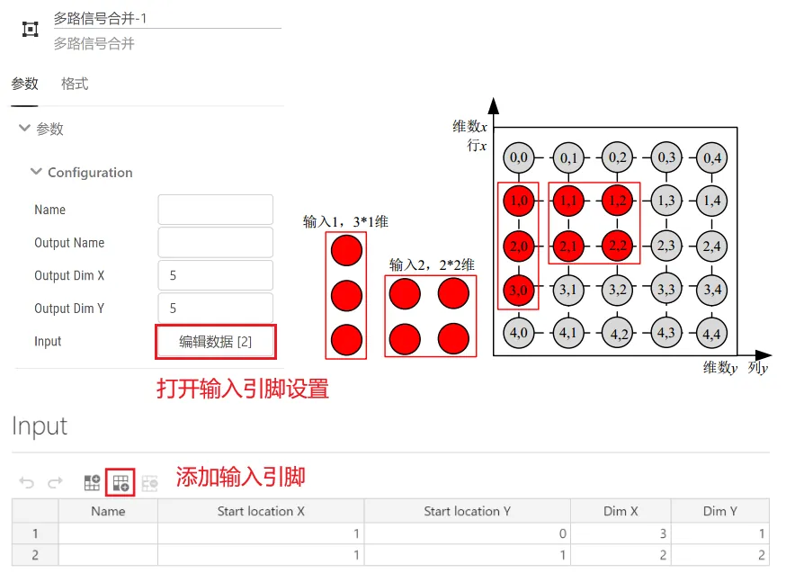

## 元件定义

该元件实现将多路输入信号进行合并输出，输出信号为多维信号。

## 元件说明

### 属性

CloudPSS 元件包含统一的**属性**选项，其配置方法详见 [参数卡](docs/documents/software/10-xstudio/20-simstudio/40-workbench/20-function-zone/30-design-tab/30-param-panel/index.md) 页面。

### 参数

import Parameters from './_parameters.md'

<Parameters/>

### 引脚

import Pins from './_pins.md'

<Pins/>

### 使用说明

**多路信号合并工作原理**

假设仿真过程中需要生成一个 M*N 维 (M 行 N 列）的信号，如图所示。可利用多路信号合并元件对多个信号进行合并。

假设仿真过程中产生了两个信号，一个为 3\*1 维信号，另一个维 2\*2 维信号，现需要将其合并为 5\*5 维的信号。此时先拖拽多路信号合并元件至工作空间，单击该元件进行参数设定，填写输出引脚的名称及维数。接着点击编辑数据，添加输入引脚，并填写输入引脚的名称、起始坐标以及维数。元件参数设置与输入引脚设置如下图所示。此时输出为 5*5 维信号，信号分布如下图所示，其中灰色信号为 0 信号。

**输入输出维数需要匹配，如在上例中理论构成的新多维信号不得小于参数设置的输出引脚维数。**

## 案例

## 常见问题
