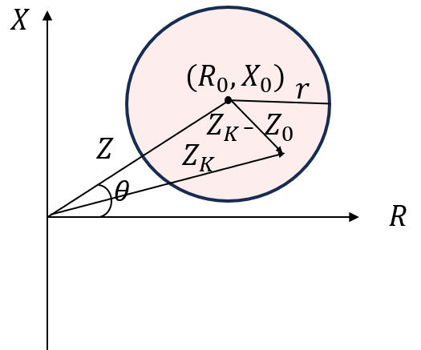

## 元件定义

## 元件说明

### 属性

CloudPSS 元件包含统一的**属性**选项，其配置方法详见 [参数卡](docs/documents/software/10-xstudio/20-simstudio/40-workbench/20-function-zone/30-design-tab/30-param-panel/index.md) 页面。

### 参数

import Parameters from './_parameters.md'

<Parameters/>

### 引脚

import Pins from './_pins.md'

<Pins/>

## 使用说明
圆形特性阻抗继电器原理如下图所示，其中红色区域为动作区。

圆形特性阻抗继电器的动作特性为任一圆形，首先确定阻抗的整定形式 `EnterType`：**XY坐标整定形式**或者**极坐标整定形式**，然后确定整定圆的**半径**，最后根据整定形式设置圆心的坐标位置。

:::info 动作信号

测量阻抗$ Z_{K} $ 位于动作区时，动作信号输出为1，否则为0。

:::

## 动作条件
$\lvert Z_{K} - Z_{0}\rvert  \leq r $

其中，$ Z_{K} $ = $R+jX$;$r$ 为整定圆半径。

## 常见问题

