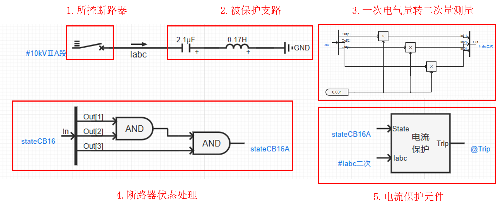
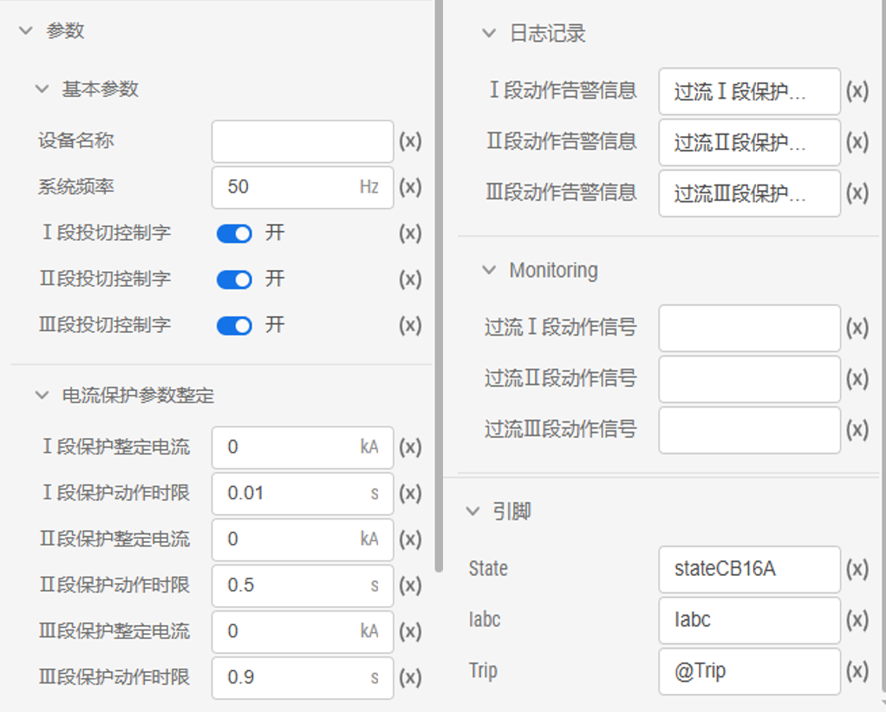

## 元件定义

## 元件说明

### 属性

CloudPSS 元件包含统一的**属性**选项，其配置方法详见 [参数卡](docs/documents/software/10-xstudio/20-simstudio/40-workbench/20-function-zone/30-design-tab/30-param-panel/index.md) 页面。

### 参数

import Parameters from './_parameters.md'

<Parameters/>

### 引脚

import Pins from './_pins.md'

<Pins/>

## 使用说明
三段式电流保护元件通过判断测量电流幅值是否超过各段整定值，结合动作时限，输出跳闸信号以及过流Ⅰ、Ⅱ、Ⅲ段动作信号，其使用方式可参考如下案例。

## 案例

以某一配网10kV出线**电流保护**为例。该案例中，三相断路器控制信号设置为 `@Trip`，**断路器状态**设置为 `stateCB16`，被保护支路为电容器支路。**首先**将电流表的**一次电气量** `Iabc` 根据**CT变比**转为**二次量测量** `Iabc二次`，作为电流保护元件的测量电流。**然后**，将三相断路器各分相状态**逻辑与**的运算结果作为电流保护元件的**断路器状态**输入量，意味着有任意一相断路器跳闸，电流保护元件将闭锁。

 

 :::info[断路器状态]

当断路器闭合时，状态为 1，断开时，状态为 0。

:::

电流保护元件参数设置如下图所示：

 

## 常见问题

