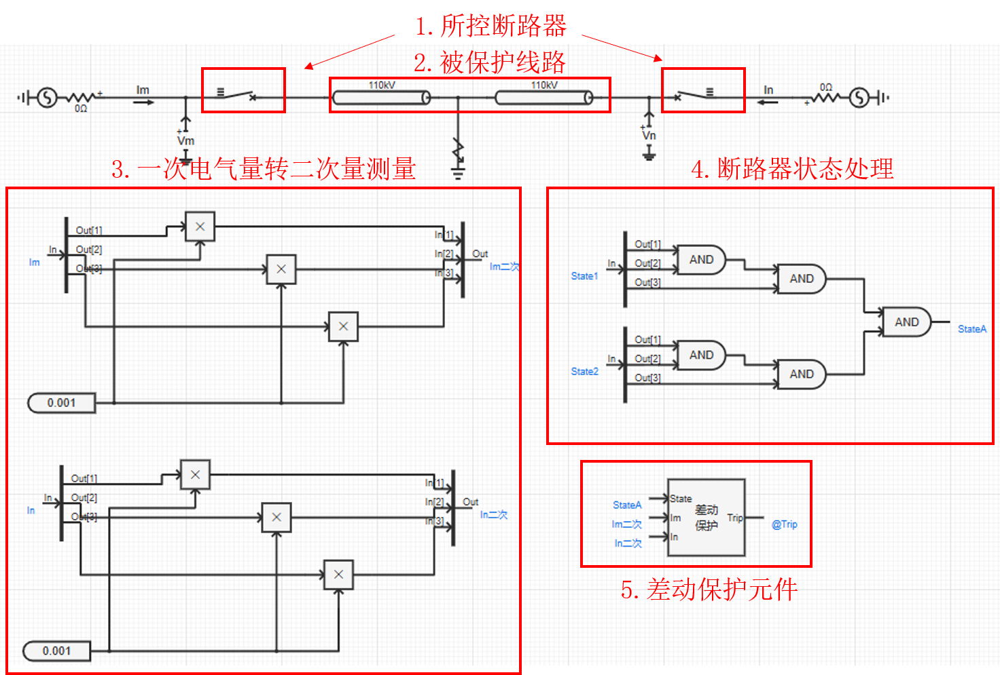
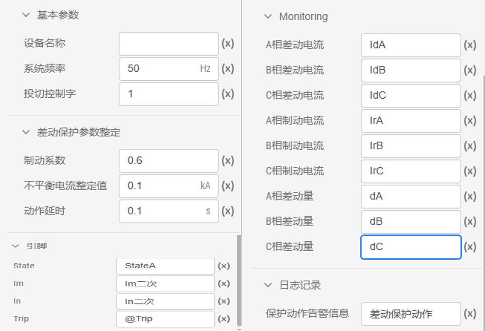

## 元件定义

## 元件说明

### 属性

CloudPSS 元件包含统一的**属性**选项，其配置方法详见 [参数卡](docs/documents/software/10-xstudio/20-simstudio/40-workbench/20-function-zone/30-design-tab/30-param-panel/index.md) 页面。

### 参数

import Parameters from './_parameters.md'

<Parameters/>

### 引脚

import Pins from './_pins.md'

<Pins/>

## 使用说明
差动保护元件通过判断差动量是否大于制动量，结合动作时限，输出跳闸信号以及差动保护动作信号，其使用方式可参考如下案例。

## 案例

以某一110kV双电源系统**差动保护**为例。该案例中，两个三相断路器控制信号均设置为 `@Trip`，**断路器状态**分别设置为 `State1`、`State2`，被保护线路为110kV线路。**首先**将双端电流表的**一次电气量** `Im`、`In` 根据**CT变比**转为**二次量测量** `Im二次`、`In二次`，作为差动保护元件的测量电流。**然后**将三相断路器各分相状态的**逻辑与**运算结果作为差动保护元件的**断路器状态**输入量，意味着两个断路器中有任意一相断路器跳闸，差动保护元件将闭锁。

 

 :::info[断路器状态]

当断路器闭合时，状态为 1，断开时，状态为 0。

:::

差动保护元件参数设置如下图所示：

 

## 常见问题