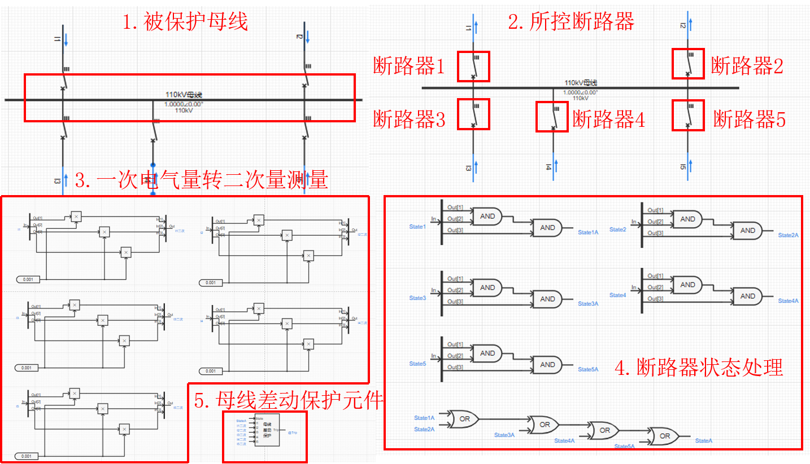
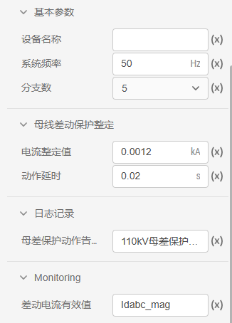

## 元件定义

## 元件说明

### 属性

CloudPSS 元件包含统一的**属性**选项，其配置方法详见 [参数卡](docs/documents/software/10-xstudio/20-simstudio/40-workbench/20-function-zone/30-design-tab/30-param-panel/index.md) 页面。

### 参数

import Parameters from './_parameters.md'

<Parameters/>

### 引脚

import Pins from './_pins.md'

<Pins/>

## 使用说明
母线差动保护元件通过判断流入母线的差动电流幅值大小，结合动作时限，输出跳闸信号以及母线差动保护动作信号，其使用方式可参考如下案例。

## 案例

以某一 110kV母线的**母线差动保护**为例。该案例中，共设置五个断路器，三相断路器控制信号均设置为 `@Trip`，**断路器状态**分别设置为 `State1`\~`State5`，被保护母线为 110kV 母线。**首先**将电流表的**一次电气量** `I1`\~`I5` 根据**CT变比**、转为**二次量测量** `I1二次`\~`I5二次`，作为母线差动保护元件的测量电流。**然后**，将各三相断路器的各分相状态**逻辑与**的运算结果再进行**或运算**，作为母线差动保护元件的**断路器状态**输入量，意味着只要母线连接处有断路器闭合，母线差动保护均投入运行。

 

 :::info[断路器状态]

当断路器闭合时，状态为 1，断开时，状态为 0。

:::

母线差动保护元件参数设置如下图所示：

 

## 常见问题

