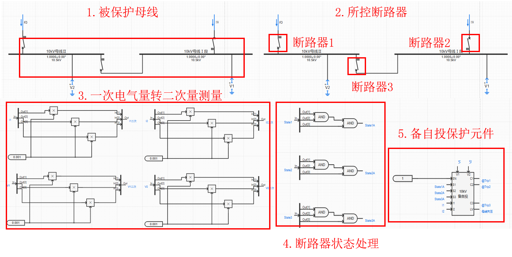
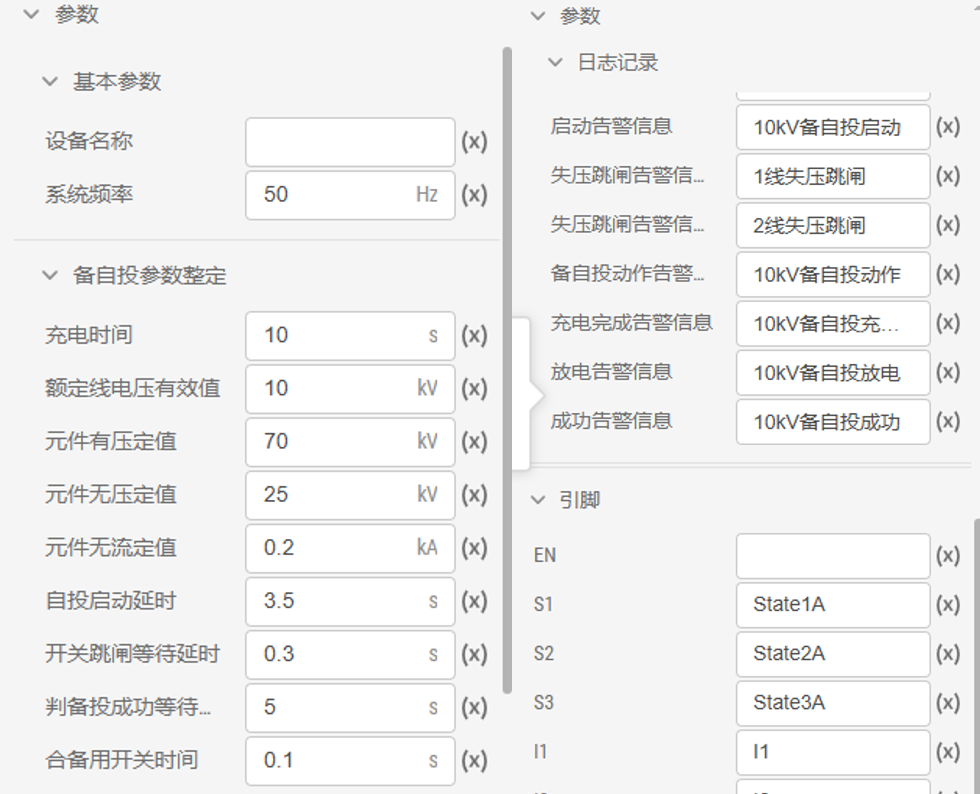

## 元件定义

## 元件说明

### 属性

CloudPSS 元件包含统一的**属性**选项，其配置方法详见 [参数卡](docs/documents/software/10-xstudio/20-simstudio/40-workbench/20-function-zone/30-design-tab/30-param-panel/index.md) 页面。

### 参数

import Parameters from './_parameters.md'

<Parameters/>

### 引脚

import Pins from './_pins.md'

<Pins/>

## 案例

以某一 10kV 双母线分段场景下的**备自投**为例。该案例中，共设置三个断路器，三相断路器控制信号分别设置为 `@Trip1`、`@Trip2`、`@Trip3`，**断路器状态**分别设置为 `State1`、`State2`、`State3`，电流表、电压表分别测量母线Ⅰ、Ⅱ的进线电流、母线电压。**首先**将电流表、电压表的**一次电气量** `I1`、`I2`、`V1`、`V2` 根据**CT\PT变比**、转为**二次量测量** `I1二次`、`I2二次`、`V1二次`、`V2二次`，作为**10kV备自投元件**的测量电流、电压。**然后**将各三相断路器的各分相状态**逻辑与**的运算结果，作为**10kV备自投元件**的**断路器状态**输入量、输出引脚`C1`、`C2`、`C3`分别设置为`@Trip1`、`@Trip2`、`@Trip3`，作为各断路器的控制信号。

 

 :::info[断路器状态]

当断路器闭合时，状态为 1，断开时，状态为 0。

:::

10kV备自投元件参数设置如下图所示：

 

## 常见问题

