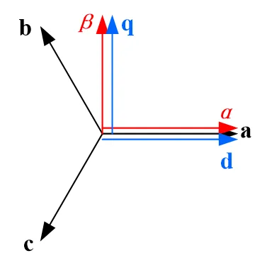

## 元件定义

该元件实现 dq 坐标轴到αβ坐标轴的相互转换功能。

## 元件说明

### 属性

CloudPSS 元件包含统一的**属性**选项，其配置方法详见 [参数卡](docs/documents/software/10-xstudio/20-simstudio/40-workbench/20-function-zone/30-design-tab/30-param-panel/index.md) 页面。

### 参数

import Parameters from './_parameters.md'

<Parameters/>

### 引脚

import Pins from './_pins.md'

<Pins/>

## 使用说明

当选择 **d 轴与 a 相对齐**时，其相对位置为图所示。计算公式为：
+ **αβ到 dq 变换**

$\begin{bmatrix}U_\mathrm{d}\\U_\mathrm{q}\end{bmatrix}=\begin{bmatrix}\mathrm{cos}\theta&\mathrm{sin}\theta\\-\mathrm{sin}\theta&\mathrm{cos}\theta\end{bmatrix}\begin{bmatrix}U_\alpha\\U_\beta\end{bmatrix}$

+ **dq 到αβ变换**

$\begin{bmatrix}U_\alpha\\U_\beta\end{bmatrix}=\begin{bmatrix}\mathrm{cos}\theta&-\mathrm{sin}\theta\\\mathrm{sin}\theta&\mathrm{cos}\theta\end{bmatrix}\begin{bmatrix}U_\mathrm{d}\\U_\mathrm{q}\end{bmatrix}$

当选择 **d 轴滞后 a 相 90度**时，其相对位置为图所示。计算公式为：
+ **αβ到 dq 变换**

$\begin{bmatrix}U_\mathrm{d}\\U_\mathrm{q}\end{bmatrix}=\begin{bmatrix}\mathrm{sin}\theta&-\mathrm{cos}\theta\\\mathrm{cos}\theta&\mathrm{sin}\theta\end{bmatrix}\begin{bmatrix}U_\alpha\\U_\beta\end{bmatrix}$

+ **dq 到αβ变换**

$\begin{bmatrix}U_\alpha\\U_\beta\end{bmatrix}=\begin{bmatrix}\mathrm{sin}\theta&\mathrm{cos}\theta\\-\mathrm{cos}\theta&\mathrm{sin}\theta\end{bmatrix}\begin{bmatrix}U_\mathrm{d}\\U_\mathrm{q}\end{bmatrix}$

## 案例

## 常见问题
