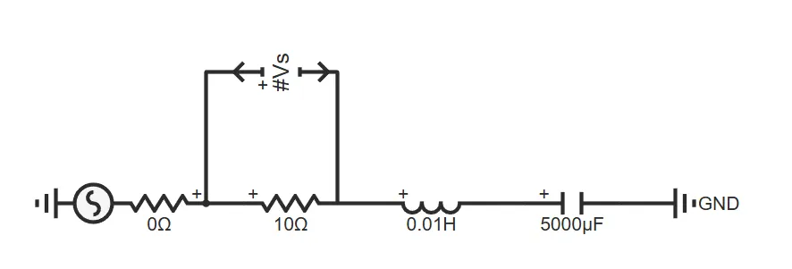
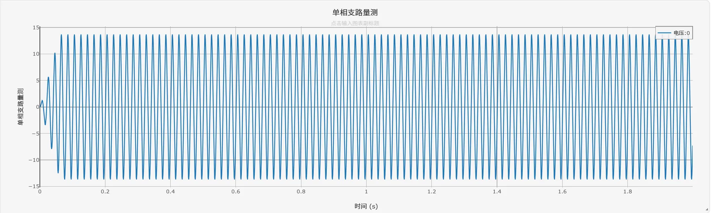

:::tip
本元件为理想采集元件，内阻无穷大，接入电路不会产生负载效应。
:::

## 元件定义
支路电压表是理想无源电压采集元件，内阻无穷大，接入电路后不消耗功率、不改变原有电路的运行状态。元件通过两个独立引脚连接待测电路端点，实时采集两点电位数据，适配单相、三相各类电路场景，是仿真中通用的电压监测元件。需要与输出通道配合使用。

## 元件说明

### 工作原理
支路电压表通过`Pin +`和`Pin -`两个引脚分别连接待测支路的高、低电位节点，采集两点的电位数据。由于元件内阻无穷大，接入后不会对原电路的电流分布产生任何影响，适配直流、交流信号采集，为后续仿真分析提供基础数据。

### 与接地电压表的核心区别
1.  测量范围：可采集任意两点间的电位数据，包括线电压、元件两端电压等，而接地电压表仅能采集节点对地电位。
2.  接线方式：需双引脚同时接入两个节点，而接地电压表仅需单引脚。

### 属性
CloudPSS 元件包含统一的**属性**选项，其配置方法详见 [参数卡](docs/documents/software/10-xstudio/20-simstudio/40-workbench/20-function-zone/30-design-tab/30-param-panel/index.md) 页面。
### 参数
import Parameters from './_parameters.md'

<Parameters/>

### 引脚
import Pins from './_pins.md'

<Pins/>

#### 使用说明
1.  标准接线：建议将 `Pin +` 连接待测支路的高电位节点，`Pin -` 连接低电位节点，符合行业通用接线规范。
2.  极性说明：若引脚接反，仅会翻转采集数据的正负符号，**不会影响输出通道、仿真运算及后续数据分析**，无需强制调换接线。
3.  适用场景：
  单相电路中采集支路电压、元件两端电压数据；
  三相电路中集线电压（如AB、BC、CA相间电压）数据；
  也可通过将`Pin -`接地，采集节点对地电位数据（等效接地电压表）。

### 案例
1.  单相串联RLC支路稳态电流仿真
    1.  从元件库拖入单相交流电压源、电阻、电感、电容、1个支路电压表，接地点。
    2.  设置元件参数，测量信号接入输出通道。
    3.  运行仿真，采集各相电流数据，用于后续三相不平衡度分析。
2. 下图为单相串联RLC支路仿真案例的电路拓扑：

运行仿真后，得到单相支路电压波形如下：

