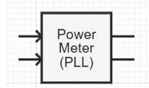
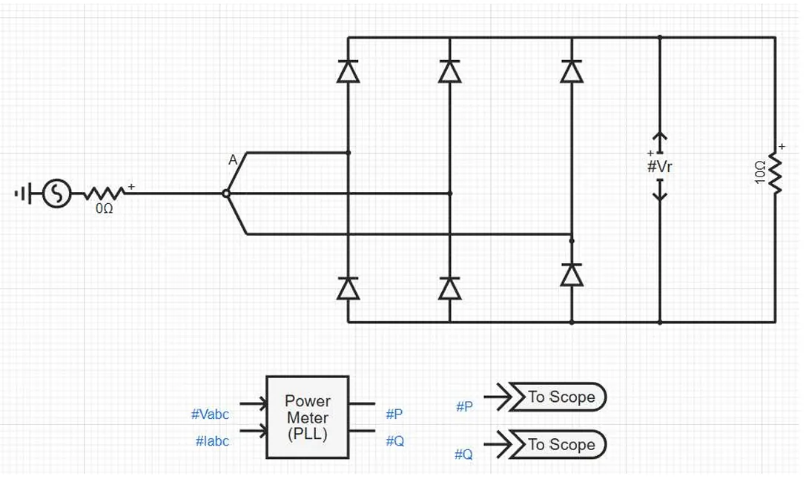
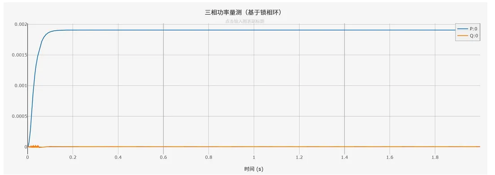

:::tip
本元件为纯信号处理元件，**不接入一次主电路**，仅对上游采集元件输出的三相电压、电流瞬时值信号做运算处理，不会影响原有电气回路与信号状态。
:::

## 元件定义

三相功率量测（基于锁相环）是理想无源信号运算元件，采用双锁相环同步与有效值检测相结合的方法，对输入的三相电压、电流瞬时值信号进行实时运算，输出基波有功功率和基波无功功率信号。元件仅提取基波功率分量，不受谐波干扰，测量精度高，广泛应用于电力仿真的功率监测、电能质量分析、闭环控制等场景。

## 元件说明

### 工作原理

元件通过信号引脚接收上游测量元件传输的三相电压瞬时值信号 $v_a(t), v_b(t), v_c(t)$ 和三相电流瞬时值信号 $i_a(t), i_b(t), i_c(t)$，基于双锁相环同步与有效值检测完成功率计算，主要包含以下四个环节：

#### 1. 双锁相环同步

元件内部集成两个独立的锁相环（PLL），分别对电压和电流信号进行同步，提取各自的基波相位：

- **电压锁相环**：跟踪三相电压信号，输出电压基波相角 $\theta_v(t)$
- **电流锁相环**：跟踪三相电流信号，输出电流基波相角 $\theta_i(t)$

两个锁相环独立工作，分别锁定电压和电流的基波相位，不受谐波、暂态扰动的影响，保证相位检测的准确性。

#### 2. 功率因数角计算

根据电压和电流的基波相角差，得到功率因数角：

$$
\varphi(t) = \theta_v(t) - \theta_i(t)
$$

其中 $\varphi(t)$ 为功率因数角，即电压相角超前电流相角的角度。

#### 3. 有效值检测

采用快速极值检测算法，分别计算三相电压和三相电流的有效值：

**有效值计算方法**：

每一时刻对三相瞬时值分别取最大值与最小值做差，得到近似幅值信号，再经过一阶惯性环节滤波后输出有效值：

$$
X_{raw}(t) = \max\left(x_a(t), x_b(t), x_c(t)\right) - \min\left(x_a(t), x_b(t), x_c(t)\right)
$$

一阶惯性滤波方程：

$$
\tau \frac{dX_{\text{RMS}}}{dt} + X_{\text{RMS}} = k \cdot X_{raw}(t)
$$

其中：
- $\tau$ 为滤波时间常数，控制滤波效果与响应速度
- $k$ 为比例换算系数，将 max-min 幅值换算为有效值

分别得到电压有效值 $V_{rms}$ 和电流有效值 $I_{rms}$。

#### 4. 功率计算

根据有效值和功率因数角，计算三相总有功功率和总无功功率：

$$
P = 3 \cdot V_{rms} \cdot I_{rms} \cdot \cos\varphi
$$

$$
Q = 3 \cdot V_{rms} \cdot I_{rms} \cdot \sin\varphi
$$

> **符号约定**：无功功率 $Q > 0$ 对应感性负载（电流滞后电压），$Q < 0$ 对应容性负载（电流超前电压）。

> **注意**：元件输出的功率信号为标幺值，基准为元件额定功率，不是有名值 MW/MVar。

### 与基于瞬时功率量测的核心区别

| 特性 | 三相功率量测（基于锁相环） | 三相功率量测（瞬时功率） |
|------|--------------------------|------------------------|
| 计算原理 | 双锁相环同步 + 有效值检测，仅计算基波功率 | 直接基于瞬时值计算总功率，包含所有分量 |
| 抗谐波能力 | 强，仅提取基波功率，不受谐波影响 | 弱，包含所有谐波分量的功率 |
| 适用场景 | 畸变电网、电能质量分析、高精度控制 | 理想电网、快速暂态功率监测 |
| 响应速度 | 稍慢，受锁相环同步时间影响 | 快，仅受平滑时间常数影响 |
| 测量精度 | 高，基波功率测量准确 | 低，谐波会影响测量结果 |

### 仿真适配说明

:::warning
与机电暂态仿真直接输出稳态功率值不同，**电磁暂态仿真输出的是高精度瞬时值信号**。三相功率量测（基于锁相环）元件需要锁相环同步和有效值滤波，因此输出结果存在固有延迟，**不会发生突变**。延迟时间主要由锁相环带宽和滤波时间常数决定。
:::

#### 使用说明

1.  **信号连接规则**

    本元件为信号链路元件，无需接入电气主回路。

    将上游三相电压采集元件输出的**三相瞬时电压量测信号**接入 `3 Phase Voltage [kV]` 引脚；

    将上游三相电流采集元件输出的**三相瞬时电流量测信号**接入 `3 Phase Current [kA]` 引脚；

    计算后的**有功功率信号**从 `Active Power [MW]` 引脚输出；

    计算后的**无功功率信号**从 `Reactive Power [MVar]` 引脚输出。

2.  **参数配置**

    - 基准频率：需与仿真系统的基波频率一致（通常为 50 Hz 或 60 Hz）；
    - 锁相环带宽：根据系统谐波含量和响应速度要求调整，带宽越大响应越快但抗扰性越差；
    - 滤波时间常数：根据有效值输出的平滑度要求调整，越大越平滑但响应越慢。

3.  **适用场景建议**

    - 含有谐波的畸变电网功率测量：优先选用本元件，可准确提取基波功率；
    - 电能质量分析、高精度闭环控制：优先选用本元件，测量精度高；
    - 理想电网、快速暂态功率分析：可选用瞬时功率量测元件，响应速度更快。
    - 
### 属性

CloudPSS 元件包含统一的**属性**选项，其配置方法详见 [参数卡](docs/documents/software/10-xstudio/20-simstudio/40-workbench/20-function-zone/30-design-tab/30-param-panel/index.md) 页面。

### 参数

import Parameters from './_parameters.md'

<Parameters/>

### 引脚

import Pins from './_pins.md'

<Pins/>

## 案例

下图展示了三相功率量测（基于锁相环）元件在含谐波的三相整流电路中的标准信号链路连接方式：

**示例说明**：

1.  一次侧搭建三相桥式整流电路，由三相交流电压源供电，线电压为 0.1 kV；
2.  整流输出端接 10 Ω 纯电阻负载，电流含有大量谐波；
3.  通过三相电压采集元件获取三相瞬时电压信号 `#Vabc`；
4.  通过三相电流采集元件获取三相瞬时电流信号 `#Iabc`；
5.  将三相电压、电流信号分别接入功率量测元件的对应输入引脚；
6.  元件输出有功功率 `#P`、无功功率 `#Q` 信号，接入输出通道进行波形观测与分析。

> 注意：功率量测元件仅与上游采集元件的信号输出端连接，**不直接接入一次电气主电路**。

### 仿真输出波形

下图为上述接线示例的仿真输出结果：

**波形说明**：

- 蓝色曲线：经过锁相环同步和滤波后的有功功率输出；
- 橙色曲线：经过锁相环同步和滤波后的无功功率输出；
- 稳态特性：仿真启动后，功率经过约 0.1~0.2 s 的锁相环同步过程后逐渐稳定；
- 抗谐波特性：尽管电流含有大量谐波，输出功率仅包含基波分量，波形平稳，体现了锁相环量测的抗谐波能力。

## 常见问题

**为什么功率输出信号存在明显波动？**

: 可通过增大「滤波时间常数」进行滤波，时间常数越大，输出结果越平滑稳定。若波动较大且伴随相位漂移，需检查锁相环带宽参数是否匹配系统频率。

**本元件和瞬时功率量测有什么区别？**

: 本元件基于锁相环，仅测量基波功率，抗谐波能力强，精度高但响应稍慢；瞬时功率量测直接计算总功率，包含所有谐波分量，响应快但受谐波影响大。根据仿真场景选择即可。

**本元件支持三相四线制电路吗？**

: 支持。对于三相四线制电路，直接输入三相相电压和三相相电流信号即可，锁相环会自动提取基波正序分量进行同步。

**锁相环带宽该怎么选？**

: - 谐波含量高、追求测量稳定性：建议设置较小带宽（如 5~10 Hz），抗扰性好；
: - 暂态变化快、追求响应速度：建议设置较大带宽（如 20~50 Hz），同步快但抗扰性稍差。