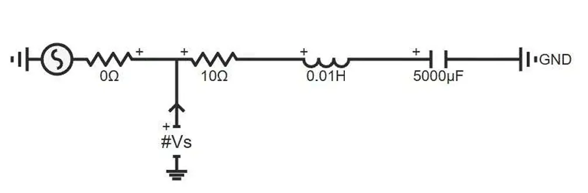
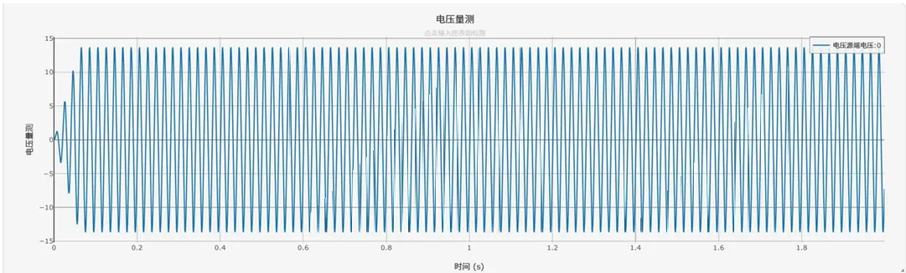

## 元件定义
电压表将单个外部引脚接入待测节点，采集节点对地电位数据，适配单相、三相各类电路场景。需要与输出通道配合使用。

## 元件说明

### 工作原理
电压表以系统参考地为基准，通过单引脚接入待测节点，采集该节点的对地电位数据，接入后不会对原电路的电位分布产生任何影响，适配直流、交流信号采集，为后续仿真分析提供基础数据。

### 属性
**CloudPSS** 元件包含统一的**属性**选项，其配置方法详见 [参数卡](/docs/documents/software/10-xstudio/20-simstudio/40-workbench/20-function-zone/30-design-tab/30-param-panel/index.md) 页面。

### 参数
import Parameters from './_parameters.md'

<Parameters/>

### 引脚
import Pins from './_pins.md'

<Pins/>

#### 使用说明
适用场景：主要用于采集单相、三相电路的对地相电压数据，不适合直接测量两个非接地节点之间的电位差（需使用支路电压表）。

### 案例
 单相串联RLC支路仿真

下图为单相串联RLC支路仿真案例的电路拓扑：

运行仿真后，得到单相支路电压波形如下：

