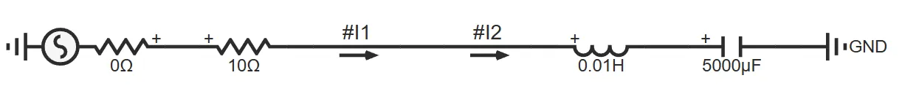
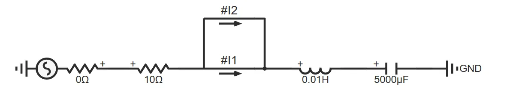
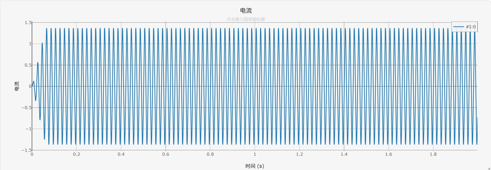

## 元件定义
元件通过两个独立引脚串联接入待测支路，实时采集电流数据，适配单相、三相各类电路场景，是仿真中通用的电流监测元件，需要与输出通道配合使用。

## 元件说明

### 工作原理
电流表串联在待测支路中，元件实时采集支路电流数据，为后续仿真分析提供基础数据。

### 属性
**CloudPSS** 元件包含统一的**属性**选项，其配置方法详见 [参数卡](/docs/documents/software/10-xstudio/20-simstudio/40-workbench/20-function-zone/30-design-tab/30-param-panel/index.md) 页面。

### 参数
import Parameters from './_parameters.md'

<Parameters/>

### 引脚
import Pins from './_pins.md'

<Pins/>

#### 使用说明

:::warning
当仿真模型中需要设置多处电流测量点时，为避免大量电流表改变电路矩阵结构性质，且如果旁边有电容电感等元件，可以直接量测其电流，避免新增电
流表元件，提升计算效率。同时，应避免采用下图所示的电流表**错误**连接方式。
:::

## 案例
 单相串联RLC支路仿真

下图为单相串联RLC支路仿真案例的电路拓扑：

运行仿真后，得到单相支路电流波形如下所示：

