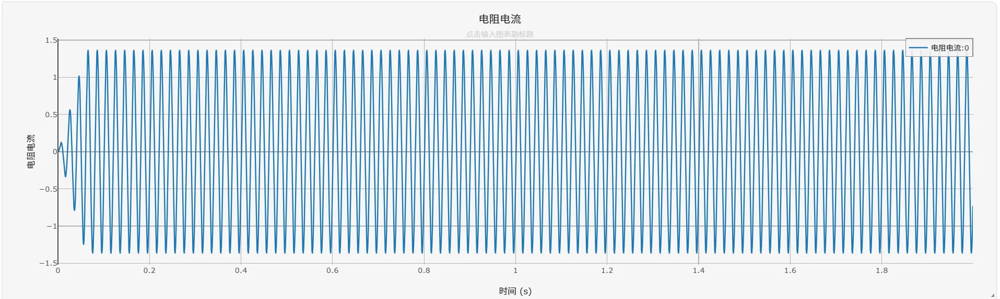

:::tip
本元件为理想串联型采集元件，内阻为 0，接入电路不会产生额外压降，不影响原电路的电流分布。
:::

## 元件定义
电流表是理想无源电流采集元件，内阻为 0，串联接入电路后不消耗功率、不改变原有电路的电流分布。元件通过两个独立引脚串联接入待测支路，实时采集电流数据，适配单相、三相各类电路场景，是仿真中通用的电流监测元件。需要与输出通道配合使用。

## 元件说明

### 工作原理
电流表串联在待测支路中，电流从`Pin +`流入、`Pin -`流出。由于元件内阻为 0，接入后不会产生压降，对原电路无任何影响。元件实时采集支路电流数据，适配直流、交流信号，为后续仿真分析提供基础数据。

### 属性
CloudPSS 元件包含统一的**属性**选项，其配置方法详见 [参数卡](docs/documents/software/10-xstudio/20-simstudio/40-workbench/20-function-zone/30-design-tab/30-param-panel/index.md) 页面。

### 参数
import Parameters from './_parameters.md'

<Parameters/>

### 引脚
import Pins from './_pins.md'

<Pins/>

#### 使用说明
1.  标准接线：元件必须**串联接入待测支路**，建议按照电流流向，让电流从 `Pin +` 流入、`Pin -` 流出，遵循行业通用规范。
2.  极性说明：若电流流向与引脚标注相反，仅会翻转采集数据的正负符号，**不会影响输出通道、仿真运算及后续数据分析**，无需强制调换接线。
3.  适用场景：
  单相电路中采集支路电流、负载电流数据；
  三相电路中采集相电流（各相支路）、线电流（相线支路）数据，中性线电流需单独串联采集。
4. 量测维数可以进行**单/三相切换**。

## 案例
1.  单相串联RLC支路稳态电流仿真
    1.  从元件库拖入单相交流电压源、电阻、电感、电容、1个电流表，接地点。
    2.  设置元件参数，测量信号接入输出通道。
2. 下图为单相串联RLC支路仿真案例的电路拓扑：

运行仿真后，得到单相支路电流波形如下：

