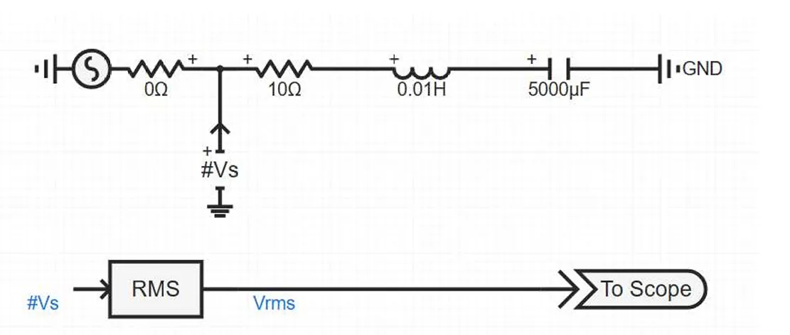
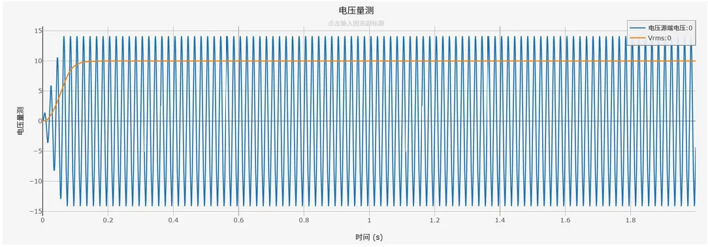

## 元件定义

RMS量测接收电压、电流类瞬时值采集信号，通过算法完成计算并输出稳定的有效值信号。元件支持单相、三相信号输入，可灵活配置量测类型、平滑时间常数，可应用于电力仿真的闭环控制、稳态监测等场景。

## 元件说明

### 工作原理

元件通过信号引脚接收上游量测元件传输的瞬时信号，并根据量测类型选择 Analog 或 Digital 算法输出有效值。

#### 1. Analog 模式

Analog 模式采用快速近似检测算法，并通过一阶惯性环节对输出进行平滑。

对于**三相信号**，元件先计算三相瞬时值的最大值与最小值之差：

$$ 
X_{raw}(t)=\max(x_a(t),x_b(t),x_c(t))-\min(x_a(t),x_b(t),x_c(t))
 $$

再将其换算为三相线电压有效值近似量：

$$ 
X_{\mathrm{eq}}(t)=\frac{\pi}{3\sqrt{2}}X_{raw}(t) 
$$

最后经过一阶惯性环节输出：

$$ 
\tau\frac{dX_{\mathrm{RMS}}}{dt}+X_{\mathrm{RMS}}=X_{\mathrm{eq}}(t) 
$$

其中，$\tau$ 为平滑时间常数。

对于**单相信号**，若采用整流平均值近似算法，可先取瞬时值绝对值：

$$ 
X_{raw}(t)=|x(t)| 
$$

再换算为有效值近似量：

$$ 
X_{\mathrm{eq}}(t)=\frac{\pi}{2\sqrt{2}}X_{raw}(t) 
$$

最后经过一阶惯性环节输出：

$$ 
\tau\frac{dX_{\mathrm{RMS}}}{dt}+X_{\mathrm{RMS}}=X_{\mathrm{eq}}(t) 
$$

#### 2. Digital 模式

Digital 模式采用离散采样窗口计算有效值。对于**单相信号**，计算公式为：

$$ 
X_{\mathrm{RMS}}(k)=\sqrt{\frac{1}{N}\sum_{i=0}^{N-1}x^2(k-i)} 
$$

其中，$N$ 为每周期采样点数。

对于**三相信号**，先计算三相线电压：

$$ 
V_{AB}=V_A-V_B 
$$

$$ 
V_{BC}=V_B-V_C 
$$

$$ 
V_{CA}=V_C-V_A 
$$

再构造三相等效输入量：

$$ 
X_{\mathrm{in}}(k)=\frac{1}{3}\left[V_{AB}^2(k)+V_{BC}^2(k)+V_{CA}^2(k)\right] 
$$

最后在采样窗口内计算有效值：

$$ 
X_{\mathrm{RMS}}(k)=\sqrt{\frac{1}{N}\sum_{i=0}^{N-1}X_{\mathrm{in}}(k-i)} 
$$

### 仿真适配说明

:::warning
与机电暂态仿真不同的是，电磁暂态仿真得到的是瞬时值信号，RMS需要一段采样窗口才可量测。因此会有一段平滑时间常数，**不会发生突变**。

- Analog模式：响应速度快；
- Digital模式：计算精度高。
:::

### 属性

**CloudPSS** 元件包含统一的**属性**选项，其配置方法详见 [参数卡](/docs/documents/software/10-xstudio/20-simstudio/40-workbench/20-function-zone/30-design-tab/30-param-panel/index.md) 页面。

### 参数

import Parameters from './_parameters.md'

<Parameters/>

### 引脚

import Pins from './_pins.md'

<Pins/>

#### 使用说明

1.  **参数配置**
   
    平滑时间常数仅在Analog模式下生效；基波频率、每周期采样点数仅在Digital模式下生效，需根据仿真信号参数匹配设置。

## 案例

下图展示了RMS量测元件在电磁暂态仿真中的标准连接方式：

### 仿真输出波形

下图为上述接线示例的仿真输出结果（Analog模式，滤波时间常数 0.02 s）：

**波形说明**：

- 蓝色曲线：电压源端输出的瞬时值电压（幅值 14.14 V，对应有效值 10 V）；

- 橙色曲线：RMS量测元件输出的有效值信号；

- 特性展示：仿真启动后，RMS输出不会瞬间跳变至10 V，而是经过约0.1 s的平滑上升过程后稳定在额定值，体现了电磁暂态仿真中RMS量测的固有延迟特性。

## 常见问题

**RMS输出信号存在明显波动如何处理？**

 - Analog模式：适当增大滤波时间常数，强化滤波效果，让输出信号更平稳。

 - Digital模式：检查基波频率、每周期采样点数是否与实际信号匹配，采样参数不匹配会造成运算结果波动。

**本元件可以直接并联/串联在电气回路中吗？**

: 不可以。本元件为信号运算元件，仅用于信号链路连接，接入电气主电路会造成回路异常，影响仿真正常运行。

