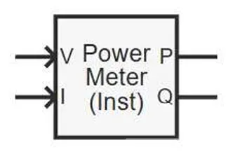
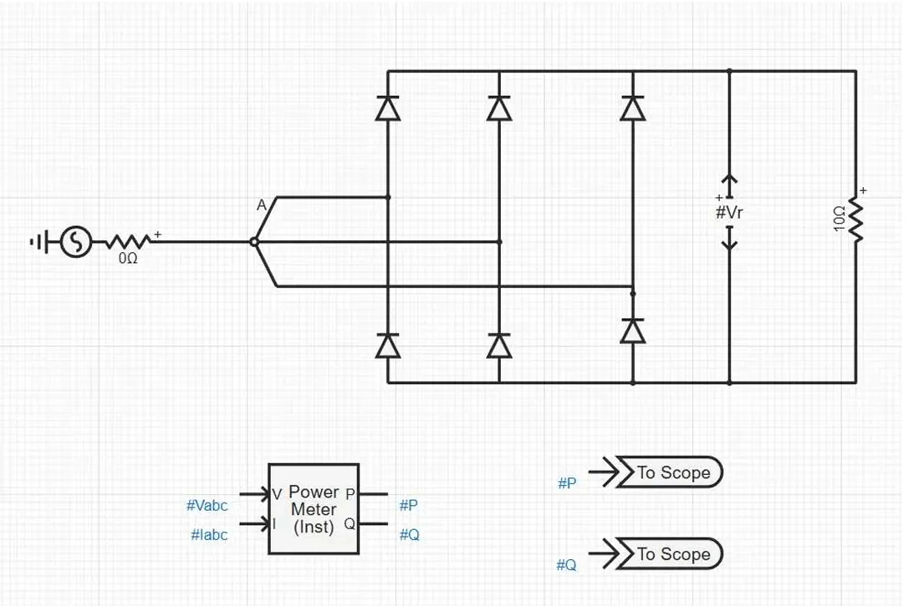
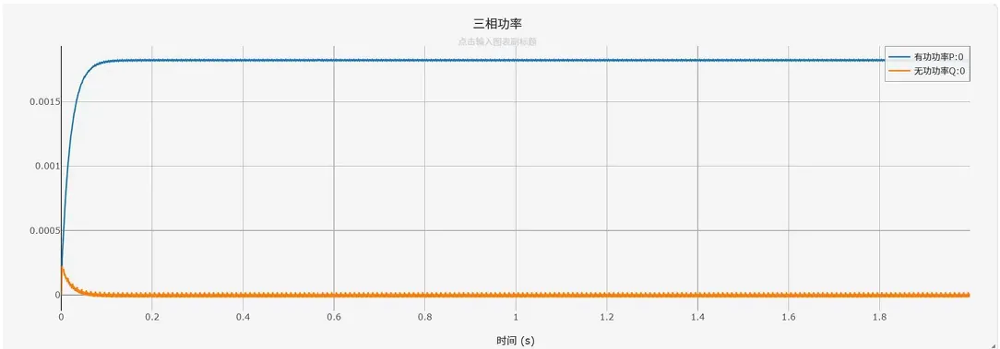

:::tip
本元件为纯信号处理元件，**不接入一次主电路**，仅对上游采集元件输出的三相电压，电流瞬时值信号做运算处理，不会影响原有电气回路与信号状态。
:::

## 元件定义
三相功率量测（瞬时功率）是理想无源信号运算元件，基于瞬时功率理论，对输入的三相电压，电流瞬时值信号进行实时运算，输出平滑后的有功功率，无功功率信号。元件支持三相三线制，三相四线制电路，可配置基准频率与平滑时间常数，广泛应用于电力仿真的功率平衡分析，发电机控制，负荷监测等场景。

## 元件说明

### 工作原理

元件基于**瞬时无功功率理论（p-q理论）**，通过信号引脚接收上游测量元件传输的三相电压瞬时值信号 $v_a(t), v_b(t), v_c(t)$ 和三相电流瞬时值信号 $i_a(t), i_b(t), i_c(t)$，经 Clarke 变换到 α-β 静止坐标系后完成实时功率计算。

#### 1. 坐标变换（Clarke 变换）

首先将三相静止 abc 坐标系下的电压、电流变换到两相静止 α-β 坐标系：

$$
\begin{bmatrix} v_\alpha \\ v_\beta \\ v_0 \end{bmatrix} = \frac{2}{3} \begin{bmatrix}
1 & -\dfrac{1}{2} & -\dfrac{1}{2} \\[6pt]
0 & \dfrac{\sqrt{3}}{2} & -\dfrac{\sqrt{3}}{2} \\[6pt]
\dfrac{1}{2} & \dfrac{1}{2} & \dfrac{1}{2}
\end{bmatrix} \begin{bmatrix} v_a \\ v_b \\ v_c \end{bmatrix}
$$

$$
\begin{bmatrix} i_\alpha \\ i_\beta \\ i_0 \end{bmatrix} = \frac{2}{3} \begin{bmatrix}
1 & -\dfrac{1}{2} & -\dfrac{1}{2} \\[6pt]
0 & \dfrac{\sqrt{3}}{2} & -\dfrac{\sqrt{3}}{2} \\[6pt]
\dfrac{1}{2} & \dfrac{1}{2} & \dfrac{1}{2}
\end{bmatrix} \begin{bmatrix} i_a \\ i_b \\ i_c \end{bmatrix}
$$

其中 $v_0$、$i_0$ 为零序分量，三相三线制系统中零序分量为零，四线制系统中需单独考虑。

#### 2. 瞬时功率计算

在 α-β 坐标系下定义瞬时有功功率 $p$ 和瞬时无功功率 $q$：

$$
p = v_\alpha i_\alpha + v_\beta i_\beta + 2 v_0 i_0
$$

$$
q = v_\beta i_\alpha - v_\alpha i_\beta
$$

转换到 abc 坐标系下，计算式为：

**瞬时有功功率**：

$$
p(t) = v_a(t)i_a(t) + v_b(t)i_b(t) + v_c(t)i_c(t)
$$

**瞬时无功功率**：

$$
q(t) = \frac{1}{\sqrt{3}} \left[ (v_a-v_b)i_c + (v_b-v_c)i_a + (v_c-v_a)i_b \right]
$$

> **符号约定**：无功功率 $q > 0$ 对应感性负载（电流滞后电压），$q < 0$ 对应容性负载（电流超前电压）。

#### 3. 物理意义说明

- **瞬时有功功率 $p(t)$**：三相电路瞬时传输的总有功功率，等于各相瞬时功率之和，包含直流分量和二倍基波频率的脉动分量；
- **瞬时无功功率 $q(t)$**：表征三相间能量振荡的速率，不参与对外做功，同样包含直流分量和二倍频脉动分量；
- **直流分量**：对应稳态下的平均有功功率和平均无功功率，与传统正弦电路的功率定义一致；
- **二倍频脉动分量**：由三相瞬时功率相位差引起，是瞬时功率的固有特性。

#### 4. 平滑滤波处理

由于瞬时功率包含两倍基波频率的脉动分量，元件通过一阶低通滤波器提取直流分量（平均功率），滤除二倍频脉动：

$$
P(t) = \frac{1}{\tau} \int_{t-\tau}^{t} p(\tau') d\tau'
$$

$$
Q(t) = \frac{1}{\tau} \int_{t-\tau}^{t} q(\tau') d\tau'
$$

其中 $\tau$ 为**平滑时间常数**（参数表中 `Smoothing Time Constant`），控制滤波效果与响应速度：$\tau$ 越大，输出越平滑，响应越慢；$\tau$ 越小，响应越快，波动越明显。

###  与基于锁相环量测的核心区别
| 特性 | 三相功率量测（瞬时功率） | 三相功率量测（基于锁相环） |
|------|----------------------------|--------------------------|
| 计算原理 | 直接基于瞬时值计算总功率 | 先锁相同步，再dq变换计算基波功率 |
| 抗谐波能力 | 弱，包含所有谐波分量的功率 | 强，仅计算基波功率，不受谐波影响 |
| 适用场景 | 理想电网，快速暂态功率监 | 畸变电网，电能质量分析，高精度控制测 |
| 响应速度 | 快，仅受平滑时间常数影响 | 稍慢，受锁相环同步时间影响 |
### 仿真适配说明
:::warning
与机电暂态仿真直接输出稳态功率值不同，**电磁暂态仿真输出的是高精度瞬时值信号**。三相功率量测元件需要依赖一段滑动采样窗口进行平滑滤波，因此输出结果存在与窗口大小对应的延迟，**不会发生突变**，延迟时间约等于平滑时间常数 $\tau$。
:::

### 属性
**CloudPSS** 元件包含统一的**属性**选项，其配置方法详见 [参数卡](/docs/documents/software/20-emtlab/110-component-library/10-basic/30-measurement/10-basic/50-_newPowerMeter_3p/_parameters.md) 页面。

### 参数
import Parameters from './_parameters.md'

<Parameters/>

### 引脚
import Pins from './_pins.md'

<Pins/>

#### 使用说明
1.  **信号连接规则**
    
    本元件为信号链路元件，无需接入电气主回路，
    将上游三相电压采集元件输出的**三相瞬时电压量测信号**接入 `3 Phase Voltage [kV]` 引脚；

    将上游三相电流采集元件输出的**三相瞬时电流量测信号**接入 `3 Phase Current [kA]` 引脚；

    计算后的**有功功率信号**从 `Active Power [MW]` 引脚输出；
  
    计算后的**无功功率信号**从 `Reactive Power [MVar]` 引脚输出。

1.  **参数配置**
   
    基准频率：需与仿真系统的基波频率一致（通常为 50 Hz 或 60 Hz）；平滑时间常数：根据仿真需求调整，稳态监测可适当增大，暂态分析可适当减小。

## 案例
下图展示了三相功率量测元件在三相整流电路中的标准信号链路连接方式：

**示例说明**：
1.  一次侧搭建三相桥式整流电路，由三相交流电压源供电，线电压为 0.1 kV；
2.  整流输出端接 10 Ω 纯电阻负载；
3.  通过三相电压采集元件获取三相瞬时电压信号 `#Vabc`；
4.  通过三相电流采集元件获取三相瞬时电流信号 `#Iabc`；
5.  将三相电压，电流信号分别接入功率量测元件的对应输入引脚；
6.  元件输出有功功率 `#P`，无功功率 `#Q` 信号，接入输出通道进行波形观测与分析。

> 注意：功率量测元件仅与上游采集元件的信号输出端连接，**不直接接入一次电气主电路**。

### 仿真输出波形
下图为上述接线示例的仿真输出结果（平滑时间常数 0.02 s）：

**波形说明**：
- 蓝色曲线：经过平滑滤波后的有功功率输出；
- 橙色曲线：经过平滑滤波后的无功功率输出；
- 稳态特性：仿真启动后，有功功率经过约 0.1 s 的平滑上升过程后稳定。
- 特性展示：直观体现了电磁暂态仿真中功率量测的固有延迟特性，输出不会瞬间跳变至稳态值。
## 常见问题

**为什么功率输出信号存在明显波动？**
: 这是正常现象，瞬时功率本身包含两倍基波频率的脉动分量。可通过增大「平滑时间常数」进行滤波，时间常数越大，输出结果越平滑稳定。

**本元件支持三相四线制电路吗？**
: 支持。对于三相四线制电路，直接输入三相相电压和三相相电流信号即可，元件会自动计算三相总功率。

**平滑时间常数该怎么选？**
: - 稳态功率监测：建议设置为 0.05~0.2 s，以获得更平滑的输出；
: - 暂态功率分析：建议设置为 0.01~0.05 s，兼顾响应速度与稳定性。