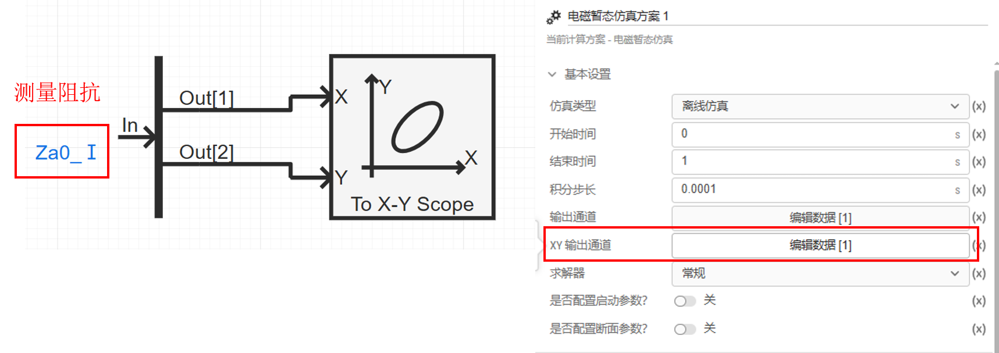

## 元件定义

## 元件说明

### 属性

CloudPSS 元件包含统一的**属性**选项，其配置方法详见 [参数卡](docs/documents/software/10-xstudio/20-simstudio/40-workbench/20-function-zone/30-design-tab/30-param-panel/index.md) 页面。

### 参数

import Parameters from './_parameters.md'

<Parameters/>

### 引脚

import Pins from './_pins.md'

<Pins/>

### 使用说明
**X-Y输出通道**的X轴、Y轴数据可由用户自定义，通常用于显示XY图，而[常规输出通道](../10-_newChannel/index.md)X轴默认只支持时间。

## 案例
例如绘制距离保护元件的测量阻抗轨迹。用户首先利用[多路信号分离元件](docs/documents/software/20-emtlab/110-component-library/10-basic/20-control/10-control-basic/10-_ChannelDeMerge/index.md)将测量阻抗信号 `Za0_Ⅰ`分解为二维信号，再将每一维度信号输入到X-Y输出通道中并设置好通道名称为Za0_Ⅰ，最后在**计算方案**中选择**XY输出通道进行配置**。

### 配置X-Y输出通道
XY输出通道配置与[常规输出通道](../10-_newChannel/index.md)一致，区别在于多了[辅助图形](docs/documents/software/20-emtlab/110-component-library/10-basic/40-output/20-scope-shapes/index.md)的选择以及可视化范围的设置，方便用户自定义显示范围。

XY输出通道的相关设置参数说明如下表。

| 名称 | 说明 |
| :--- | :--- | 
| 示波器分组名称 | 代表了示波器窗口的名称；在结果页面，该名称在示波器窗口的图表标题进行显示 |
| 采样频率 [Hz] | 示波器的采样频率，采样频率越高，单位时间的采样点越多；采样频率最大不超过 1 / 仿真积分步长 |
| 示波器输出通道 | 示波器输出通道选择，可选择用户在仿真中添加的X-Y输出通道 |
| 辅助图形 | 在示波器X-Y输出通道中，可选择[辅助图形](docs/documents/software/20-emtlab/110-component-library/10-basic/40-output/20-scope-shapes/index.md)进行显示。 |
| X Min(绘图范围) | 示波器窗口的X轴显示最小范围 |
| X Max(绘图范围) | 示波器窗口的X轴显示最大范围 |
| Y Min(绘图范围) | 示波器窗口的Y轴显示最小范围 |
| X Max(绘图范围) | 示波器窗口的Y轴显示最大范围 |

:::warning
XY输出通道的信号只能在计算方案中的XY输出通道中配置，不可与常规输出通道混淆。
:::

## 常见问题

