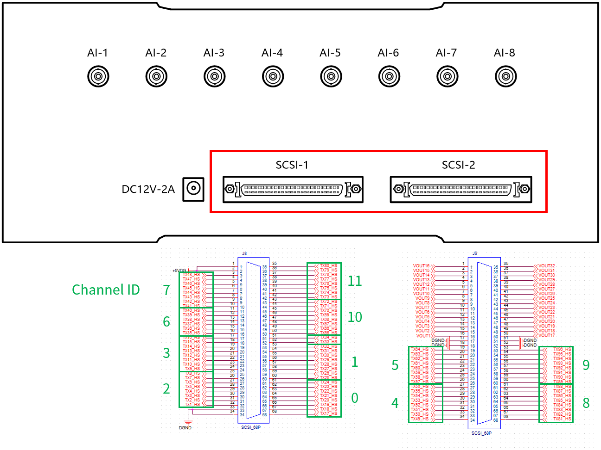

## 元件定义

该元件为数字量输出，可将仿真模型中的数据从 [CloudPSS I/O Signal Hub](../../../../../hardware/10-desktop-type/20-cloudpss-io-signal-hub/index.md) 数字量输出接口送出。

## 元件说明

数字量输出元件参数标签页包括**属性**、**参数**、**引脚**三类参数，下面对每类参数进行详细说明。

### 属性

CloudPSS 提供了一套统一的元件属性功能，关于元件属性参数的配置，详见 [参数卡](docs/documents/software/10-xstudio/20-simstudio/40-workbench/20-function-zone/30-design-tab/30-param-panel/index.md) 页面。

### 参数

import Parameters from './_parameters.md'

<Parameters/>

### 引脚

import Pins from './_pins.md'

<Pins/>

### 使用方法

使用时，该元件的引脚可以连接到其他元件的控制输出引脚或虚拟输出引脚。

设置 Signal Hub 的数字量通道方向为**输出**，参数中的组别与通道序号对应 Signal Hub 的数字量接口，最多 96 路。与硬件接口的对应关系如下图所示。

  

## 案例

## 常见问题

