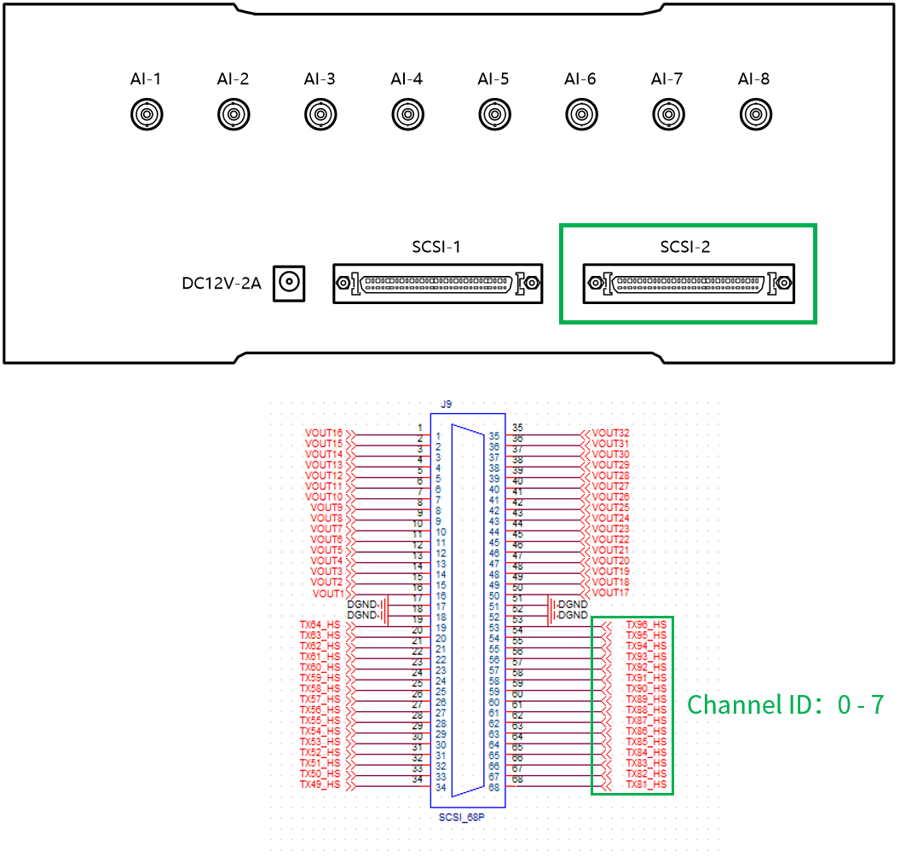

## 元件定义

该元件为调制波输出，可将仿真模型中的调制波调制为 PWM 信号后，从 [CloudPSS I/O Signal Hub](../../../../../hardware/10-desktop-type/20-cloudpss-io-signal-hub/index.md) 的 PWM 输出接口送出。

## 元件说明

### 属性

CloudPSS 元件包含统一的**属性**选项，其配置方法详见 [参数卡](docs/documents/software/10-xstudio/20-simstudio/40-workbench/20-function-zone/30-design-tab/30-param-panel/index.md) 页面。

### 参数

import Parameters from './_parameters.md'

<Parameters/>

### 引脚

import Pins from './_pins.md'

<Pins/>

### 使用方法

使用时，该元件的引脚可以连接到其他元件的控制输出引脚或虚拟输出引脚。

设置 Signal Hub 的数字量通道 Ch 81-88、Ch 89-96 方向为**输出**，并启用 **PWM Out**，参数中的通道序号对应 Signal Hub 的 PWM 输出接口，最多 8 对高、低电平信号，共 16 路。与硬件接口的对应关系如下图所示。

  

## 案例

## 常见问题

