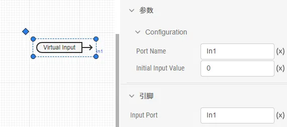
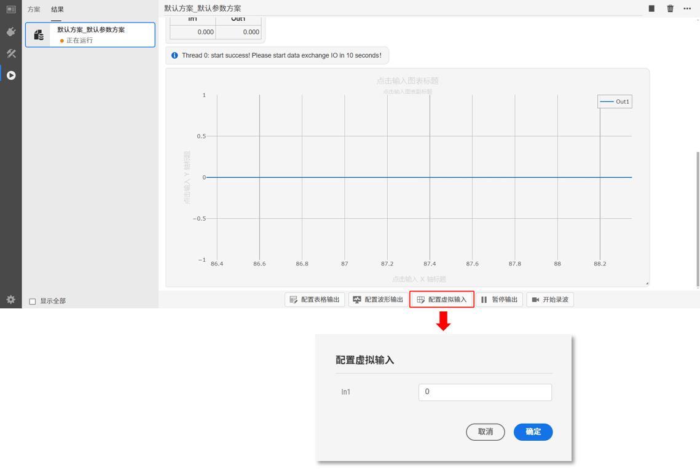

## 元件定义

该元件为虚拟输入端口，用于在实时仿真中在线修改参数或下发指令，元件将与实时仿真时的**虚拟输入配置**关联。

## 元件说明

虚拟输入端口元件参数标签页包括**属性**、**参数**、**引脚**三类参数，下面对每类参数进行详细说明。

### 属性

CloudPSS 提供了一套统一的元件属性功能，关于元件属性参数的配置，详见 [参数卡](docs/documents/software/10-xstudio/20-simstudio/40-workbench/20-function-zone/30-design-tab/30-param-panel/index.md) 页面。

### 参数

import Parameters from './_parameters.md'

<Parameters/>

### 引脚

import Pins from './_pins.md'

<Pins/>

### 使用方法

使用时，该元件的引脚可以连接到其他元件的控制输入引脚或虚拟输入引脚。填写虚拟输入端口名称，并设置初始值，如下图所示。

  

在实时仿真过程中，可以配置虚拟输入端口的值，实现在线数据下发。

  

## 案例

## 常见问题

