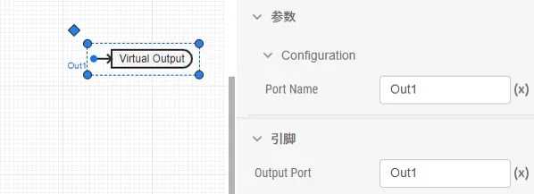
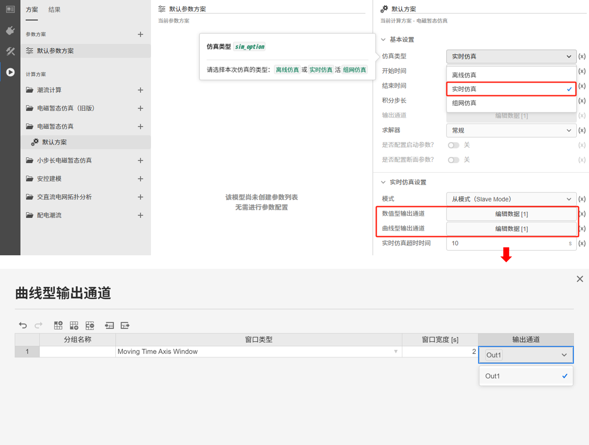
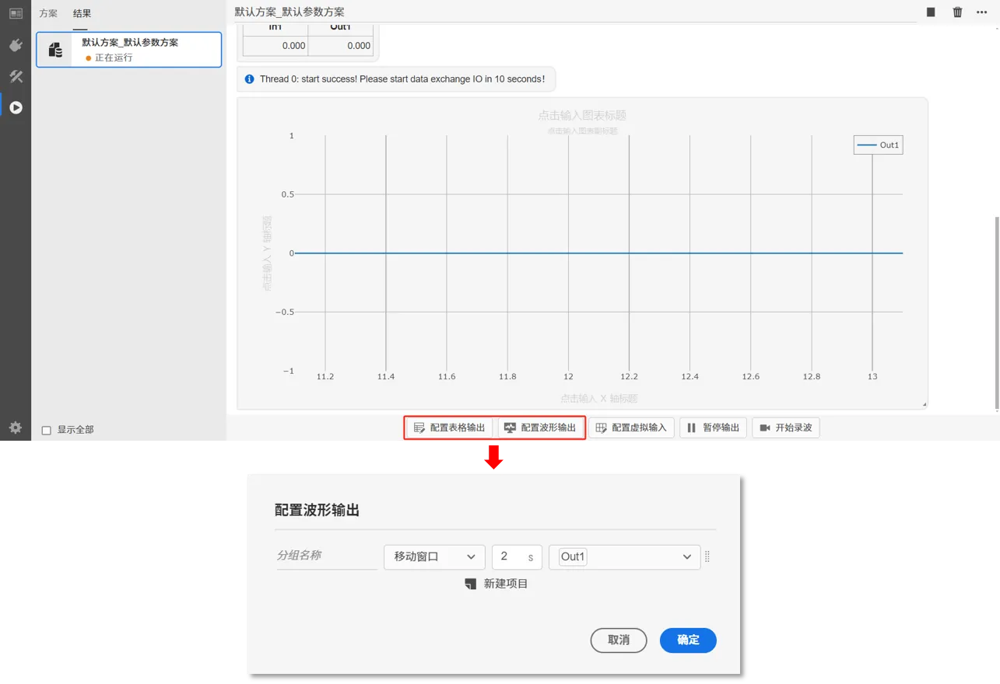

## 元件定义

该元件为虚拟输出端口，用于在实时仿真中观测数据和录波，元件将与实时仿真时的**实时输出配置**关联。

## 元件说明

虚拟输出端口元件参数标签页包括**属性**、**参数**、**引脚**三类参数，下面对每类参数进行详细说明。

### 属性

CloudPSS 提供了一套统一的元件属性功能，关于元件属性参数的配置，详见 [参数卡](docs/documents/software/10-xstudio/20-simstudio/40-workbench/20-function-zone/30-design-tab/30-param-panel/index.md) 页面。

### 参数

import Parameters from './_parameters.md'

<Parameters/>

### 引脚

import Pins from './_pins.md'

<Pins/>

### 使用方法

使用时，该元件的引脚可以连接到其他元件的控制输出引脚或虚拟输出引脚。填写虚拟输出端口名称，如下图所示。

  

当仿真类型为**实时仿真**时，可在**实时仿真设置**的输出通道配置中，选择对应的虚拟输出端口名称，在仿真开始前配置实时输出通道。

  

也可在实时仿真过程中，在线配置或修改实时输出通道的显示，实现实时数据观测。

  

## 案例

## 常见问题

