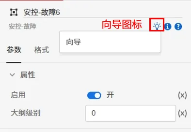
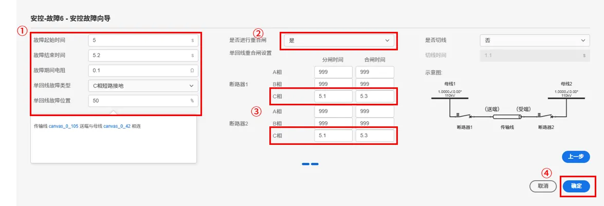
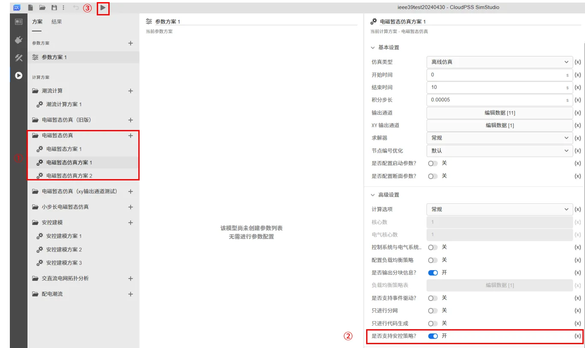
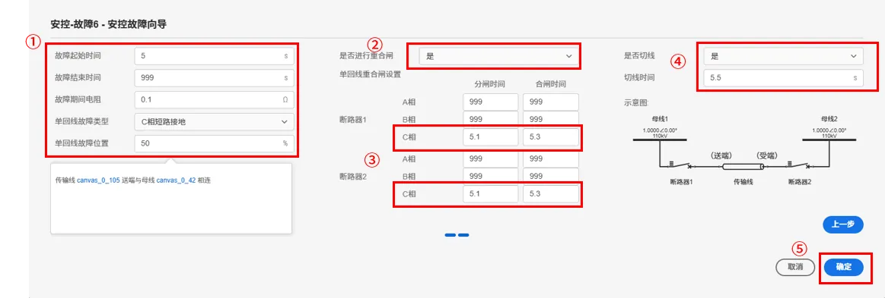
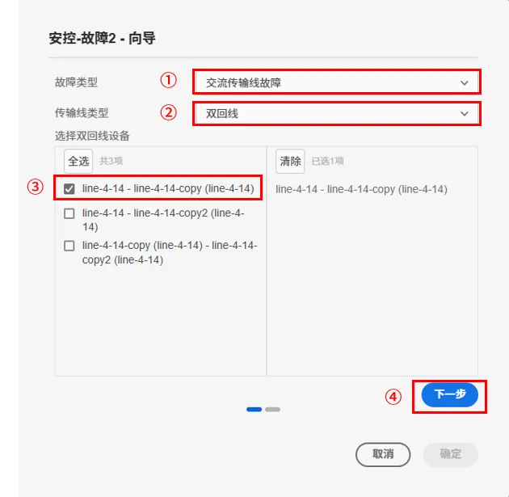
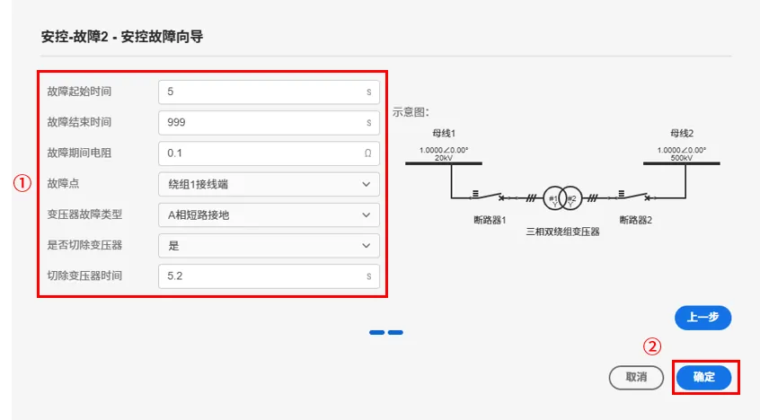
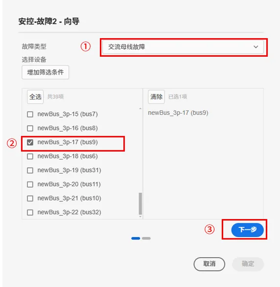
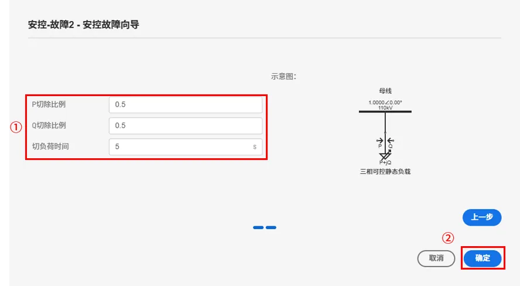
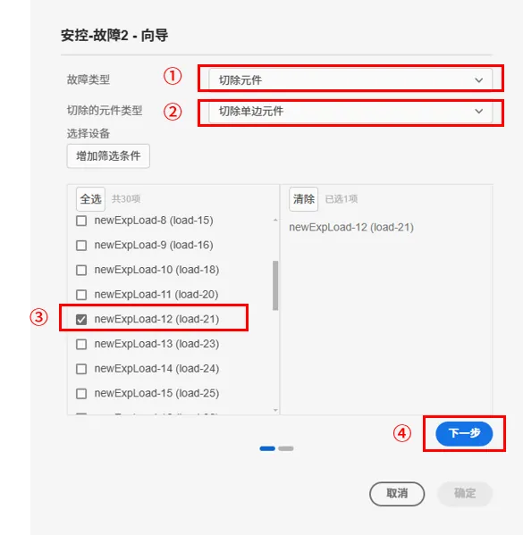
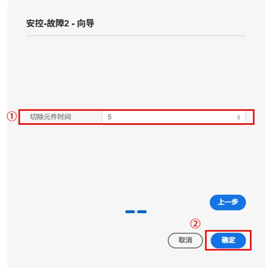

## 元件定义
该元件用于模拟多种常见的故障，主要包括：
- 交流传输线故障：单相短路故障、相间短路故障、三相短路故障、三相短路单相拒动故障、双回线异名相相间短路故障等；
- 变压器故障：三相双绕组变压器短路故障、三相三绕组变压器短路故障；
- 交流母线故障：母线短路故障跳所有出线；
- 发电机故障：切机操作；
- 负荷故障：百分比切负荷操作；
- 切除元件：N-1，N-2……N-k操作。

### 属性

CloudPSS 元件包含统一的**属性**选项，其配置方法详见 [参数卡](docs/documents/software/10-xstudio/20-simstudio/40-workbench/20-function-zone/30-design-tab/30-param-panel/index.md) 页面。

### 参数

import Parameters from './_parameters.md'

<Parameters/>

### 引脚

import Pins from './_pins.md'

<Pins/>

## 案例

import Tabs from '@theme/Tabs';
import TabItem from '@theme/TabItem';

### 交流传输线故障
对于交流传输线故障，可通过传输线故障设置模拟出多种故障方式，比如：单相短路故障、相间短路故障、三相短路故障、三相短路单相拒动故障、双回线异名相相间短路故障等。

以下对几种典型的故障设置方法进行说明。

<Tabs>
<TabItem value="case1" label="单相瞬时性短路故障">
单相瞬时性短路故障包含了以下过程：
- 传输线在某处发生单相短路接地（故障在一段时间后消失）；
- 传输线两侧的断路器将故障相跳开；
- 一段时间后断路器重合闸重合成功。

该故障的基本示意图如下：

可通过元件向导进行故障的设置：

- 以**10 机 39 节点标准测试系统**为例，第一次拖拽安控-故障元件到图纸中可自动弹出元件的向导界面。

- 如果后续想通过向导界面对设置进行修改，可选中安控-故障元件，在右侧栏上方点击向导图标进入向导界面。
  

- 选择**故障类型**为交流传输线故障，**传输线类型**为单回线；筛选框中会自动筛选出算例中的所有传输线，勾选需要设置故障的传输线，点击下一步。

- 设置**故障起始时间**、**故障结束时间**、**故障期间电阻**、**单回线故障类型**和**单回线故障位置**，本案例的故障起始时间为 5s，故障结束时间为 5.2s，故障期间电阻为 0.1Ω，单回线故障类型为 C 相短路接地，单回线故障位置为距离线路送端 50% 处。

- 将**是否进行重合闸**选项设置为是，断路器 1 和断路器 2 的分闸时间设置为 5.1s，合闸时间设置为 5.3s。
  
- 点击向导界面的确定按钮，将设置的值写入安控-故障元件的参数列表。

  
- 对设置故障的传输线添加电流量测，并在电磁暂态方案的添加输出通道，量测方法可参考 [量测和输出系统](../../../50-emts/30-meters-and-outputs/index.md)，此处不再赘述。
  
- 在**运行标签页**，选择电磁暂态方案，开启**是否支持安控策略**按钮，点击启动任务按钮。

  
- 在结果页面的示波器窗口中使用鼠标框选 4.5 ~ 5.5s 区域波形，可以看到设置故障的传输线电流如下图所示：

</TabItem>

<TabItem value="case2" label="单相永久性短路故障">
单相永久性短路故障包含了以下过程：
- 传输线在某处发生单相短路接地（故障永久存在）；
- 传输线两侧的断路器将故障相跳开；
- 一段时间后断路器重合闸重合失败；
- 传输线两侧的断路器三相分闸将线路断开。

该故障的基本示意图如下：

可通过元件向导进行故障的设置：

- 以**10 机 39 节点标准测试系统**为例，第一次拖拽安控-故障元件到图纸中可自动弹出元件的向导界面。

- 如果后续想通过向导界面对设置进行修改，可选中安控-故障元件，在右侧栏上方点击向导图标进入向导界面。
  

- 选择**故障类型**为交流传输线故障，**传输线类型**为单回线；筛选框中会自动筛选出算例中的所有传输线，勾选需要设置故障的传输线，点击下一步。

- 设置**故障起始时间**、**故障结束时间**、**故障期间电阻**、**单回线故障类型**和**单回线故障位置**，本案例的故障起始时间为 5s，故障结束时间为 999s，故障期间电阻为 0.1Ω，单回线故障类型为 C 相短路接地，单回线故障位置为距离线路送端 50% 处。

- 将**是否进行重合闸**选项设置为是，断路器 1 和断路器 2 的分闸时间设置为 5.1s，合闸时间设置为 5.3s。

- 将**是否切线**选项设置为是，切线时间为5.5s。
  
- 点击向导界面的确定按钮，将设置的值写入安控-故障元件的参数列表。

- 对设置故障的传输线添加电流量测，并在电磁暂态方案的添加输出通道，量测方法可参考 [量测和输出系统](../../../50-emts/30-meters-and-outputs/index.md)，此处不再赘述。
  
- 在**运行标签页**，选择电磁暂态方案，开启**是否支持安控策略**按钮，点击启动任务按钮。

  
- 在结果页面的示波器窗口中使用鼠标框选 4 ~ 6s 区域波形，可以看到设置故障的传输线电流如下图所示：
  

</TabItem>

<TabItem value="case3" label="三相短路单相拒动故障">
三相短路单相拒动故障包含了以下过程：
- 传输线在某处发生三相短路接地故障（故障永久存在）；
- 传输线两侧的断路器将故障相跳开，但某一相开关拒动；
- 一段时间后传输线两侧的断路器三相分闸将线路断开。

该故障的基本示意图如下：

可通过元件向导进行故障的设置：

- 以**10 机 39 节点标准测试系统**为例，第一次拖拽安控-故障元件到图纸中可自动弹出元件的向导界面。

- 如果后续想通过向导界面对设置进行修改，可选中安控-故障元件，在右侧栏上方点击向导图标进入向导界面。
  

- 选择**故障类型**为交流传输线故障，**传输线类型**为单回线；筛选框中会自动筛选出算例中的所有传输线，勾选需要设置故障的传输线，点击下一步。

- 设置**故障起始时间**、**故障结束时间**、**故障期间电阻**、**单回线故障类型**和**单回线故障位置**，本案例的故障起始时间为 5s，故障结束时间为 999s，故障期间电阻为 0.1Ω，单回线故障类型为 ABC 相短路接地，单回线故障位置为距离线路送端 50% 处。

- 将**是否进行重合闸**选项设置为是，断路器 1 的 A 相和 B 相分闸时间设置为 5.1s，C 相分闸时间为 999s；断路器 2 的 A 相、 B 相和 C 相分闸时间设置为 5.1s。

- 将**是否切线**选项设置为是，切线时间为5.2s。
  
- 点击向导界面的确定按钮，将设置的值写入安控-故障元件的参数列表。

- 对设置故障的传输线添加电流量测，对故障传输线相连的母线添加电压量测，并在电磁暂态方案的添加输出通道，量测方法可参考 [量测和输出系统](../../../50-emts/30-meters-and-outputs/index.md)，此处不再赘述。
  
- 在**运行标签页**，选择电磁暂态方案，开启**是否支持安控策略**按钮，点击启动任务按钮。

  
- 在结果页面的示波器窗口中使用鼠标框选 4.8 ~ 5.3s 区域波形，可以看到故障传输线相连的母线电压和故障的传输线电流如下图所示：
  

</TabItem>

<TabItem value="case4" label="双回线异名相相间永久短路故障">
双回线异名相相间永久短路故障包含了以下过程：
- 双回线中一回线的某一相和另一回线的某一相发生短路故障（故障永久存在）；
- 线路 1 和 线路 2 两侧的断路器将故障相跳开；
- 一段时间后断路器重合闸重合失败；
- 传输线两侧的断路器三相分闸将线路断开。

该故障的基本示意图如下：

可通过元件向导进行故障的设置：

- 以**10 机 39 节点标准测试系统**为例，复制三相传输线 line4-14，并把复制的三相传输线的两端与 bus4 和 bus14连接。

- 第一次拖拽安控-故障元件到图纸中可自动弹出元件的向导界面。

- 如果后续想通过向导界面对设置进行修改，可选中安控-故障元件，在右侧栏上方点击向导图标进入向导界面。
  

- 选择**故障类型**为交流传输线故障，**传输线类型**为双回线；筛选框中会自动筛选出算例中的所有双回线，勾选需要设置故障的双回线，点击下一步。

- 设置**故障起始时间**、**故障结束时间**、**故障期间电阻**、**双回线故障类型**和**双回线故障位置**，本案例的故障起始时间为 5s，故障结束时间为 999s，故障期间电阻为 0.1Ω，双回线故障类型为双回线中一回线的 B 相到另一回线的 C 相短路，双回线的 线路1 和 线路 2 的故障位置均设置为距离线路送端 50% 处。

- 将**是否进行重合闸**选项设置为是，线路1 的断路器 1 和断路器 2 的 B 相分闸时间设置为 5.1s，合闸时间设置为 5.5s； 线路2 的断路器 1 和断路器 2 的 C 相分闸时间设置为 5.1s，合闸时间设置为 5.5s。

- 将**是否切线**选项设置为是，切线时间为5.6s。
  
- 点击向导界面的确定按钮，将设置的值写入安控-故障元件的参数列表。

- 对设置故障的双回线添加电流量测，并在电磁暂态方案的添加输出通道，量测方法可参考 [量测和输出系统](../../../50-emts/30-meters-and-outputs/index.md)，此处不再赘述。
  
- 在**运行标签页**，选择电磁暂态方案，开启**是否支持安控策略**按钮，点击启动任务按钮。

  
- 在结果页面的示波器窗口中使用鼠标框选 4.8 ~ 5.3s 区域波形，可以看到故障的双回线的总电流如下图所示：
  

</TabItem>

</Tabs>

### 变压器故障
对于变压器故障，可通过变压器故障设置模拟出多种故障方式，比如：三相双绕组变压器短路故障、三相三绕组变压器短路故障。下文以三相双绕组变压器短路故障为例，对故障设置方法进行说明。

三相双绕组变压器短路故障包含了以下过程：
- 三相双绕组变压器在某个端口处发生三相短路接地故障（故障永久存在）；
- 一段时间后变压器的每个接线端的断路器分闸将变压器切除。

该故障的基本示意图如下：

可通过元件向导进行故障的设置：

- 以**10 机 39 节点标准测试系统**为例，选择**故障类型**为变压器故障，**变压器类型**为三相双绕组变压器；筛选框中会自动筛选出算例中的所有三相双绕组变压器，勾选需要设置故障的三相双绕组变压器，点击下一步。

- 设置**故障起始时间**、**故障结束时间**、**故障期间电阻**、**故障点**和**变压器故障类型**，本案例的故障起始时间为 5s，故障结束时间为 999s，故障期间电阻为 0.1Ω，故障点为绕组 1 接线端，变压器故障类型为 A 相短路接地。

- 将**是否切除变压器**选项设置为是，**切除变压器时间**为5.2s。

- 点击向导界面的确定按钮，将设置的值写入安控-故障元件的参数列表。

- 对设置故障的变压器绕组 1 侧添加电流量测，对故障的变压器绕组 1 相连的母线添加电压量测，并在电磁暂态方案的添加输出通道，量测方法可参考 [量测和输出系统](../../../50-emts/30-meters-and-outputs/index.md)，此处不再赘述。
  
- 在**运行标签页**，选择电磁暂态方案，开启**是否支持安控策略**按钮，点击启动任务按钮。

  
- 在结果页面的示波器窗口中使用鼠标框选 4.8 ~ 5.3s 区域波形，可以看到故障的变压器绕组 1 的电流和相连的母线电压如下图所示：
  

### 交流母线故障
对于交流母线故障，可通过交流母线故障设置模拟出多种故障方式，比如：母线单相接地短路故障、母线相间短路故障、母线三相短路故障和母线短路故障跳所有出线。下文以母线短路故障跳所有出线为例，对故障设置方法进行说明。

母线短路故障跳所有出线包含了以下过程：

- 母线发生三相短路接地故障（故障永久存在）；
- 一段时间后母线接线端的断路器分闸，将跳开与母线相连的所有元件。

该故障的基本示意图如下：

可通过元件向导进行故障的设置：

- 以**10 机 39 节点标准测试系统**为例，选择**故障类型**为交流母线故障；筛选框中会自动筛选出算例中的所有交流母线，勾选需要设置故障的交流母线，点击下一步。

- 设置**故障起始时间**、**故障结束时间**、**故障期间电阻**和**母线故障类型**，本案例的故障起始时间为 5s，故障结束时间为 999s，故障期间电阻为 0.1Ω，母线故障类型为 ABC 相间短路接地。

- 将**是否跳开所有出线**选项设置为是，**母线跳所有出线时间**为5.2s。

- 点击向导界面的确定按钮，将设置的值写入安控-故障元件的参数列表。

- 对设置故障母线相连的线路添加电流量测，并在电磁暂态方案的添加输出通道，量测方法可参考 [量测和输出系统](../../../50-emts/30-meters-and-outputs/index.md)，此处不再赘述。
  
- 在**运行标签页**，选择电磁暂态方案，开启**是否支持安控策略**按钮，点击启动任务按钮。

  
- 在结果页面的示波器窗口中使用鼠标框选 4.8 ~ 5.3s 区域波形，可以看到故障母线相连的线路的电流如下图所示：
  

### 发电机故障
发电机故障用于模拟发电机切机操作，发电机接线端的断路器在**切机时间**进行分闸操作，将发电机切除。

发电机故障的基本示意图如下：

可通过元件向导进行故障的设置：

- 以**10 机 39 节点标准测试系统**为例，选择**故障类型**为发电机故障；筛选框中会自动筛选出算例中的所有同步发电机，勾选需要设置故障的同步发电机，点击下一步。

- 设置**切机时间**为 5.1s，点击向导界面的确定按钮，将设置的值写入安控-故障元件的参数列表。

- 对设置切机的发电机添加电流量测，并在电磁暂态方案的添加输出通道，量测方法可参考 [量测和输出系统](../../../50-emts/30-meters-and-outputs/index.md)，此处不再赘述。
  
- 在**运行标签页**，选择电磁暂态方案，开启**是否支持安控策略**按钮，点击启动任务按钮。

  
- 在结果页面的示波器窗口中使用鼠标框选 4.8 ~ 5.3s 区域波形，可以看到发电机的电流如下图所示：
  

### 负荷故障
负荷故障用于模拟百分比切除负荷操作，在**切负荷时间**按照 P 切除比例和 Q 切除比例修改负荷的 P，Q值。

可通过元件向导进行故障的设置：

- 以**10 机 39 节点标准测试系统**为例，选择**故障类型**为负荷故障；筛选框中会自动筛选出算例中的所有负荷，勾选需要设置故障的负荷，点击下一步。

- 本案例设置 **P 切除比例**和 **Q 切除比例**为 0.5，**切除时间**为 5s。点击向导界面的确定按钮，将设置的值写入安控-故障元件的参数列表。

- 对设置故障的负荷添加电流量测，并在电磁暂态方案的添加输出通道，量测方法可参考 [量测和输出系统](../../../50-emts/30-meters-and-outputs/index.md)，此处不再赘述。
  
- 在**运行标签页**，选择电磁暂态方案，开启**是否支持安控策略**按钮，点击启动任务按钮。

  
- 在结果页面的示波器窗口中使用鼠标框选 4.8 ~ 5.3s 区域波形，可以看到故障负荷的电流如下图所示：
  

### 切除元件
切除元件用于模拟 N-1，N-2……N-k操作，支持切除的元件如下：
- 单边元件：同步发电机、三相交流电压源、静态负荷、综合负荷、风场等值模型、光伏电站模型；
- 双边元件：三相传输线、三相双绕组变压器。

可通过元件向导进行故障的设置：

- 以**10 机 39 节点标准测试系统**为例，选择**故障类型**为切除元件，**切除的元件类型**为单边元件；筛选框中会自动筛选出算例中可切除的元件，勾选需要切除的的元件，点击下一步。

- 本案例设置**切除时间**为 5s。点击向导界面的确定按钮，将设置的值写入安控-故障元件的参数列表。
  

- 对切除的元件所连的母线添加电压量测，并在电磁暂态方案的添加输出通道，量测方法可参考 [量测和输出系统](../../../50-emts/30-meters-and-outputs/index.md)，此处不再赘述。
  
- 在**运行标签页**，选择电磁暂态方案，开启**是否支持安控策略**按钮，点击启动任务按钮。

  
- 在结果页面的示波器窗口中使用鼠标框选 4.8 ~ 5.3s 区域波形，可以看到母线的电压如下图所示：
  

## 常见问题

