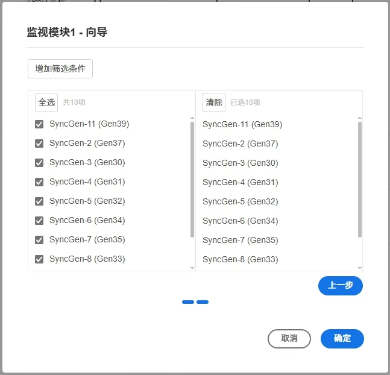
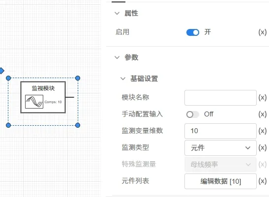

## 元件定义
该元件用于批量监视各类型元件的输出信号，例如：
- 三相交流母线的电压；
- 三相交流母线的频率；
- 交流传输线的传输功率；
- 发电机的输出功率；
- 风机、光伏等新能源设备的电压等。

在安控策略建模中，通常采用监视模块-判断模块-操作模块的连接方法，监视模块为安控策略的第一部分。

## 元件说明

### 属性

CloudPSS 元件包含统一的**属性**选项，其配置方法详见 [参数卡](docs/documents/software/10-xstudio/20-simstudio/40-workbench/20-function-zone/30-design-tab/30-param-panel/index.md) 页面。

### 参数

import Parameters from './_parameters.md'

<Parameters/>

### 引脚

import Pins from './_pins.md'

<Pins/>

## 案例

import Tabs from '@theme/Tabs';
import TabItem from '@theme/TabItem';

对几种典型的信号监视方法进行说明。

<Tabs>
<TabItem value="case1" label="母线频率">

可通过元件向导进行故障的设置：

- 以**10 机 39 节点标准测试系统**为例，第一次拖拽安控-监视元件到图纸中可自动弹出元件的向导界面。

- 在**选择待量测器件**选项中选择**母线**，在**选择待量测信号**选项中选择**母线频率**。
- **单位**可根据需求进行选择，若选择**有名值**则输出信号单位为Hz；若选择**标幺值**则输出信号为以工频频率为基值的标幺值。这里以选择**有名值**为例。

- 点击**下一步**按钮进入第二页向导界面。这里可以选择需要监视的母线，只有被选中的元件才会输出对应频率信号。这里以全选为例。

- 点击**确定**按钮，完成监视元件的配置。

可以看到，元件的参数列表中已经自动配置了相应的参数，包括监控变量维数、监测类型、元件列表等。

- 根据[量测和输出系统](docs/documents/software/20-emtlab/50-emts/30-meters-and-outputs/index.md) 添加39维输出通道，输出监视的母线频率信号。
  
- 在运行标签页，选择电磁暂态方案，开启是否支持安控策略按钮，点击启动任务按钮。

- 得到的曲线结果如下图所示。

</TabItem>

<TabItem value="case2" label="传输线功率">

可通过元件向导进行故障的设置：

- 以**10 机 39 节点标准测试系统**为例，第一次拖拽安控-监视元件到图纸中可自动弹出元件的向导界面。

- 在**选择待量测器件**选项中选择**传输线**，在**选择待量测信号**选项中选择**送端有功**。
  
- **单位**可根据需求进行选择，若选择**有名值**则输出信号单位为MW；若选择**标幺值**则需要额外填写**系统容量基值**参数。这里以选择**标幺值**为例。

- 点击**下一步**按钮进入第二页向导界面。这里可以选择需要监视的传输线，只有被选中的元件才会输出对应有功功率信号。这里以选择``line-16-17``、``line-14-15``两条传输线为例。

- 点击**确定**按钮，完成监视元件的配置。

可以看到，元件的参数列表中已经自动配置了相应的参数，包括监控变量维数、监测类型、元件列表等。

- 根据[量测和输出系统](docs/documents/software/20-emtlab/50-emts/30-meters-and-outputs/index.md) 添加2维输出通道，输出监视的传输线功率信号。
  
- 在运行标签页，选择电磁暂态方案，开启是否支持安控策略按钮，点击启动任务按钮。

- 得到的曲线结果如下图所示。

可以看到，随着2s时bus16的接地短路，两条传输线的有功功率发生波动。

</TabItem>

<TabItem value="case3" label="电机功率">

可通过元件向导进行故障的设置：

- 以**10 机 39 节点标准测试系统**为例，第一次拖拽安控-监视元件到图纸中可自动弹出元件的向导界面。

- 在**选择待量测器件**选项中选择**电机**，在**选择待量测信号**选项中选择**有功**。
  
- **单位**可根据需求进行选择，若选择**有名值**则输出信号单位为MW；若选择**标幺值**则需要额外填写**系统容量基值**参数。这里以选择**标幺值**为例。

- 点击**下一步**按钮进入第二页向导界面。这里可以选择需要监视的电机，只有被选中的元件才会输出对应有功功率信号。这里以全选为例。

- 点击**确定**按钮，完成监视元件的配置。

可以看到，元件的参数列表中已经自动配置了相应的参数，包括监控变量维数、监测类型、元件列表等。

- 根据[量测和输出系统](docs/documents/software/20-emtlab/50-emts/30-meters-and-outputs/index.md) 添加10维输出通道，输出监视的电机功率信号。
  
- 在运行标签页，选择电磁暂态方案，开启是否支持安控策略按钮，点击启动任务按钮。

- 得到的曲线结果如下图所示。

可以看到，随着2s时bus16的接地短路，电机的有功功率发生波动。

</TabItem>

</Tabs>

## 示例模型下载连接

案例：[安控-监控模块案例](./10机39节点标准测试系统-scdoc.cmdl)

## 常见问题

