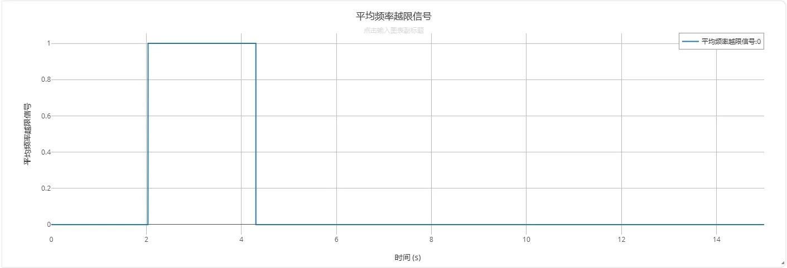
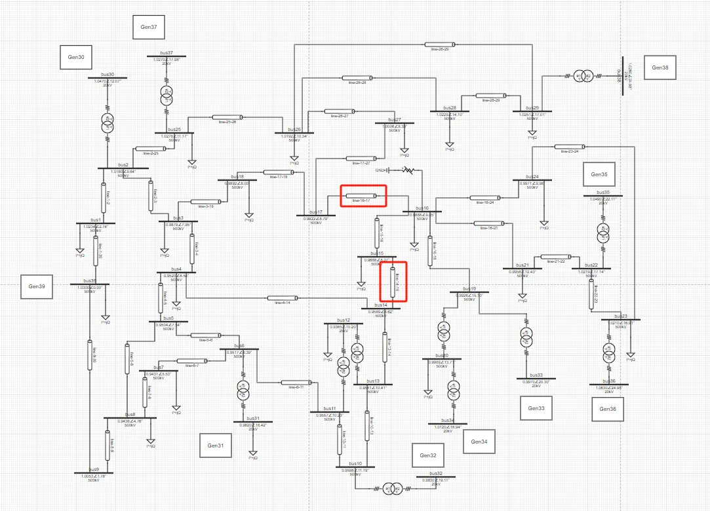

## 元件定义
该元件用于对多维监测信号进行处理，包括：
- 多维信号求和，通常用于断面总功率计算、总发电量计算等场景；
- 多维信号最大、最小值的差，通常用于最大功角差计算等场景；
- 多维信号求平均，通常用于平均频率求取等场景；
- 多维信号最小值、最大值，通常用于频率、电压越限判断等场景；
- 多维信号分别判断后取与/取或，通常用于频率、电压越限判断等场景；

在安控策略建模中，通常采用监视模块-判断模块-操作模块的连接方法，判断模块为安控策略的第二部分。

## 元件说明

### 属性

CloudPSS 元件包含统一的**属性**选项，其配置方法详见 [参数卡](docs/documents/software/10-xstudio/20-simstudio/40-workbench/20-function-zone/30-design-tab/30-param-panel/index.md) 页面。

### 参数

import Parameters from './_parameters.md'

<Parameters/>

### 引脚

import Pins from './_pins.md'

<Pins/>

## 案例

import Tabs from '@theme/Tabs';
import TabItem from '@theme/TabItem';

- 基于[监视模块](docs/documents/software/20-emtlab/110-component-library/60-security-control-module/20-Security-Control-Monitor/index.md) 的输出信号，进一步配置判断模块。

<Tabs>
<TabItem value="case1" label="全网平均母线频率">

- 在采用[监视模块](docs/documents/software/20-emtlab/110-component-library/60-security-control-module/20-Security-Control-Monitor/index.md) 量测39条母线的频率后，拖入一个**判断模块**及一个[阶跃发生器](docs/documents/software/20-emtlab/110-component-library/10-basic/20-control/80-control-signal-generators/80-_newStepGen/index.md)元件，按下图所示方式进行配置。

其中，变量上下限为59.5Hz~60.5Hz，高位延迟时间为0.01s，低位延迟时间为2s，代表平均频率超过60.5Hz或低于59.5Hz，并保持0.01s后，**越限信号**置为1；平均频率低于60.5Hz且高于59.5Hz，并保持2s后，**越限信号**置为0.

判断模块的**Enab**信号用于启用判断模块的**越限信号**输出，当**Enab**信号置为0时，**越限信号**始终为0。这里采用1s阶跃的阶跃发生器，连接到**Enab**端口。

判断模块的**对输入信号处理后的输出**虚拟引脚，可输出39条母线的平均频率；判断模块的**输出**引脚，可输出平均频率的**越限信号**。

- 配置输出通道并运行仿真，输出的平均频率信号及越限信号如下所示。
  

</TabItem>

<TabItem value="case2" label="断面总功率">

- 在采用[监视模块](docs/documents/software/20-emtlab/110-component-library/60-security-control-module/20-Security-Control-Monitor/index.md) 中，量测了``line-16-17``、``line-14-15``两条传输线的功率。从拓扑图中可见，这两条线将39节点算例分成两个部分，因此可以考虑基于该交流断面的总功率设计安控策略。

- 拖入一个**判断模块**及一个[阶跃发生器](docs/documents/software/20-emtlab/110-component-library/10-basic/20-control/80-control-signal-generators/80-_newStepGen/index.md)元件，按下图所示方式进行配置。

其中，变量上下限为 -3 p.u. ~ 3 p.u.，高位延迟时间为0.1s，低位延迟时间为2s，代表断面总功率超过300MW，并保持0.1s后，**越限信号**置为1；断面总功率小于300MW，并保持2s后，**越限信号**置为0.

判断模块的**Enab**信号用于启用判断模块的**越限信号**输出，当**Enab**信号置为0时，**越限信号**始终为0。这里采用1s阶跃的阶跃发生器，连接到**Enab**端口。

- 配置输出通道并运行仿真，输出的断面总功率信号及越限信号如下所示。
  

</TabItem>

</Tabs>

## 示例模型下载连接

案例：[安控-判断模块案例](./10机39节点标准测试系统-scdoc.cmdl)

## 常见问题

