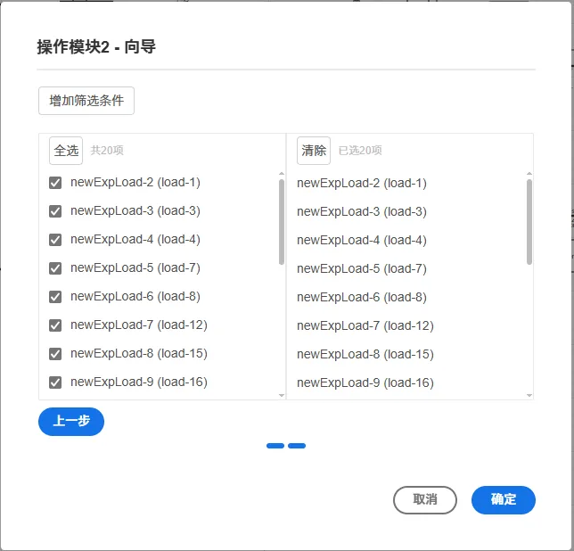
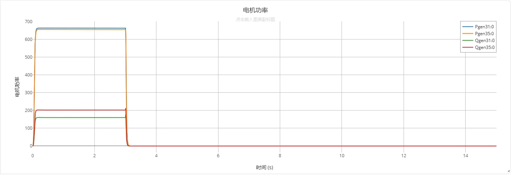

## 元件定义

该元件基于触发信号，对特定元件进行批量处理，目前支持的功能包括：
- 按比例切除负荷；
- 切除电机；
在安控策略建模中，通常采用监视模块-判断模块-操作模块的连接方法，操作模块为安控策略的第三部分。

## 元件说明

### 属性

CloudPSS 元件包含统一的**属性**选项，其配置方法详见 [参数卡](docs/documents/software/10-xstudio/20-simstudio/40-workbench/20-function-zone/30-design-tab/30-param-panel/index.md) 页面。

### 参数

import Parameters from './_parameters.md'

<Parameters/>

### 引脚

import Pins from './_pins.md'

<Pins/>

## 案例

import Tabs from '@theme/Tabs';
import TabItem from '@theme/TabItem';

对两种安控操作方法进行说明。

<Tabs>
<TabItem value="case1" label="按比例切除负荷">

可通过元件向导进行故障的设置：

- 以**10 机 39 节点标准测试系统**为例，第一次拖拽安控-操作元件到图纸中可自动弹出元件的向导界面。

- 在**操作类型**选项中选择**负荷百分比**，在**P切除比例**参数栏填写0.2，代表将切除20%的有功负荷；在**Q切除比例**参数栏填写0.2，代表将切除20%的无功负荷。
  

- 点击**下一步**按钮进入第二页向导界面。这里可以选择需要切除的负荷，只有被选中的元件才会切除负荷。这里以全选为例。
  

- 点击**确定**按钮，完成操作元件的配置。

可以看到，元件的参数列表中已经自动配置了相应的参数，包括待操作的负荷列表、有功和无功的比例等。

- 拖入一个[阶跃发生器](docs/documents/software/20-emtlab/110-component-library/10-basic/20-control/80-control-signal-generators/80-_newStepGen/index.md)元件，作为切除负荷操作的触发信号，设置其在3s时动作，从0阶跃到1。

- 根据[量测和输出系统](docs/documents/software/20-emtlab/50-emts/30-meters-and-outputs/index.md) 配置操作模块的曲线输出，包括所有20个负荷的有功功率、无功功率、端口电压，如下图所示。

  
- 在运行标签页，选择电磁暂态方案，开启是否支持安控策略按钮，点击启动任务按钮。

- 得到的曲线结果如下图所示。

</TabItem>

<TabItem value="case2" label="切除电机">

可通过元件向导进行故障的设置：

- 以**10 机 39 节点标准测试系统**为例，第一次拖拽安控-操作元件到图纸中可自动弹出元件的向导界面。

- 在**操作类型**选项中选择**切机**，点击**下一步**按钮进入第二页向导界面。这里可以选择需要切除的电机，只有被选中的元件才会切除。这里以切除Gen31和Gen35两台电机为例。
  

- 点击**确定**按钮，完成操作元件的配置。
- 

可以看到，元件的参数列表中已经自动配置了相应的参数，包括待电机等。

- 拖入一个[阶跃发生器](docs/documents/software/20-emtlab/110-component-library/10-basic/20-control/80-control-signal-generators/80-_newStepGen/index.md)元件，作为切除负荷操作的触发信号，设置其在3s时动作，从0阶跃到1。

- 根据[量测和输出系统](docs/documents/software/20-emtlab/50-emts/30-meters-and-outputs/index.md) 配置待切除的两台电机的有功、无功输出，如下图所示。

  
- 在运行标签页，选择电磁暂态方案，开启是否支持安控策略按钮，点击启动任务按钮。

- 得到的曲线结果如下图所示。

可见，被选中的两台电机在3s时被切除。

</TabItem>
</Tabs>

## 示例模型下载连接

案例：[安控-操作模块案例](./10机39节点标准测试系统-scopp.cmdl)

## 常见问题

