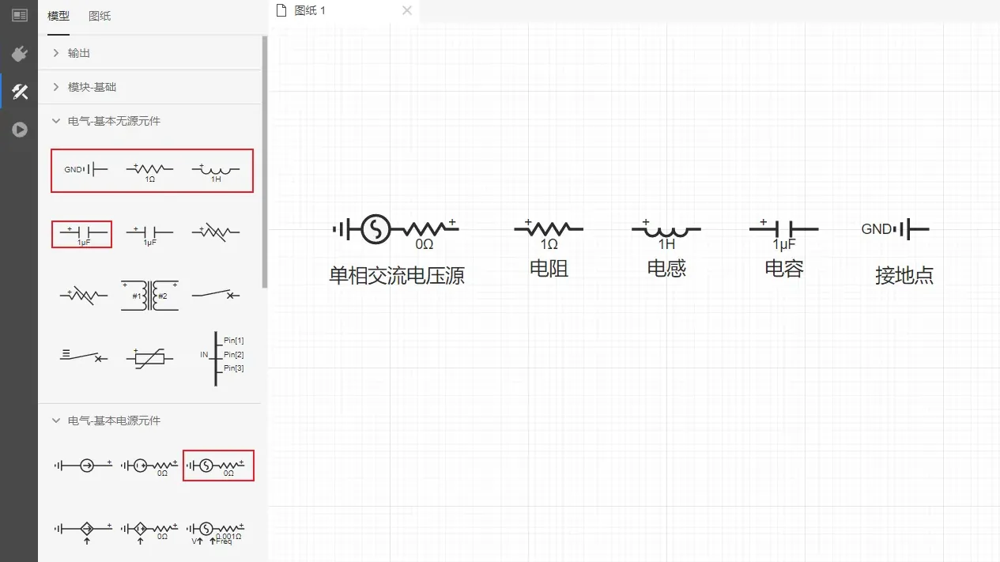
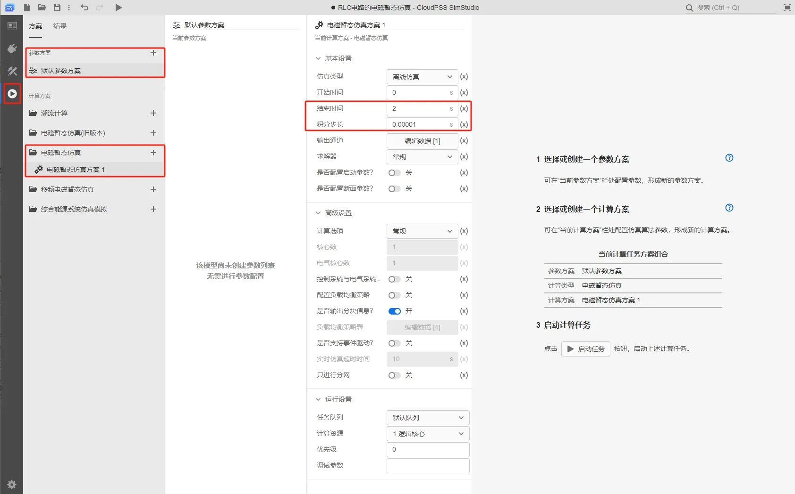
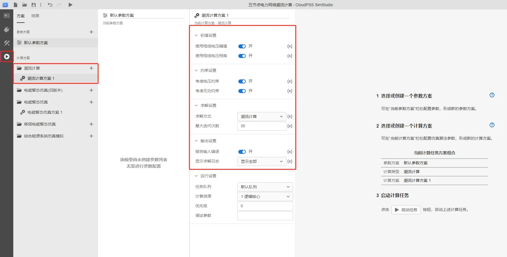
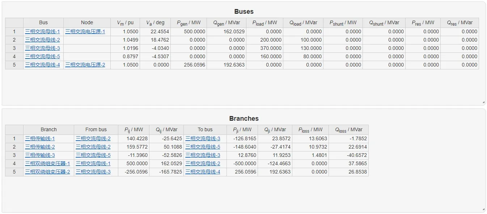

本节主要介绍两个入门案例：**RLC 电路的电磁暂态仿真**和**五节点电力网络的潮流计算仿真**，用户可通过搭建入门案例熟悉 EMTLab 的电磁暂态仿真和潮流计算仿真的使用。

import Tabs from '@theme/Tabs';
import TabItem from '@theme/TabItem';

<Tabs>
<TabItem value="case1" label="RLC 电路的电磁暂态仿真">
本案例主要介绍简单 RLC 串联电路的搭建及仿真过程。该 RLC 串联电路由单相交流电压源、电阻、电感、电容元件组成。

#### 放置元件
- 在 SimStudio 工作台，点击新建电力系统仿真项目。

- 在**实现标签页**，点击**电气-基本电源元件**选择单相交流电压源元件拖拽至工作空间，在**电气-基本无源元件**分别选择接地点、电阻、电感、电容元件拖拽至工作空间，即可完成对相应元件的放置。

- 可利用鼠标长按元件进行拖动或选中元件后用 <kbd>键盘方向键</kbd> 改变元件位置。可以 <kbd>鼠标右键</kbd> 点击元件进行元件的剪切、复制、粘贴、创建副本、删除、隐藏元件名称等操作，或者通过快捷键快速实现上述操作。点击元件上方的圆形箭头或利用 <kbd>Ctrl</kbd> <kbd>R</kbd> 对元件进行旋转。元件放置结束后的工作空间如上图所示。

#### 连接元件
- 将鼠标光标移至元件引脚处，若该引脚出现蓝色圆形阴影，说明该引脚可用。此时单击该引脚，按住 <kbd>鼠标左键</kbd> 并移动光标至需要被连线的引脚处，当该引脚处出现橙色边框，松开 <kbd>鼠标左键</kbd> 即完成两个元件的连线。在连线后，选中连线并在连线路径上单击 <kbd>鼠标左键</kbd> 可以在该处设置拐点，拐点可以被拖动调整位置。元件连接示例如图所示。

- 若出现元件较多、连线不便的情况，可以通过**设置引脚**的方式对两个及以上的引脚进行连接。单击需要连接的元件，在工作空间的右侧栏会出现**参数**面板，在需要连接的引脚处填写相同的字符，即可实现连接，如下图所示。

:::tip 引脚连接注意事项
- 电气引脚与信号引脚不能互相连接；
- 信号输入引脚不能并联，信号输出引脚不能并联，即信号输出引脚需连接至另一信号输入引脚；
- 引脚连接需满足维数要求：例如**三相交流电压源**的正端为三维电气引脚，不能直接与**单相电阻**的一维引脚连接，此时可加入**分线器**进行电气引脚拆分。同理，多维的信号引脚加入**多路信号合并**或**多路信号分离**元件进行拆分/聚合。 
:::

#### 设置参数
- 点击任一元件（以电阻为例），工作空间右侧将出现如图所示的**参数**面板。**参数**面板右侧为**格式**面板，用于设置元件的图标特性，如样式、文本以及排列。各元件参数设置：单相交流电压源相电压有效值为 10kV，频率为 50Hz；电阻为 10Ω；电感为 0.01H；电容为 5000μF，其它参数为默认值。

#### 添加测量元件
- 常用的量测元件有**电压表**、**支路电压表**以及**电流表**。以电压表为例，在左侧**模型**栏中点击**量测**选择**电压表**元件拖拽至工作空间，并连接至电路。点击该元件出现参数配置面板，填写该电压表测得电压信号的名称，以 `#` 号开头。

- 此外，电气元件本身支持部分内部量输出，无需外加量测元件。如在电阻元件中添加量测，点击电阻元件,在参数的 `Monitoring` 中填写以 `#` 号开头的量测信号输出名称。更多关于信号名称的信息详见 [参数及引脚体系](../../40-simstudio/30-modeling/10-params-variables-pins/index.md)。

#### 添加输出通道
- 量测元件只对电气量进行采集，如需显示还需加入输出元件。 EMTLab 的输出波形显示需同时用到示波器分组以及输出通道。输出通道类比与实际物理示波器的探头，示波器分组类比于任意通道数的实际物理示波器。
- 在左侧**模型**栏中点击**输出**选择**输出通道**元件拖拽至工作空间，单击设置参数，如下图所示。通道名称设定为：电压源端电压，输入信号维数设定为 1，因为采集得到的电压源端电压为 1 维。输入引脚填写为以 `#` 号开头的电压表测量输出信号名称 `#Vs`。

- 至此工作空间的仿真内容全部搭建完毕，总的仿真图如下图所示。

#### 仿真运行方法
- 点击左侧**运行标签页**，分别配置仿真的**参数方案**和**计算方案**。参数方案是对该项目的参数列表的参数进行配置。在计算方案中选择**电磁暂态仿真方案**，可对电磁暂态仿真方案中的仿真参数进行配置（如，基本设置、 求解器设置、启动/断面参数）。其中，示波器分组可在**电磁暂态仿真方案 - 输出通道 - 编辑数据**进行设置，点击**输出通道 - 编辑数据**，弹出输出通道页面，可以对示波器分组名称、采样频率、窗口类型、窗口宽度、示波器输出通道进行设置。
- 由于本算例为入门案例，在此采用平台预置**参数方案**，无需对其进行配置，在计算方案中选择**电磁暂态仿真方案**设置仿真结束时间为 2s，积分步长为 0.00001s，如下图所示：

- 点击**输出通道 - 编辑数据**，在弹出的输出通道页面，对示波器分组的设置如下图所示：

- 点击**启动任务**开始仿真，仿真结果如下图所示：

</TabItem>
<TabItem value="case2" label="五节点电力网络的潮流计算仿真">
本案例主要介绍五节点电力网络的搭建及仿真流程。该五节点电力网络由发电机、变压器、传输线、负荷及交流母线组成。

#### 五节点电力网络潮流计算原理
如图所示。母线 1、2、3 为 PQ 节点，各节点的负荷分别为：${S_1} = 1.6 + j0.8$，${S_2} = 2 + j1$，${S_3} = 3.7 + j1.3$；节点 4 为 PV 节点，给定 ${P_4} = 5$，${V_4} = 1.05$；节点 5 为平衡节点，给定 ${V_5} = 1.05 \angle {0^ \circ }$。

各 PQ 和 PV 节点已知的注入功率为 ${P_1S} = -1.6$，${Q_1S} = -0.8$，${Q_2S} = -2$，${P_3S} = -3.7$，${P_4S} = 5$。  
    
用牛顿-拉夫逊法计算潮流，当收敛指标取 ${10^{ - 6}}$ 时，需要进行四次迭代。迭代过程中各节点电压变化情况如表所示：

| 迭代次数 | ${\theta _1}$ |  ${\theta _2}$ | ${\theta _3}$ | ${\theta _4}$ | ${V_1}$ |${V_2}$ |${V_3}$ |
| :-----:| :----: | :----: | :----: | :----: | :----: |:----: |:----: |
| 1 | -1.9982 |  21.0307 | -3.6913 | 25.2051 | 0.9726 |1.0712 |1.0374 |
| 2 | -4.2545 |  19.1453 | -4.0304 | 23.1260 | 0.8813 |1.0505 |1.0196 |
| 3 | -4.6213 |  19.0733 | -4.0641 | 23.0545 | 0.8684 |1.0494 |1.0183 |
| 4 | -4.6316 |  19.0736 | -4.0649 | 23.0549 | 0.8681 |1.0493 |1.0183 |

迭代结果各节点电压大小和相位角列于下表：

| 节点编号 | ${V}$ |  ${\theta}$ |  
| :-----:| :----: | :----: | 
| 1 | 0.8681 |  -4.6316 | 
| 2 | 1.0493 |  19.0736 | 
| 3 | 1.0183 |  -4.0649 | 
| 4 | 1.0500 |  23.0549 | 
| 5 | 1.0500 |  0 | 

#### 放置元件
- 在 SimStudio 工作台，点击新建电力系统仿真项目。

- 在左侧**模型**栏中点击**电气 - 三相交流元件**分别选择**三相交流电压源**、**三相交流母线**、**三相双绕组变压器**、**三相传输线**、**静态负荷**元件拖拽至工作空间，即可完成对相应元件的放置。

- 可利用鼠标长按元件进行拖动或选中元件后用**键盘方向键**改变元件位置。可以 <kbd>鼠标右键</kbd> 点击元件进行元件的剪切、复制、粘贴、创建副本、删除、隐藏元件名称等操作，或者通过快捷键快速实现上述操作。点击元件上方的圆形箭头或利用 <kbd>Ctrl</kbd> <kbd>R</kbd> 对元件进行旋转。元件放置结束后的工作空间如上图所示。

#### 连接元件
- 将鼠标光标移至元件引脚处，若该引脚出现蓝色圆形阴影，说明该引脚可用。此时单击该引脚，按住 <kbd>鼠标左键</kbd> 并移动光标至需要被连线的引脚处，当该引脚处出现橙色边框，松开 <kbd>鼠标左键</kbd> 即完成两个元件的连线。在连线后，选中连线并在连线路径上单击 <kbd>鼠标左键</kbd> 可以在该处设置拐点，拐点可以被拖动调整位置。元件连接示例如图所示。

#### 设置参数
- 点击任一元件（以三相交流电压源为例），工作空间右侧将出现如图所示的**参数**面板。

各元件参数设置如下：
- 三相交流电压源的线电压有效值均设置为 115.5kV ，频率均为 50Hz
  -  三相交流电压源-1 的节点类型设置为 PV Bus，节点注入有功功率为 500MW，母线电压幅值为 1.05p.u.；
  -  三相交流电压源-2 的节点类型设置为 Slack Bus，母线电压幅值为 1.05p.u.，母线电压相位为 0Deg。
- 三相交流母线的电压基值均设置为 110kV
- 三相双绕组变压器的额定容量设置为 100MVA，绕组 1 和绕组 2 的额定电压有效值均设置为 110kV，连接方式均为Delta-Delta 连接
  - 三相双绕组变压器-1 的正序漏电抗为 0.015p.u.，变压器分接头选择绕组 2，变比为 1.02；
  - 三相双绕组变压器-2 的正序漏电抗为 0.03p.u.，变压器分接头选择绕组 1，变比为 1.02。
- 三相传输线的长度均为 1km，额定电压为 110kV，额定容量为 100MVA，集中参数模型，标幺值输入方式
  - 传输线-1 的电阻为 0.08p.u./km，电抗为 0.3p.u./km，单位长度电纳为 0.5p.u./km；
  - 传输线-2 的电阻为 0.04p.u./km，电抗为 0.25p.u./km，单位长度电纳为 0.5p.u./km；
  - 传输线-3 的电阻为 0.1p.u./km，电抗为 0.35p.u./km，单位长度电纳为 0.5p.u./km。
- 静态负载的线电压有效值均为 110kV
  - 静态负载-1 的额定有功功率为 160MW，额定无功功率为 80MW;
  - 静态负载-2 的额定有功功率为 200MW，额定无功功率为 100MW;
  - 静态负载-3 的额定有功功率为 370MW，额定无功功率为 130MW。

至此工作空间的仿真内容全部搭建完毕，总的仿真图如下图所示。

#### 仿真运行方法
在**运行标签页**，配置**计算方案**：由于本案例为入门案例，在此采用平台预置**计算方案**，无需对其进行配置。

点击**启动任务**开始仿真，仿真结果如下图所示。

</TabItem>
</Tabs>
---------------

## 示例模型下载连接
案例： [五节点电力网络的潮流计算仿真](./case-2.cmdl)