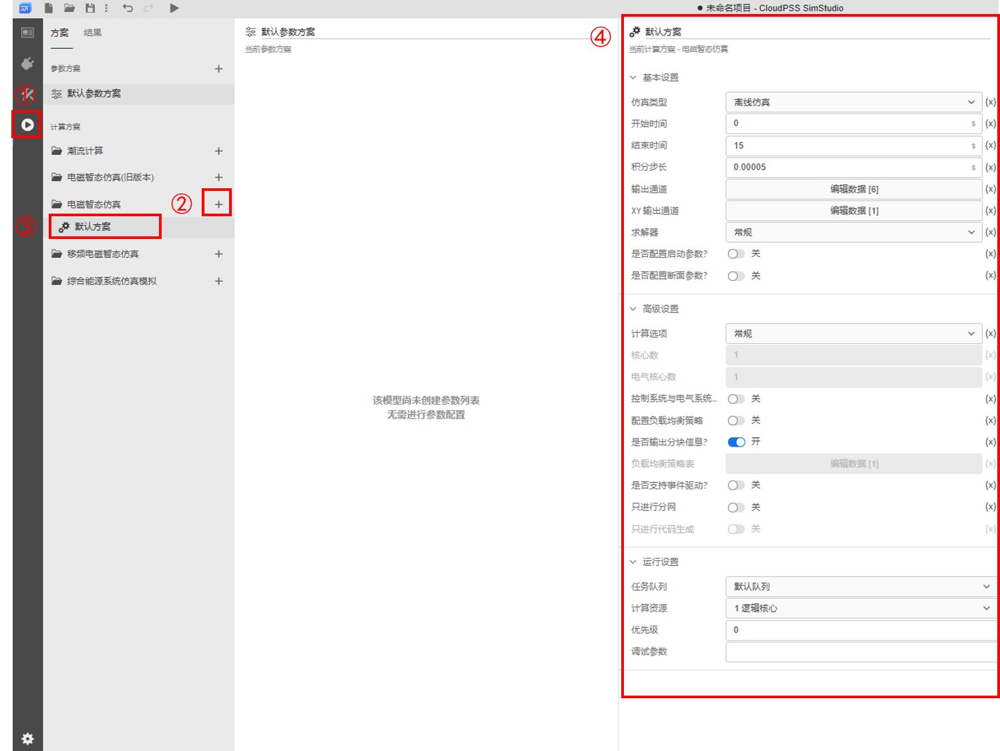
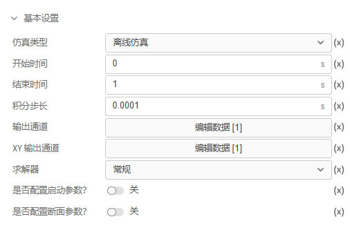
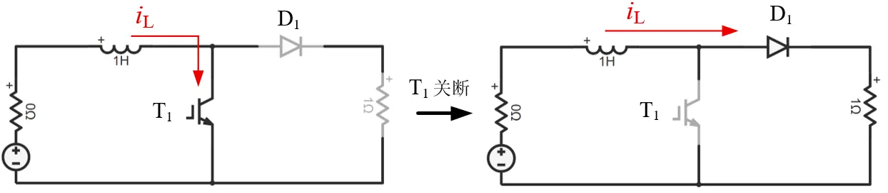
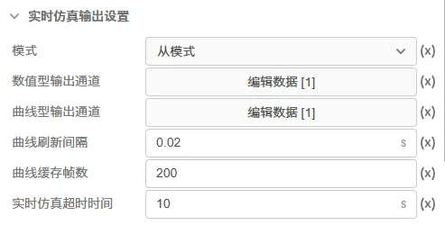
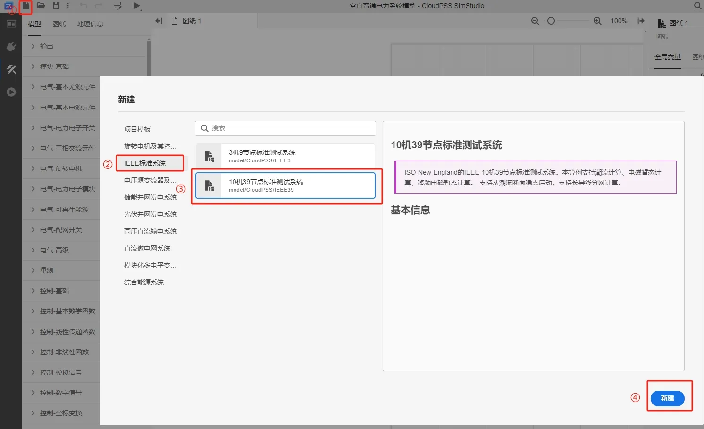
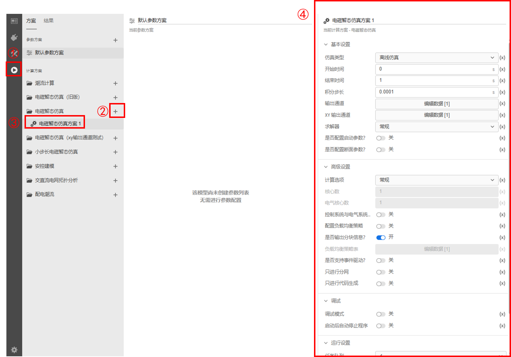
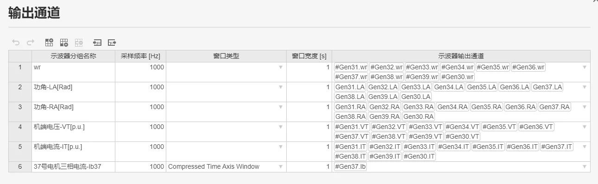
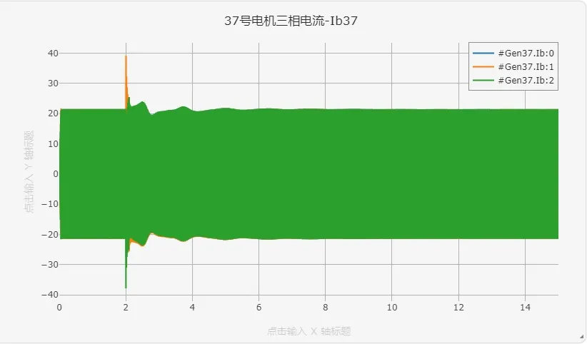

<!--
:::warning
1. 补充实时超时参数的说明和运行参数的说明，步长建议那里也调整一下。(7月底前完成)
2. 注意按照规范要求调整该文档。(优先级低)
:::
-->

本文档介绍如何配置电磁暂态仿真的计算方案，包括基础设置、高级设置和运行设置。

## 功能定义

在 **SimStudio 运行标签页**，新建或选择 **电磁暂态仿真** 方案栏下的任一计算方案，即可对选中的电磁暂态仿真方案进行配置。

## 功能说明

电磁暂态仿真方案配置栏包含**基础设置**、**高级设置**和**运行设置** 3 个常规模块。

+ 用户可通过配置 **基础设置** 和 **运行设置** 模块，完成基础仿真时长、积分步长、输出通道、断面启动和计算资源的配置。
  + 量测和输出通道配置方法 详见 [量测及输出系统](../30-meters-and-outputs/index.md) 帮助页。
  + 断面保存和断面启动设置方法 详见 [断面参数设置](../40-snapshot/index.md) 帮助页。
+ 如需使用 **并行加速**、**实时仿真**或**事件驱动**相关功能，则需额外配置 **高级设置** 模块。

<Tabs>
<TabItem value="set1" label="基本设置">
电磁暂态仿真基本设置的参数如下图所示：

| 参数名 | 含义 | 说明 |
| :--- | :--- | :--- | 
| 仿真类型 | 电磁暂态仿真的应用类型 | 可选择**离线仿真**、**实时仿真**或**组网仿真**，默认选择**离线仿真**, 实时仿真相关内容可查看 [电磁暂态实时仿真](../../80-emts-rt/index.md) 帮助文档。**组网仿真**与**实时仿真**依赖 CloudPSS 专有硬件，公网平台暂不支持。 | 
| 开始时间 | 电磁暂态仿真的开始时间 | 单位为秒(s)，默认为 0s，仿真任务将从该设定时间开始执行时域积分。在进行[断面启动](../40-snapshot/index.md)功能时该参数需要与断面参数进行配合选取。 |
| 结束时间 | 电磁暂态仿真的结束时间 | 单位为秒(s)，当仿真时间达到该值时仿真停止。 |
| 积分步长 | 仿真的积分步长 | 单位为秒(s)，默认为 0.00005s，即 50 微秒。积分步长越小，仿真越精确，但计算量越大，仿真耗时越大，需结合实际情况进行选取。 |
| 输出通道 | 电磁暂态仿真的曲线输出配置 | 配置在结果页面显示的输出曲线，包括配置分辨率（输出频率）、显示方法、通道选择等内容。更多详细内容可查看 [量测及输出系统](../30-meters-and-outputs/index.md) 帮助文档。 |
| 求解器设置 | 求解器设置选项 | 可选择**常规**和**开关/离散事件处理增强**，默认选择**常规**。对于包含由分立开关元件构成的电力电子拓扑，可选择**开关/离散事件处理增强**，准确判断单一步长内的同步开关事件。 |
| 节点编号优化 | 仿真拓扑解析时，节点编号方法选择 | 可选择**默认**和**稳定**，通常情况下选择**默认**。**默认**方法采用相对高效的节点编号策略，**稳定**的编号方法将在多次仿真期间提供相对固定的节点编号策略。 |
| 是否配置启动参数 | 启动参数的开关 | 仅适用于纯交流系统，默认关闭。开启后，可以额外配置**启动参数模块**，在启动参数模块中可启用**预启动流程**，其作用是将[同步发电机](../../110-component-library/10-basic/10-electrical/40-three-phase-ac-components/120-SyncGeneratorRouter/index.md#使用说明)等交流设备的初始化放入预启动流程中，使电磁暂态仿真可以直接给定潮流断面启动，更多启动参数说明可查看 [潮流结果写回及初始化](../../60-power-flow/30-initializing-from-power-flow-results/index.md) 帮助文档。但通常情况下，建议将该选项置为关闭，并将[同步电机启动方法](../../110-component-library/10-basic/10-electrical/40-three-phase-ac-components/120-SyncGeneratorRouter/index.md#使用说明)设置为电压源转电机选项。|
| 是否配置断面参数 | 配置断面参数的开关 | 默认关闭。开启后，电磁暂态仿真可以从给定断面开始仿真，详细说明可查看 [断面参数设置](../40-snapshot/index.md) 帮助文档。 |

:::warning
**求解器设置** - **开关/离散事件处理增强** 适用于含同步开关的开关拓扑电路（如电压源型变流器）。通过同步开关预判机制，求解器可在当前时步直接确定变流器元件的稳态开关状态，无需迭代计算，显著提升仿真效率[^同步开关]。以下为同步开关定义和 **开关/离散事件处理增强** 的使用建议：
- 同步开关：电路网络中某些开关的变化可能同时导致其他开关的状态发生变化（如下图，当开关管 $T_1$ 关断时，由于电感电流 $i_L$ 不可突变，二极管 $D_1$ 续流而同时导通）。 

- 使用建议：**求解器设置** - **常规** 无法判断同步开关事件，当电路存在同步开关时，建议启用 **开关/离散事件处理增强**。若电路无同步开关，可不启用。
:::

</TabItem>

<TabItem value="set2" label="高级设置">
电磁暂态仿真高级设置的参数如下图所示：

| 参数名 | 含义 | 说明 |
| :--- | :--- | :--- | 
| 计算选项 | 选择仿真计算加速方式 | 可选择**常规**、**分网并行**、 **CPU Turbo** 或 **CPU Super Turbo**，默认选择**常规**。**常规**即利用单个 CPU 核心完成全部计算；**分网并行**即对电网进行解耦，不同分区分配在多个 CPU 核心中完成计算，利用多核 CPU 加速仿真；**CPU Turbo** 即自动利用多核 CPU 完成计算，该选项会执行自动负载均衡策略；**CPU Super Turbo** 是在 CPU Turbo 的基础上优化计算流程，进一步提升计算效率。并行计算相关配置方法可参考 [电磁暂态仿真并行加速](../../70-parallel-acceleration/index.md) 帮助文档。 |
| 核心数 | 仿真使用的 CPU 核心数 | 计算选项选择**分网并行**、 **CPU Turbo** 或 **CPU Super Turbo** 时可设置，代表单次仿真所使用的 CPU 核心数，默认值为 1。 |
| 电气核心数 | 计算电气系统时使用的 CPU 核心数 | **控制系统与电气系统并行**开关开启时可设置，设置计算电气系统的 CPU 核心数, 如果**电气核心数** = **核心数**，代表控制系统与电气系统串行。 |
| 控制系统与电气系统并行 | 并行开关 | 默认关闭。若开启，则使能控制系统与电气系统的并行计算,从而提高仿真效率。需要注意的是，启用该功能后，每个仿真时步不再采用控制-电气串行的计算流程，即电气元件不再接收当前时步控制指令进行本时步计算，而是基于上个时步的控制指令计算。因此，启用该选项将带来一定误差，需谨慎使用。 |
| 配置负载均衡策略 | 手动负载均衡策略配置开关 | 默认关闭。若关闭，系统将采用自动负载均衡策略；若开启，需手动配置负载均衡策略表。关于负载均衡策略的生成与配置可详见[负载均衡功能](../../90-topology-analysis/index.md#负载均衡功能)。 |
| 是否输出分块信息 | 输出分块信息开关 | 默认开启。开启是否输出分块信息选项后可以输出电气节点统计、控制节点统计以及CPU分区表等信息。详见[并行计算高级参数设置](../../70-parallel-acceleration/20-advanced-param-setup/index.md#更多高级设置)。 |
| 负载均衡策略表 | 手动负载均衡配置表 | 在开启**配置负载均衡策略**选项后，可手动配置负载均衡策略表。使用该功能时，请先执行**交直流电网拓扑分析**，获取各个分区数据，并根据各个分区计算量和预估耗时，设计负载均衡策略，将分区编号对应填入“分区-核心”映射表。也可以在交直流电网拓扑分析结果页中写入负载均衡信息，将负载均衡策略表设置为拓扑分析后的默认值。更多详细说明可查看 [交直流拓扑分析](../../90-topology-analysis/index.md) 文档。 |
| 是否支持事件驱动 | 事件驱动开关 | 默认关闭。若开启，可在仿真过程中添加异步事件。更多事件驱动相关内容可参考 [事件驱动仿真](../../100-event-driven/index.md) 帮助文档。 |
| 只进行分网 | 分网选项 | 默认关闭。若开启，仿真则只进行初始化分网，不进行后续仿真。主要用于交直流拓扑分析。更多详细说明可查看 [交直流拓扑分析](../../90-topology-analysis/index.md) 帮助文档 |
| 使用清翼编译器 | 是否使用清翼编译器 | 该功能仅在部分私有化部署平台可用，公网平台暂不可用。默认关闭。启用该功能后，在运行电磁暂态仿真时将执行清翼编译器（Tsing-E）仿真内核，即先通过自动生成运行代码并编译为可执行文件，再执行编译化的电磁暂态仿真程序，可显著提升仿真效率。 |
| 是否支持安控策略 | 选择是否启用安控策略 | 启用后，将执行考虑安控策略的电磁暂态仿真程序，支持的模块包括[安控元件库](../../110-component-library/60-security-control-module/index.md)。具体使用案例可查看[安全稳定控制策略案例](../../../../../cases/10-emtlab/10-typical-cases/140-security-and-stability-control-strategies/10-ieee-39-ssc-demo/index.md) |
| 是否启用全局CDA | 选择是否在仿真过程中保持CDA算法 | 启用后，将在仿真的每个时步均采用[CDA算法](../10-fundamentals/index.md)，即半步长后向欧拉算法。 |
| 元件功率量测方法 | 选择三相交流元件的功率量测方法 | 用于切换三相交流功率的计算方法，可在**PLL**和**瞬时功率**选项中选择，默认选择**PLL**。当选择**PLL**时，通过采用锁相环分别获取电压、电流信号的瞬时相角，并采用 $ P = \lvert {\tilde V} \rvert\lvert {\tilde I} \rvert\cos \left( {{\theta _V} - {\theta _I}} \right),  Q = \lvert {\tilde V} \rvert\lvert {\tilde I} \rvert\sin \left( {{\theta _V} - {\theta _I}} \right) $ 的方式求解。当选择**瞬时功率**时，将采用赤木泰文的瞬时功率理论[^瞬时功率理论]求解交流功率。  |

</TabItem>

<TabItem value="set3" label="运行设置">
电磁暂态仿真运行设置的参数如下图所示：

| 参数名 | 含义 | 说明 |
| :--- | :--- | :--- | 
| 任务队列 | 任务运行使用的队列 | 默认设置为**默认队列**。如网内存在多台 CloudPSS 设备和多类设备，可自行选择相应的任务队列。 |
| 计算资源 | 任务运行使用的计算资源 | 默认设置为**1 逻辑核心**。此处的核心数应大于等于**高级设置**中的**核心数**。 |
| 优先级 | 任务运行的优先级 | 默认设置为 0。优先级仅在 **计算资源** 不足，任务需要排队等待时使用。任务等待时，由 **优先级** 和 **队列参数** 共同计算出该任务在队列中位置，此处的 **优先级** 设置越高，任务在队列中的位置越靠前。更多 **队列参数** 详见 [队列管理](../../../50-user-center/50-system-administrator-settings/20-queue-management/index.md#新建队列) 帮助页。|
| 调试参数 | 任务调试时使用的调试参数 | 默认为空，可用于输入额外的调试参数。 |
</TabItem>

<TabItem value="set4" label="实时仿真输出设置">
实时仿真输出设置仅在**仿真类型**选择**实时仿真**时才可配置，其参数如下图所示：

| 参数名 | 含义 | 说明 |
| :--- | :--- | :--- | 
| 模式 | 设置为**主模式**或**从模式** | 当选为**主模式**时，CloudPSS-RT 将会以设置的仿真积分步长为间隔，持续发送和接收数据，并且不会校验接收到的数据；当选为**从模式**时，CloudPSS-RT 将会以设置的仿真积分步长为间隔接收数据，并校验数据的同步帧，若同步帧匹配，则发送数据。具体参考[硬件在环仿真](../../80-emts-rt/10-hardware-in-the-loop/index.md#主从式同步机制) 文档。 |
| 数值型输出通道 | 配置数值型输出通道 | 实时仿真结果以数值的形式显示，可设置分组名称、刷新频率、小数位数，并选择待观测的输出通道。同一个分组中可选择多个输出通道，各通道的结果将形成一个表格并在结果页面显示。每一行视为一个分组，可添加多个分组。详情请参考[实时仿真信号监视器](../../../../software-tools/20-signal-monitor/index.md#数值型输出通道)文档。  |
| 曲线型输出通道 | 配置曲线型输出通道 | 实时仿真结果将以曲线的形式显示，可设置分组名称、窗口类型、窗口宽度，并选择待观测的输出通道。同一个分组中可选择多个输出通道。可添加多个分组。详情请参考[实时仿真信号监视器](../../../../software-tools/20-signal-monitor/index.md#曲线型输出通道)文档。  |
| 曲线型刷新间隔 | 配置曲线型刷新间隔 | 单位为秒 (s)，输入曲线型输出通道的刷新时间间隔，默认为 0.02s，即每 0.02s 刷新一帧，每一帧包含 0.02s 的数据。详情请参考[实时仿真信号监视器](../../../../software-tools/20-signal-monitor/index.md#曲线刷新间隔)文档。  |
| 曲线型缓存帧数 | 配置曲线型缓存帧数 | 曲线型输出通道的缓存帧数，默认为 200 帧。增加缓存帧数可以提升曲线刷新流畅度，但同时会增加缓存数据量。如遇页面卡顿，可减少曲线缓存帧数。建议低性能配置的用户终端使用默认或更少的曲线缓存帧数。详情请参考[实时仿真信号监视器](../../../../software-tools/20-signal-monitor/index.md#曲线缓存帧数)文档。  |
| 实时仿真超时时间 | 实时仿真超时设置 | 仿真类型为**实时仿真**，且实时仿真模式设置为**从模式**时可配置。假如超过**实时仿真超时时间**，数据交互的通信也没有成功建立，实时仿真任务将自动终止。更多实时仿真相关内容可查看 [电磁暂态实时仿真](../../80-emts-rt/index.md) 帮助文档。  |

</TabItem>

</Tabs>

## 案例
import Tabs from '@theme/Tabs';
import TabItem from '@theme/TabItem';

<Tabs>
<TabItem value="case1" label="IEEE 39 节点的基本参数设置">
本案例使用 IEEE 39 节点模板算例演示电磁暂态计算方案的基本设置。
- 在 SimStudio 工作台，点击新建电力系统仿真项目。

- 点击左上角的新建图标，选中 IEEE 标准系统，选择 10 机 39 节点标准测试系统，最后点击新建。

- 在**运行标签页**，新建电磁暂态仿真计算方案，选中并开始设置仿真方案：将结束时间设置为 15s，输出通道按照下图进行设置，计算选项为默认的常规选项，选择计算资源为 1 逻辑核心。

- 点击运行按钮，在结果页面可显示出电磁暂态的仿真结果。

</TabItem>
</Tabs>

## 常见问题

电磁暂态仿真的积分步长设置为多少较为合理？
:
    积分步长取决于所关注暂态过程的时间常数，比如受同步发电机主导的传统电力系统，时间常数一般在毫秒到秒的时间范围；以电力电子设备和新能源大规模接入的新能源系统时间常数范围为微秒级。一般情况下，若要获得准确、分辨率合理的仿真结果，仿真步长（积分步长）不应超过所模拟系统最小时间常数的 1/10。当然，积分步长越小，仿真精度越高，但所需仿真时间越长。

    以下为典型系统的仿真步长选择建议：
    + 纯交流系统：典型值 50μs，建议选择范围：10 - 100μs。
    + 直流输电系统（LCC或MMC型）：建议选择范围：10 - 50μs。
    + 电压源型变流器详细模型：一般在 10μs 以下，需要根据开关频率调整。
    + 电压源型变流器平均模型：典型值 50μs，建议选择范围：10 - 100μs。

电磁暂态仿真的开始时间设置不为 0 时，仿真结果不对？
:
    需要注意系统中[阶跃发生器](../../110-component-library/10-basic/20-control/80-control-signal-generators/80-_newStepGen/index.md)、[三相交流电压源](../../110-component-library/10-basic/10-electrical/40-three-phase-ac-components/90-_newACVoltageSource_3p/index.md)等元件采用的时间是当前的仿真时刻。
    
    例如，当设置电磁暂态仿真的开始时间为 2s，同时系统中[同步发电机](../../110-component-library/10-basic/10-electrical/40-three-phase-ac-components/120-SyncGeneratorRouter/index.md)采用电压源转电机的启动方法，设置了 0.06s 的爬坡时间（Ramping Time），且对应的S2M信号由[阶跃发生器](../../110-component-library/10-basic/20-control/80-control-signal-generators/80-_newStepGen/index.md)提供，设置为 1s 阶跃。那么当开始仿真后，系统将从2s开始计算，会跳过电压源的爬坡时间及电机的启动过程，造成仿真结果的不准确。
    
    因此，当设置电磁暂态仿真的开始时间设置不为 0 时，需要核对系统中各元件与时间相关的参数，确保各过程正确响应。

[^同步开关]:张芮,宋炎侃,于智同,等.基于同步开关预判的半桥型VSC快速电磁暂态建模方法[J].电力系统自动化,2021,45(20):148-156.
[^瞬时功率理论]:日 赤木泰文,巴西 Watanabe Edson Hirokazu,巴西 Aredes Mauricio.瞬时功率理论及其在电力调节中的应用[M].机械工业出版社,2009.
