本文档介绍 EMTLab 的**运行结果页**功能，包括运行快照、结果管理、日志信息查看及数据结果图形操作。

## 功能定义
在 **SimStudio 运行标签页**，点击左边栏顶部的**结果**标签可切换至**运行结果页**，**运行结果页**用于查看仿真任务的执行状态、日志信息和数据结果，并支持运行快照管理与结果导出。

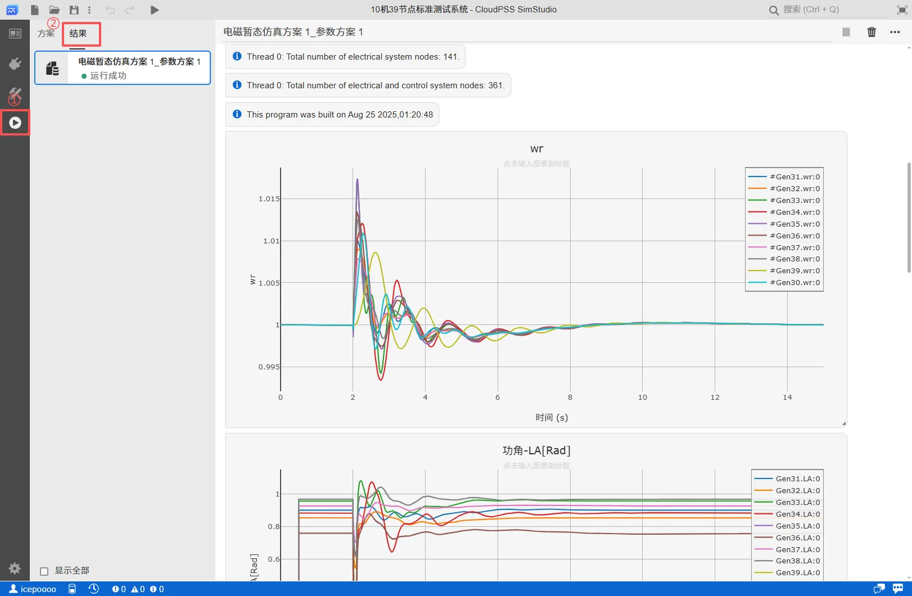

## 功能说明
**运行结果页**分为**结果管理栏**和**结果展示区**两个区域。

**结果管理栏**以列表的形式存储用户的每一次计算任务的结果，并显示每个任务的执行状态。用户可在**结果管理栏**选择不同计算任务，在右侧**结果展示区**浏览仿真结果。

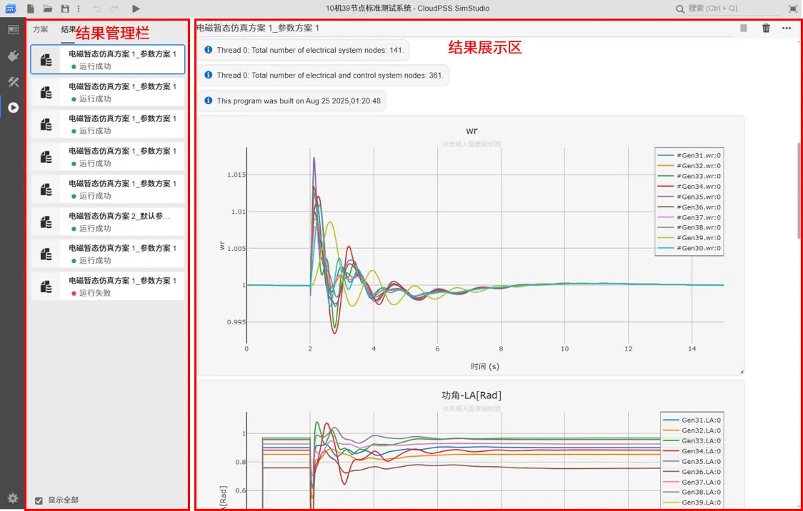

### 结果管理栏

#### 运行快照
在**结果管理栏**，右键选择待某一计算结果，在弹出菜单中选择**打开运行快照**，可以在新的窗口中打开对应结果的运行快照。

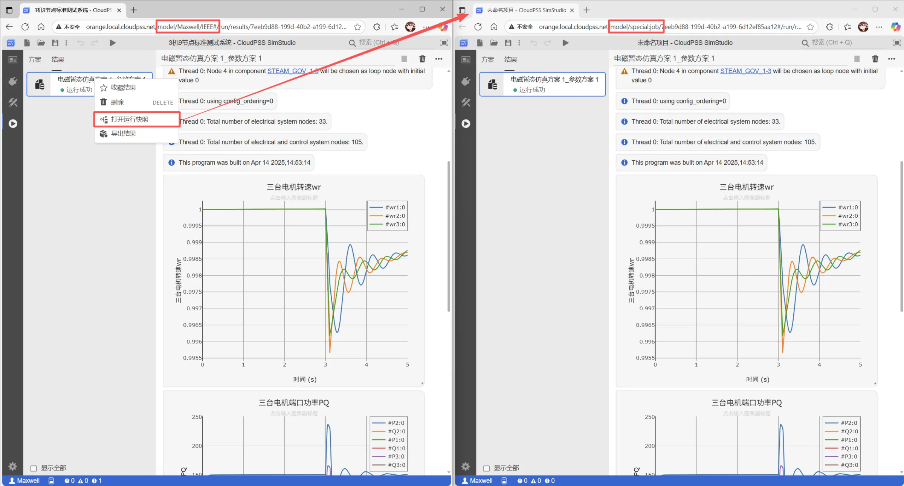

CloudPSS 平台具备快照机制，每次计算任务运行时，CloudPSS 会自动将当前计算任务的模型、参数方案和计算方案打包形成**快照**（**snapshot**）。用户可通过快照回溯历史仿真结果及其对应的算例拓扑和参数。

通过地址的格式，可快速辨识 SimStudio 的模型和任务快照。
SimStudio模型地址形式通常为`model/用户ID/XXXXXX`，而任务快照的地址形式统一为`model/special:job/XXXXXX`。在任务快照中，也可通过切换至其他标签页，查看对应该任务的拓扑参数和运行参数。

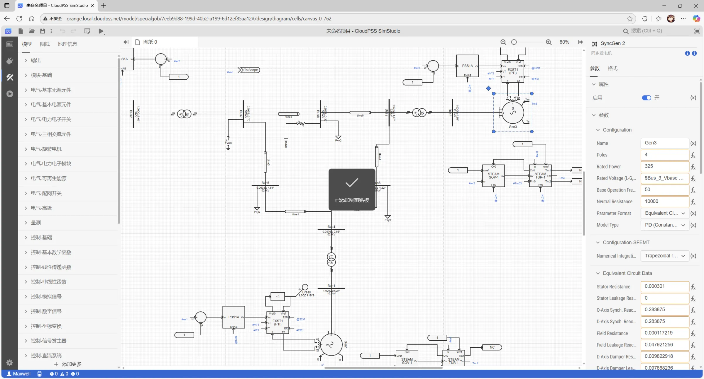

:::tip
CloudPSS 会**存储一段时间内全部计算任务及其运行结果**，并以运行快照的形式保存。

用户也可在**个人中心 - 设置 - 任务管理**处查看并管理当前用户执行过的全部计算任务快照。

详细介绍可查看 [任务管理](../../../50-user-center/40-general-account-settings/50-task-management/index.md) 帮助文档。
:::

#### 结果管理

import Tabs from '@theme/Tabs';
import TabItem from '@theme/TabItem';

<Tabs>
<TabItem value="manage1" label="导出与导入结果">

- **导出结果** 

   在**结果管理栏**，右键选择待导出的计算结果，在弹出菜单中选择**导出结果**，可将该仿真结果导出为 **cjob** 格式的文件。

   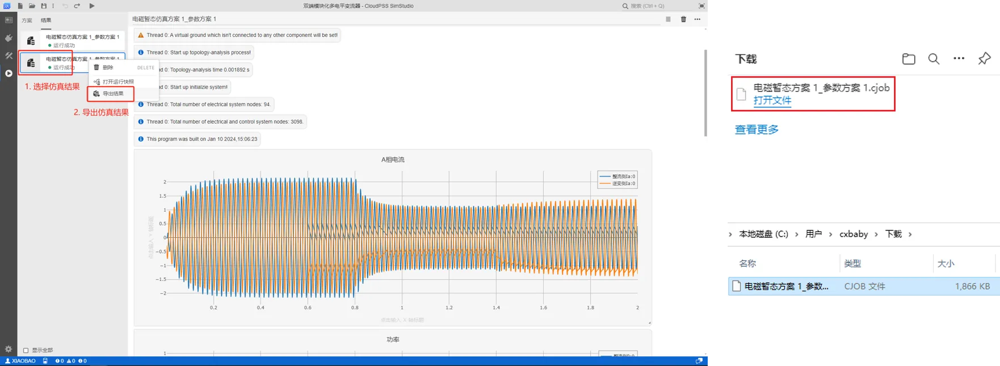

- **导入结果**  

   在**运行结果页**，通过**工具栏**-**搜索框**搜索**导入结果**，点击**导入结果**选项，或通过快捷键 **<kbd>Ctrl</kbd> + <kbd>I</kbd>** ，可导入 **cjob** 格式的结果文件。导入后的结果会显示在**结果管理栏**。

   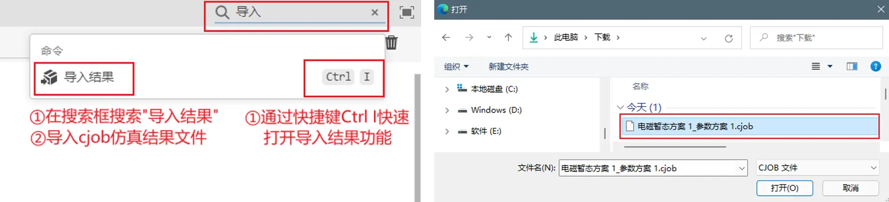

</TabItem>

<TabItem value="manage2" label="收藏结果">

在**结果管理栏**，右键选择待某一计算结果，在弹出菜单中选择**收藏结果**，收藏的结果会标记上收藏标识，在删除运行结果数据时，收藏的结果数据不会被删除。

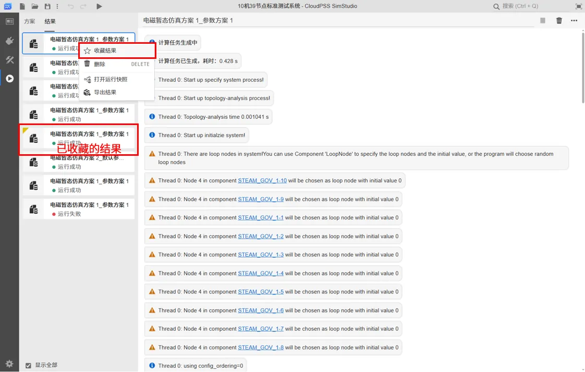

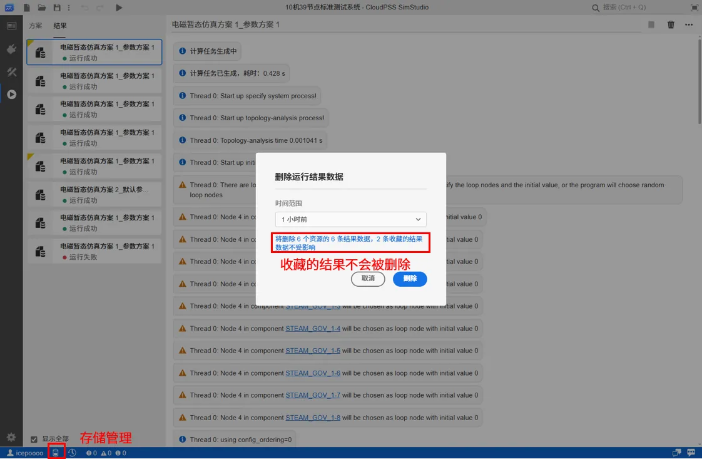

</TabItem>

<TabItem value="manage3" label="删除结果">

在**结果管理栏**，右键选择待删除的计算结果，在弹出菜单中选择**删除**可删除选中的计算结果。

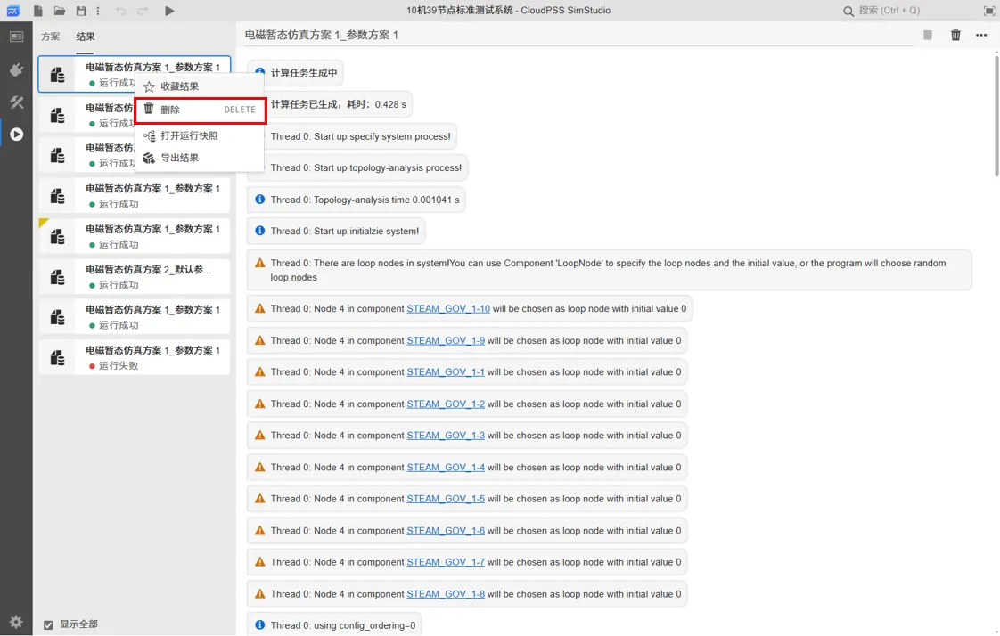

</TabItem>

<TabItem value="manage4" label="重命名结果">

在**结果管理栏**选择待重命名的计算结果，在**结果展示区**的顶端，可修改当前计算结果名称。

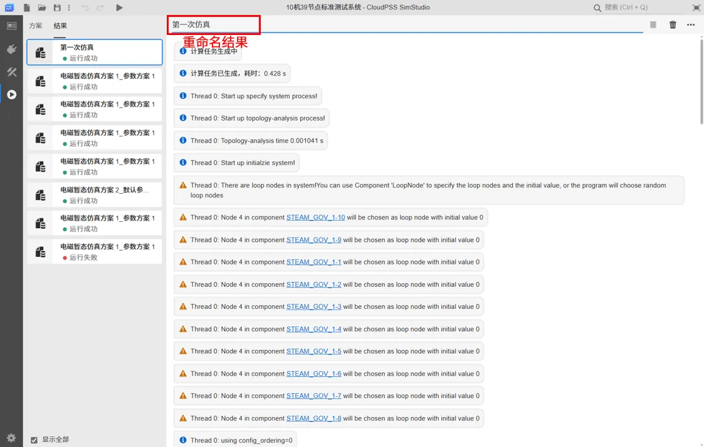

</TabItem>
</Tabs>

### 结果展示区

在**结果展示区**，会显示计算任务运行时产生的日志信息和曲线结果，具体的说明如下：

- **日志等级**  
   每条日志消息前的**图标**代表了日志的等级，不同的**图标**及其代表的日志等级如下图所示：

   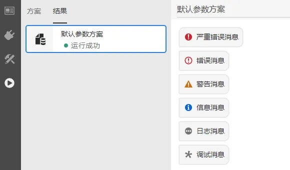

   :::tip 
   其中，日志消息和调试消息的详细信息需要**点击消息前面的图标**显示。
   :::

- **算例节点信息**  
   日志中会显示出当前计算任务的控制节点与电气节点数量，如下图所示。需要说明的是，统计的电气节点为单相电气节点。

   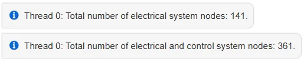

   

- **内核版本**  
   日志中会显示出当前 EMTLab 的内核编译时间，如下图：

   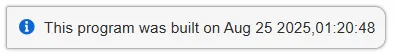

- **日志时间戳**  
   鼠标悬浮于某条日志上时，在右下角可显示出浏览器接收到该日志的时间戳。

   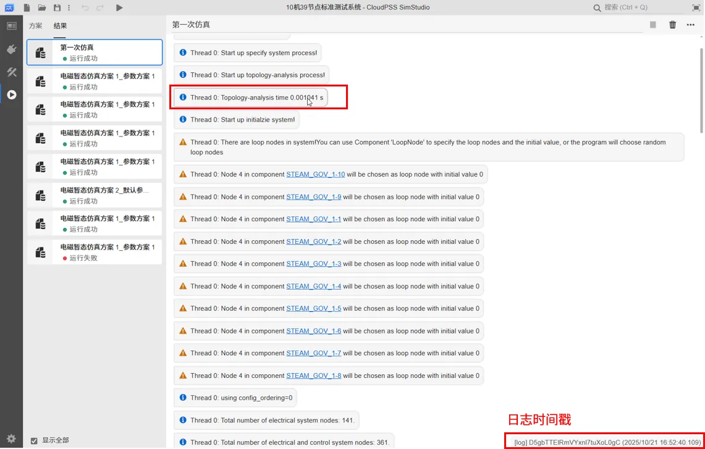

- **数据结果图形操作**  
   结果曲线支持缩放、平移、重命名坐标轴名称、重命名标题名称、波形数据下载、波形图像下载、在 **Chart Studio** 中编辑等操作。详细说明可查看 [仿真结果编辑](../30-meters-and-outputs/index.md#仿真结果编辑)。
   
   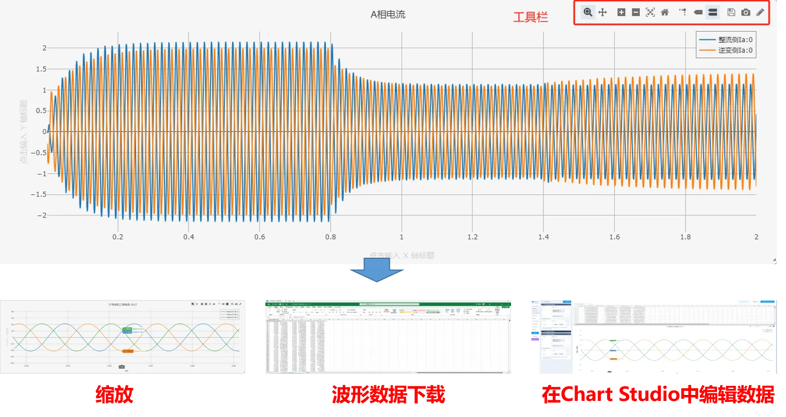

   

## 常见问题

不小心关闭了浏览器，如何找回计算中的任务

: 
   点击**个人中心-设置-任务管理**，进入**任务管理**页面，此页面以表格的形式列出所有历史运行的算例任务。可根据任务状态与任务创建时间找到不小心关闭的任务。点击列表操作里的**跳转**图标，进入该任务。

   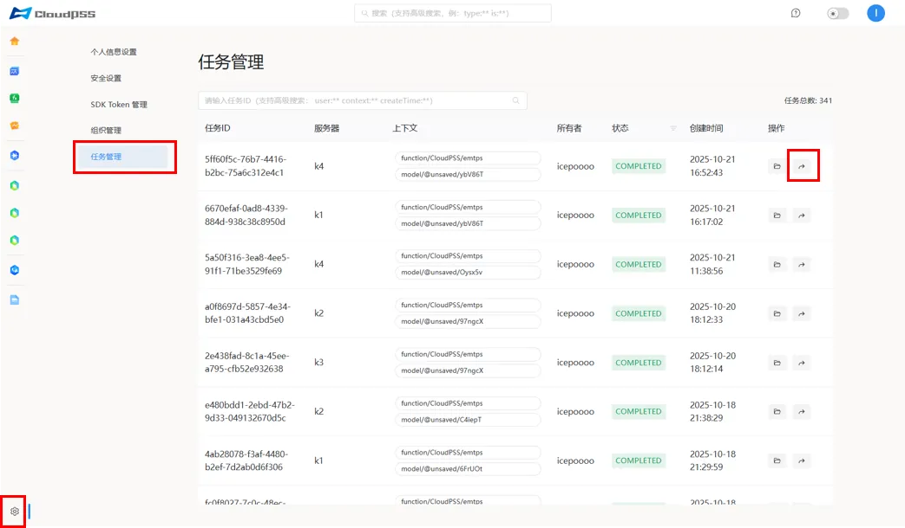

常见的报错信息排查

: 
    - KLU 错误，报错如下图:

         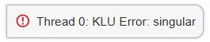  
      
      修改思路：检查电气部分的接地是否正确，将悬空的节点接地，比如下图：

         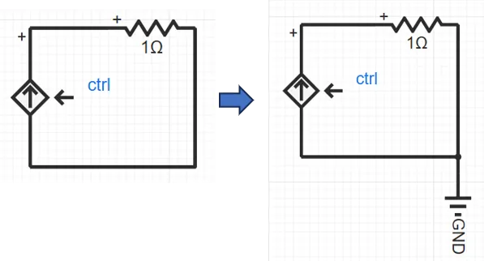
   
    - 异常值错误，报错如下图:

         
      
      修改思路：检查设备元件的参数的设置，修改不合理的参数设置，比如下图的直流线路电感参数为 0，需将其修改为大于 0 的值：

         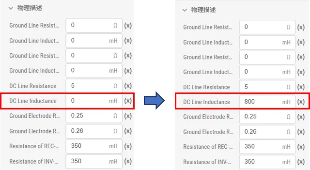