<!--
:::warning
1. 这篇文档问题很大！前面介绍信号类型的部分不通顺，介绍控制量量测时，为何还要介绍虚拟输入？？？？？这有关系么 (7月底前完成)
2. 虚拟输出引脚的描述要修改。现在不需要#号了。（7月底前完成）
3. 多维信号量测不要放在FAQ部分，放在前面重点介绍。（7月底前完成）
4. 这篇文档的逻辑重新组织一下：
   1. 第一部分 - 信号量测：先介绍信号的种类，再介绍不同种类的量测方法；介绍输出通道元件，强调一下信号维度、信号名称两个概念。告知用户如何辨识量测出来的信号维度是多少？如何提取多维信号中的一路或几路？（直接引用挑战跳转多路信号合并、多路信号分离两个元件的用法）（7月底前完成）
   2. 第二部分 - 配置示波器输出通道：介绍输出通道配置方法，包括示波器分组、采样频率、窗口类型、窗口宽度、示波器输出通道几个概念的介绍和配置方法。
   3. 第三部分 - 仿真结果编辑：包括对示波器窗口的各类操作、结果保存等操作。
   4. 在示波器输出通道那里备注好：该功能仅在离线仿真中生效。实时仿真的通道配置参考XXX页面。
5. 注意按照规范要求调整该文档。(优先级低)
:::
-->

本文档介绍 EMTLab 的量测和输出系统，包括信号量测、配置示波器输出通道和仿真结果编辑。

## 功能说明
在 EMTLab 的量测和输出系统中，一个信号从量测到输出要经过信号量测、信号接入输出通道和输出通道接入示波器 3 个环节。下文将详细介绍这 3 个环节的具体操作方法。

### 信号量测
信号量测的本质是给待量测的信号赋予一个**引脚标签**。EMTLab 中的信号类型分为**电气量**和**控制量**两类，**电气量**包括电流、电压、功率、电气元件的内部量等，**控制量**为控制元件的输入量、输出量和控制元件内部量等。下面分别介绍**电气量**和**控制量**的量测方法。 

#### 电气量量测方法
对于电气量的量测主要有三种方法：
- 使用量测元件（如电压表、电流表、功率表等）进行量测。以电压表为例，将电压表连接至电路，在电压表的 `Name for Voltage Signal [kV]` 参数框中填写量测的电压信号的名称，如下图所示。

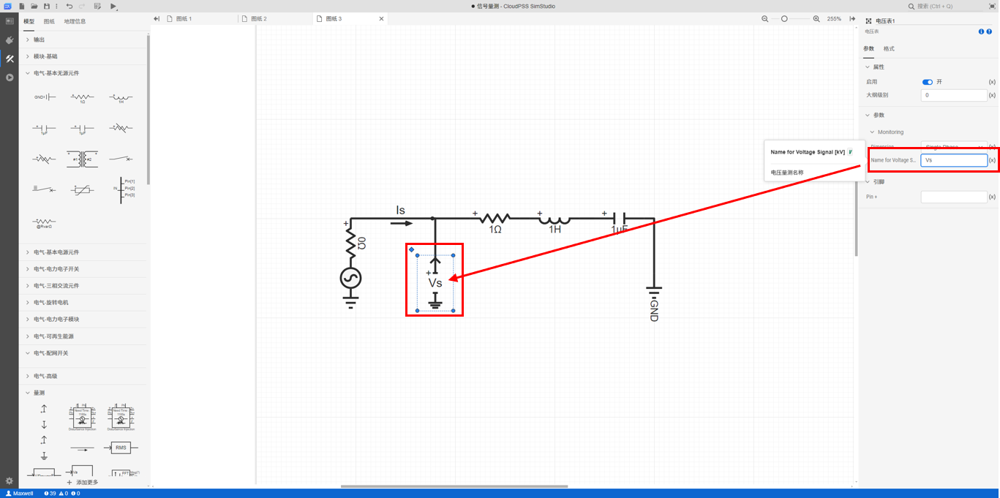

- 使用电气元件的**虚拟输出引脚**获取量测信号，即在 `Monitoring` 参数组下的参数框中填写量测信号名称。以电阻为例，在电阻的 `Monitoring` 参数组下填写量测信号名称，如下图所示。

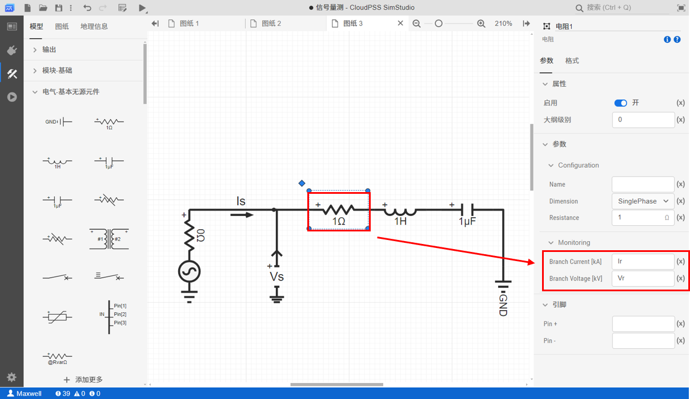

- 对于电气元件的**电气引脚**，可以直接量测其电压信号（单位为 V），但这种量测方法很容易导致单位错误，因此 CloudPSS 不推荐使用。

#### 控制量量测方法
控制量的量测与电气量基本相同，主要有两种量测方法：
- 对于控制元件，可以直接量测**控制输入引脚**和**控制输出引脚**的信号。以积分器为例，可在积分器的**引脚**参数组下的参数框中填写**引脚标签**，如下图所示。

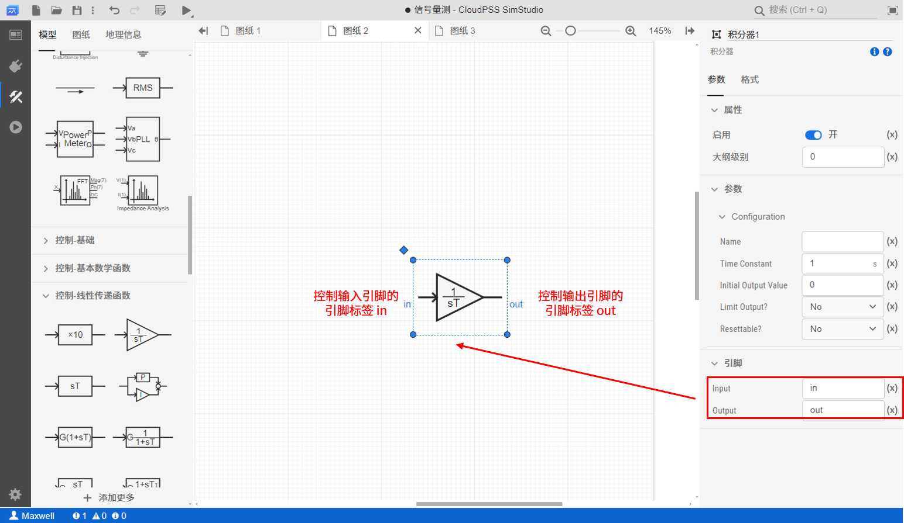

- 使用控制元件的**虚拟输出引脚**获取量测信号，即在 `Monitoring` 参数组下的参数框中填写量测信号名称。以锁相振荡器为例，在锁相振荡器的 `Monitoring` 参数组下填写量测信号名称,如下图所示。

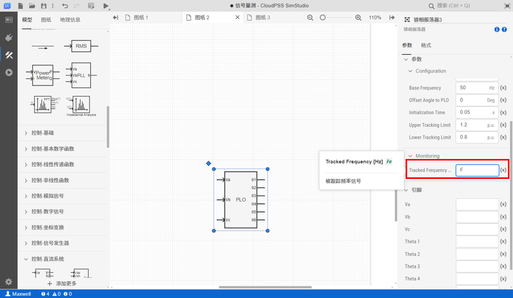

:::info 虚拟引脚相关说明
SimStudio v4.3 之前的版本，**虚拟输出引脚**的信号标签必须是以 `#` 标签开头的字符串，如 `#I_R`、`#Ps` 等。**v4.3及之后的版本移除了上述限制，虚拟引脚与一般引脚的用法一致**。

用户使用前，请先点击 SimStudio 左侧标签栏最下方的 **设置** 按钮，点击 **关于** 选项查看当前的版本号，并参考对应版本的命名标准。
:::

#### 输出通道
通过上述信号量测方法获取到量测信号后，需要将量测信号接入**输出通道**元件。**输出通道**元件可理解为示波器的探头，所有量测信号都需要通过探头连接到示波器。**输出通道**元件需要填写的参数有 `Channel Name` 和 `Dim. of Input Signal`。 `Channel Name` 为信号名称，是对接入**输出通道**的量测信号进行命名。 `Dim. of Input Signal` 为量测信号的信号维数，比如阶跃信号发生器的输出为 1 维信号，三相交流电压源元件 `Monitoring` 参数组中的 `3 Phase Source Votage Vector` 所对应的信号为 3 维信号。更多元件的信号维数信息可在 [EMTLab 元件库](../../110-component-library/index.md) 帮助文档查看。

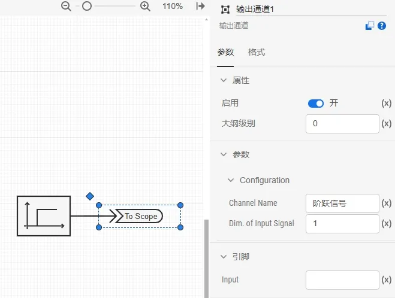

如果用户需要量测多维信号中某一维的信号，比如三相电压中的 A 相电压，则可利用**多路信号分离**元件进行信号分离。同理，如果要将多路信号合并为多维信号进行量测，则可利用**多路信号合并**元件进行信号合并。更多信号分离与信号合并相关内容可查看 [多路信号分离](../../110-component-library/10-basic/20-control/10-control-basic/10-_ChannelDeMerge/index.md) 和  [多路信号合并](../../110-component-library/10-basic/20-control/10-control-basic/20-_ChannelMerge/index.md) 帮助文档。

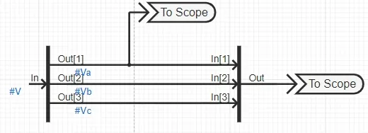

### 配置示波器输出通道
完成上述的操作后，需要将**输出通道**接入示波器，即在计算方案中配置示波器输出通道。具体操作如下：  
- 在**运行**标签页下，选中电磁暂态仿真方案。
- 点击**基本设置 - 输出通道 - 编辑数据**选项，可弹出**输出通道**的可编辑表格。
  
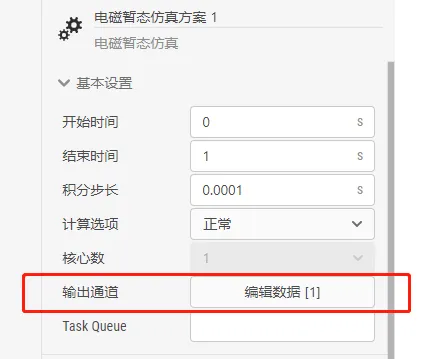

- 在该表格中插入 / 删除行，等同于添加 / 删除示波器窗口。
- 填写**示波器分组名称**、**采样频率**、**窗口宽度**，选择**窗口类型**和**示波器输出通道**。

示波器输出通道的相关设置参数说明如下表。

| 名称 | 说明 |
| :--- | :--- | 
| 示波器分组名称 | 代表了示波器窗口的名称；在结果页面，该名称在示波器窗口的图表标题进行显示 |
| 采样频率 [Hz] | 示波器的采样频率，采样频率越高，单位时间的采样点越多；采样频率最大不超过 1 / 仿真积分步长 |
| 窗口类型 | 示波器窗口类型，可选择 `Compressed Time Axis Window`、 `Global Time Axis Window`、 `Moving Time Axis Window` 和 `Oscilloscope Time Axis Window` 四种类型，每种类型的具体说明可见 [示波器窗口类型](./index.md#示波器窗口类型) |
| 窗口宽度 [s] | 窗口类型为 `Moving Time Axis Window` 或 `Oscilloscope Time Axis Window` 时的时间坐标轴范围 |
| 示波器输出通道 | 选择需要在示波器窗口显示的**输出通道**信号名称 |

#### 示波器窗口类型
EMTLab 提供了四种示波器窗口类型，用户可选择每个示波器的显示模式，如下图所示。

一共有四种模式可选，其含义分别如下：

1. `Compressed Time Axis Window`：默认模式，时间坐标轴最大值随仿真时间变化，最小值为仿真开始时间不变，如下图所示。

2. `Global Time Axis Window`：时间坐标轴最大值为仿真结束时间不变，最小值为仿真开始时间不变，如下图所示。

3. `Moving Time Axis Window`：时间坐标轴最大值随仿真时间变化，时间坐标轴范围为参数 `Window Width` 指示的值，如下图所示。

4. `Oscilloscope Time Axis Window`：与示波器显示模式相近，仿真窗口时间轴范围为 `Window Width` 指示的值，如下图所示。

#### 示波器子图
EMTLab 提供了示波器子图功能，**示波器分组名称**按照**同名分组:序号**的格式进行填写（例如wr:1和wr:2），可将多个示波器分组在同一个示波器窗口中显示，如下图所示：

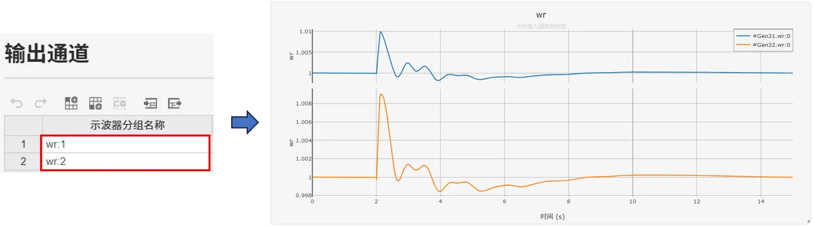

:::info 示波器输出通道配置相关说明
**电磁暂态仿真方案 - 基本设置 - 输出通道**的相关配置仅在仿真类型为**离线仿真**时生效，仿真类型为**实时仿真**时，输出通道配置参考 [实时仿真](../../80-emts-rt/index.md) 帮助文档。
:::

### 仿真结果编辑
运行电磁暂态仿真后，用户可以在**运行标签页**的**结果**处查看到各示波器窗口的结果。示波器窗口的上侧为图表标题，左侧和下侧分别为图表的 x 轴标题和 y 轴标题，右侧为图例。

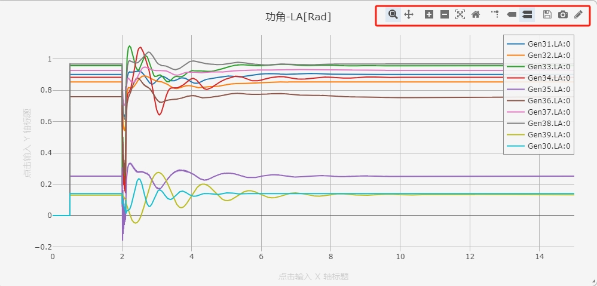

鼠标放在示波器窗口上时，可在右上角显示示波器窗口的操作按钮，具体说明如下表。

| 操作按钮名 | 说明 |
| :--- | :--- | 
| 缩放 | 鼠标框选缩放波形 |
| 平移 | 鼠标拖动波形平移 |
| 放大 | 放大当前图形 |
| 缩小| 缩小当前图形 |
| 自动缩放 | 显示默认大小波形 |
| 重置轴 | 重置 `X/Y` 轴 |
| 悬停时比较数据 | 鼠标悬停显示 X, Y 轴对应辅助线 |
| 悬停时显示最近的数据 | 鼠标悬停显示最近数据 |
| 下载图表为 CSV 格式 | 将当前输出窗口中所有通道数据导出到 `.CSV` 文件中 |
| 下载图表为 PNG 格式 | 将当前输出窗口图形保存为 `.png` 文件 |
| 在 `chart studio` 中编辑 | 在 `chart studio` 中编辑当前输出窗口的图表 |

如需保存示波器窗口内的信号数据，可点击**下载图表为 CSV 格式**，导出的 CSV 数据格式如下，第一列为图表的 x 轴，即仿真时间，第二列为图表的 y 轴，即该仿真时间点的信号值。

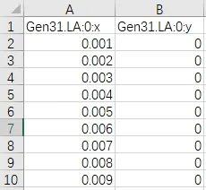

:::info 输出通道及其配置相关说明

SimStudio v4.3 之后,新增了**X-Y输出通道**，支持用户自定义X轴、Y轴数据，详情见
[X-Y输出通道](docs/documents/software/20-emtlab/110-component-library/10-basic/40-output/10-output/20-XYChannel/index.md)。

:::

## 案例
import Tabs from '@theme/Tabs';
import TabItem from '@theme/TabItem';

<Tabs>
<TabItem value="case1" label="3 机 9 节点算例的量测和输出系统设置">
本案例使用 IEEE 9 节点模板算例，演示量测方法以及输出系统的设置与使用。

- 在 SimStudio 工作台，点击新建电力系统仿真项目。  

- 点击左上角的新建图标，选中 IEEE 标准系统，选择 3 机 9 节点标准测试系统，点击新建。
  

- 模板中使用了两种量测方法，分别是通过量测元件（电压表）获取量测信号，和通过元件的**虚拟输出引脚**获取量测信号。

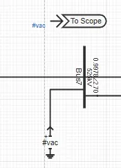

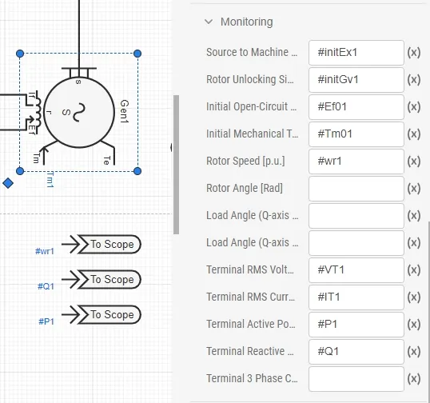 

- 在**实现标签页**，拖拽**输出通道**元件，将维数设置为 3 维，将**输出通道**与 1 号母线相连，测量1号母线电压信号。

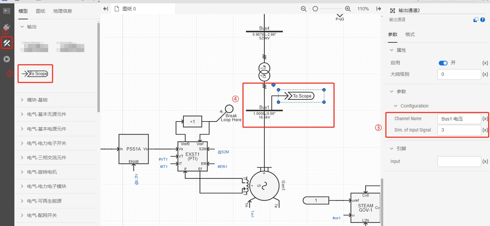

- 在**运行**标签页，配置示波器输出通道，将新增加的**输出通道**添加到示波器窗口。

 

- 点击仿真按钮，在结果界面，可以查看到 1 号母线三相电压，选中 3 秒附近区域，可查看接地故障时 1 号母线三相电压波形。

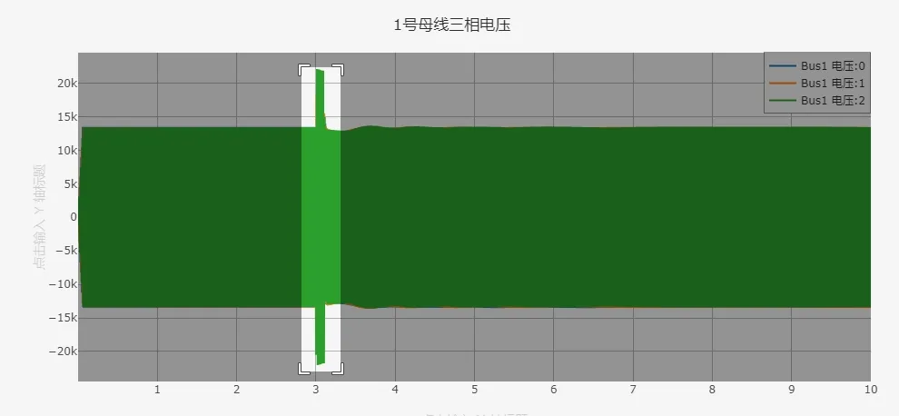

 

</TabItem>
</Tabs>

## 常见问题
假如有两个相似的算例，并且量测的信号相同，如何快速配置示波器输出通道。

:
  用户可以在一个算例配置好示波器输出通道后，使用输出通道配置的导出功能，将输出通道配置导出为 CSV 格式，然后在另一个算例中导入该 CSV 文件，即可快速配置好示波器输出通道。

  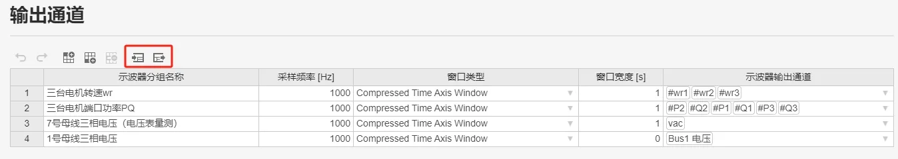

