<!--
:::warning
1. 断面功能介绍的太简单，很多东西没讲清楚，比如，断面名称是否可重复？重复保存后会有什么效果？断面是否可删除？断面功能的使用限制，在哪些功能下可用？实时仿真可用么？联合仿真可用么？保存断面后，添加了故障元件，是否还能用？有什么使用技巧？ (7月底前完成)
2. 不要改变专有名词的说法。比如，simstudio中写的是存储断面和载入断面。因此文档就不要使用保存、导入等词。要与工作台保持一致。我目前已经改完了功能说明的第一段。继续把后续的内容改完。
3. SDK 的部分移到 SDK文档里，这里只保留跳转链接。 (7月底前完成)
4. 注意按照规范要求调整该文档。(优先级低)
:::
-->

本文档介绍 EMTLab 电磁暂态仿真过程中存储断面和载入断面的设置方法，并使用模板算例进行演示。

## 功能定义
EMTLab 的电磁暂态仿真内核提供存储断面和载入断面的功能。针对初始化过程漫长的复杂算例，用户可选择预先存储一个或多个稳态断面，后续仿真中可直接选择从对应的断面直接启动。

## 功能说明
在 **运行标签页 - 电磁暂态仿真方案 - 基本设置** 处开启 **是否配置断面参数**，可显示 **断面参数设置选项卡**。断面配置功能包括**存储断面**和**载入断面**两部分。

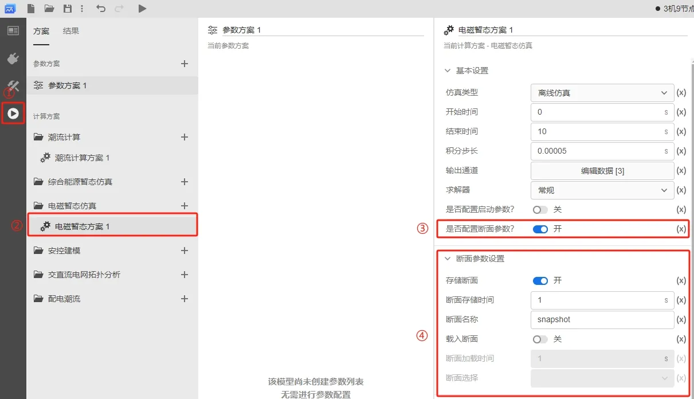

### 存储断面
开启**断面参数设置**下的**存储断面**，填写**断面存储时间**和**断面名称**。

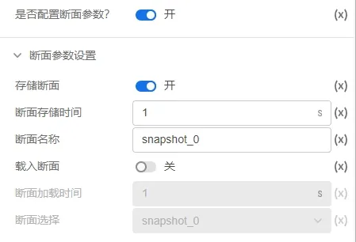

需要说明的是，**断面名称**用于命名某个电磁暂态任务的断面，并不是唯一标识。换句话说，**断面名称**可以重复。存储的断面由**任务 ID** 和系统时间共同确定一个 hash 值，该值才是断面的唯一标识。如下图所示，在存储断面后，可在**断面选择**框选择断面，查看已存储断面的信息，点击表达式可查看该断面的 hash 值。

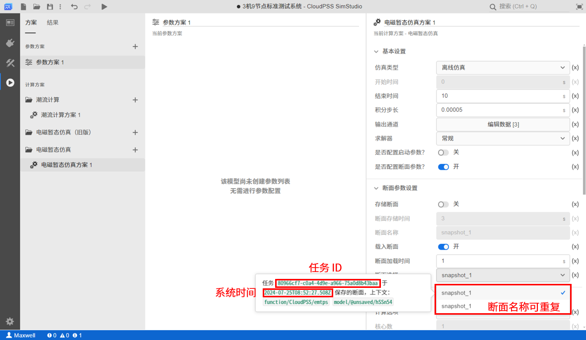

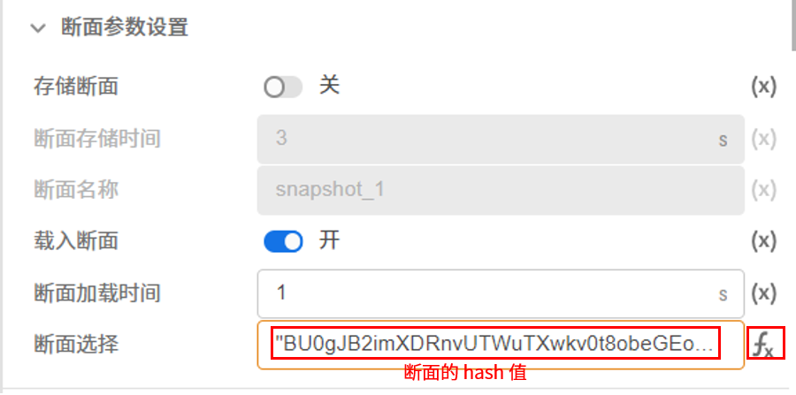

运行电磁暂态仿真后，在结果页面点击**断面信息**选项框下的**修改项目文件**按钮，弹出的确认框中点击**应用**，将断面信息进行存储。

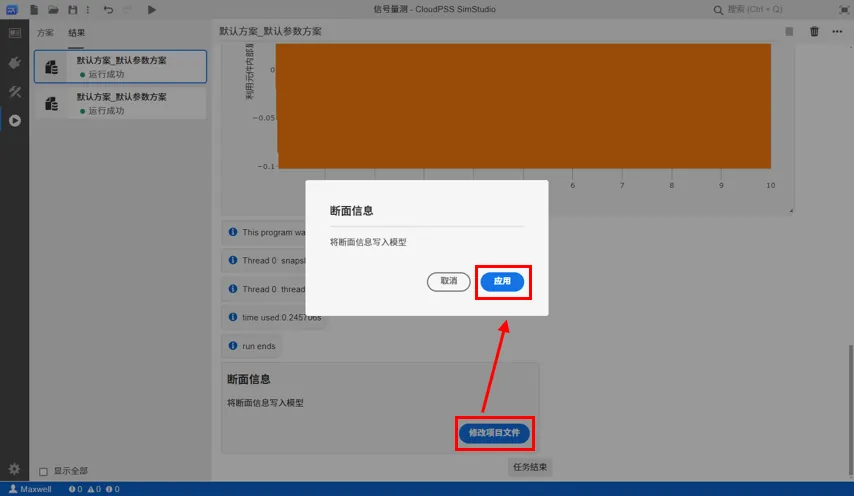

### 载入断面
开启**断面参数设置**下的**载入断面**，在**断面选择**框中选择断面，选择断面后会自动生成**断面载入时间**，并将**基本设置 - 开始时间**自动设置为**断面载入时间**。

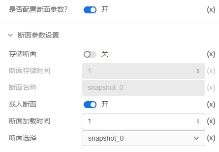

点击**启动任务**按钮，在结果页面可以看到断面加载成功的信息，仿真从**断面加载时间**开始启动。

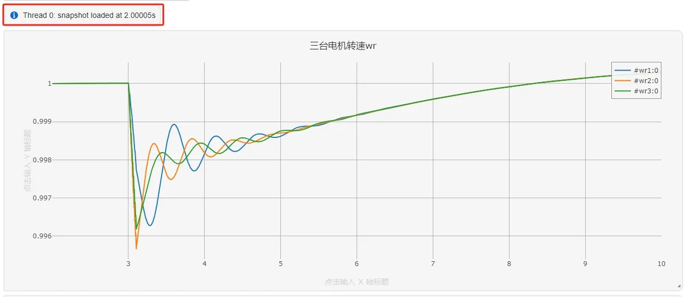

:::info 断面功能的相关说明
- **存储断面**和**载入断面**的相关配置仅在仿真类型为**离线仿真**时生效，仿真类型为**实时仿真**和**组网仿真**时无法开启 **是否配置断面参数**。
- 暂不支持断面删除功能。
- 启用**载入断面**进行仿真时，要求现有的算例拓扑和选择载入断面的拓扑一致，即不能在所选的断面基础上新增 / 删除元件，否则会导致仿真错误或者仿真失败。
:::

## 案例
import Tabs from '@theme/Tabs';
import TabItem from '@theme/TabItem';

<Tabs>
<TabItem value="case1" label="3 机 9 节点算例从给定断面开始仿真">
本案例使用 IEEE 9 节点模板算例，介绍断面参数设置并演示从给定断面开始仿真。

- 在SimStudio 工作台，点击新建电力系统仿真项目。  

- 点击左上角的新建图标，选中 IEEE 标准系统，选择 3 机 9 节点标准测试系统，最后点击新建。
  
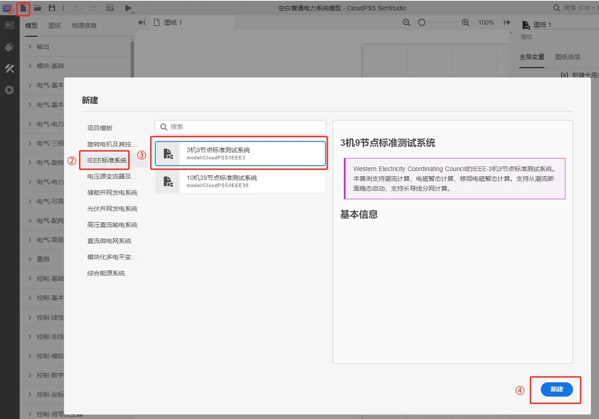

- 在**运行标签页**，新建电磁暂态仿真计算方案，选中并开始设置仿真方案：开启**是否配置断面参数**和**存储断面**，填写断面存储时间为 2s，填写断面名称为 snapshot_1。

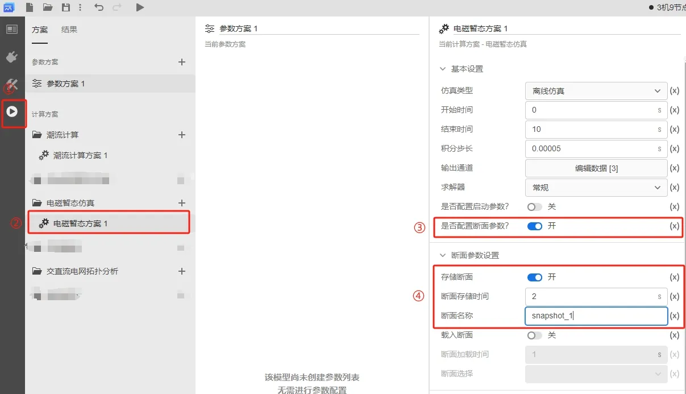

- 点击**启动任务**按钮，在结果页面可以看到**断面信息**的提示框，点击**修改项目文件**，在弹出的确认框中点击**应用**。需要说明的是，如果遗漏了应用断面信息的步骤，开启**载入断面**后，会无法在断面选择中找到存储的断面。

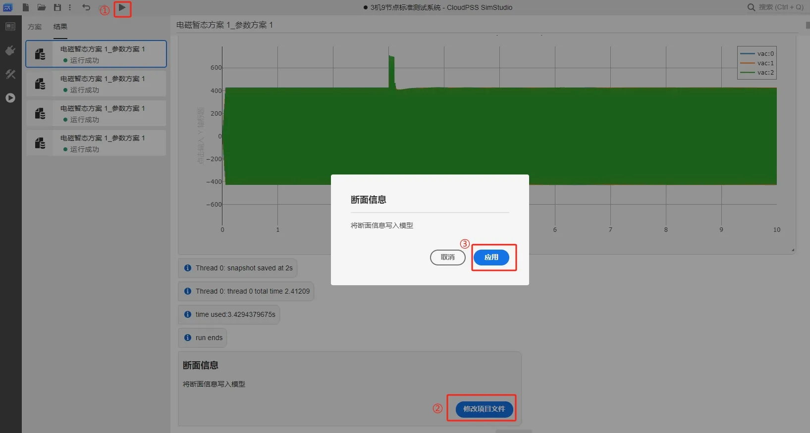

- 回到**方案**页面，关闭**存储断面**并开启**载入断面**，填写断面加载时间为 2s，断面选择为 snapshot_1。

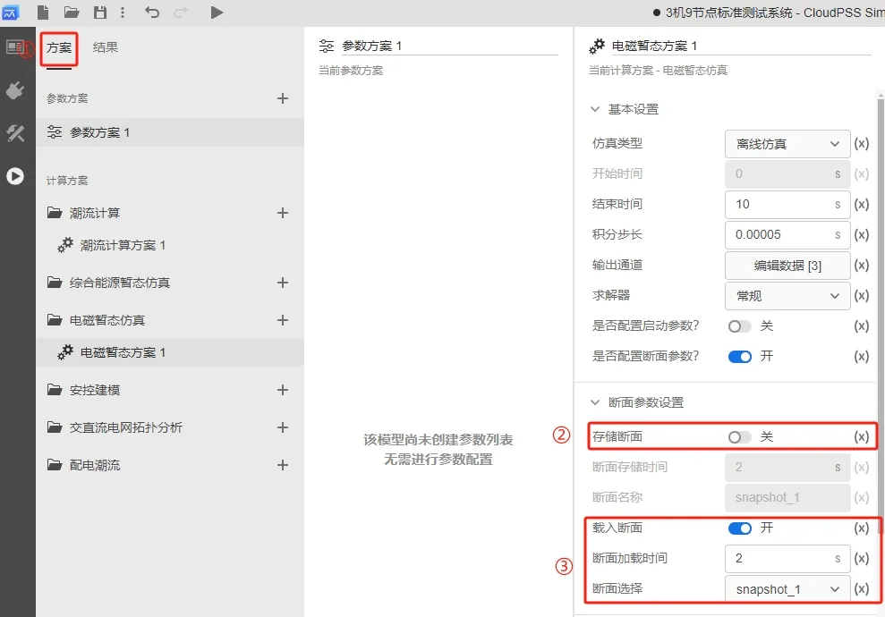

- 点击**启动任务**按钮，在结果页面可以看到断面加载成功的信息，仿真从断面加载时间开始启动。

</TabItem>
</Tabs>

## 常见问题
断面功能有什么常见的使用技巧

: 
    - 对于初始化过程漫长的复杂算例（包含直流输电、风力发电机组、光伏电站、储能系统和同步发电机），可以在系统启动到稳态后存储断面，后续仿真通过载入断面直接从稳态断面开始启动。
    - 研究不同故障类型和故障位置对系统稳定性影响时，可在算例的不同位置添加三相故障电阻，先将三相故障电阻的 `Fault Start Time` 和 `Fault End Time` 设置为 9999；在系统启动到稳态后存储断面，修改某个或多个三相故障电阻的参数后，载入断面直接从稳态断面开始启动，将仿真聚焦于故障暂态过程。
    - 类似的，研究控制保护逻辑和参数变化对系统影响时，可预先在稳态存储断面，修改控制参数后载入断面进行仿真。

存储断面后，哪些元件的参数修改在载入断面时可以生效

:
   - 对于**控制元件**，修改元件参数，断面启动时使用的控制元件参数为修改后的参数。  
   - 对于**电气元件**，假如元件参数的类型为**实数**、**整数**或**文本**，例如电阻的阻值，变压器额定容量，这些参数在算例初始化时已经固定，所以修改这些参数在载入断面时不会生效；假如元件参数的类型为**选择**、**多选**或**虚拟引脚**，例如三相故障电阻的故障类型，可变电阻的阻值，这些参数在仿真的每个时步都需要进行判断或者更新，所以修改这些参数载入断面时可以生效。更多电气元件的参数类型可以查看  [EMTLab 元件库](../../110-component-library/index.md) 帮助文档。

如何使用 EMTLab SDK 实现断面启动功能

:
  详细信息可查看 [存储断面和载入断面](../../../80-sdk-python/40-emtlab-sdk/20-advanced/50-advanced-case5/index.md) 帮助文档。