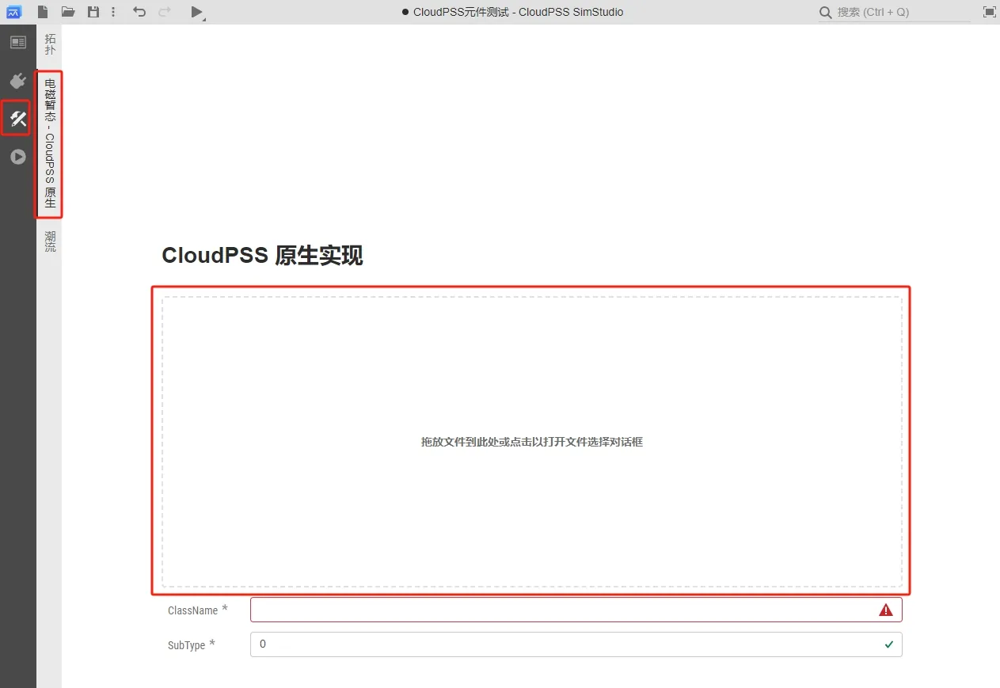
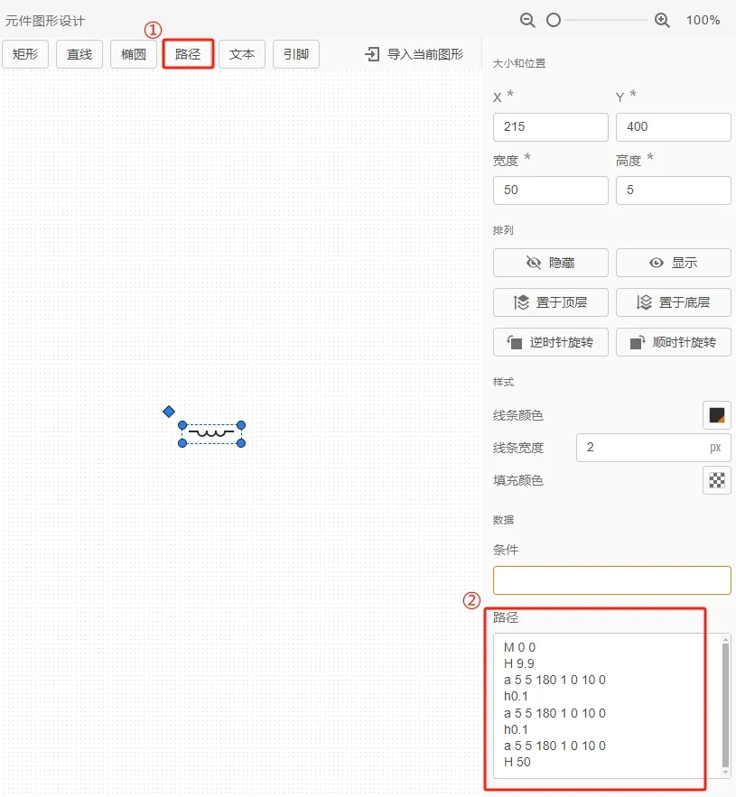
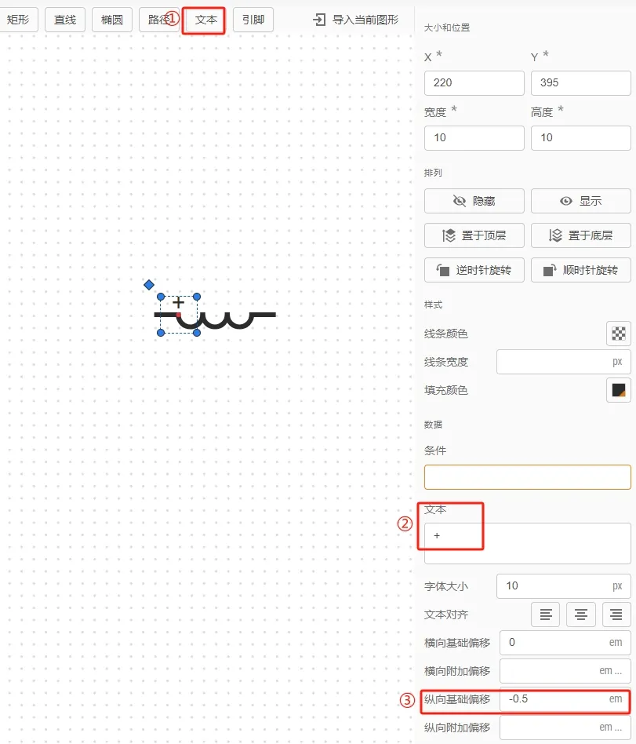
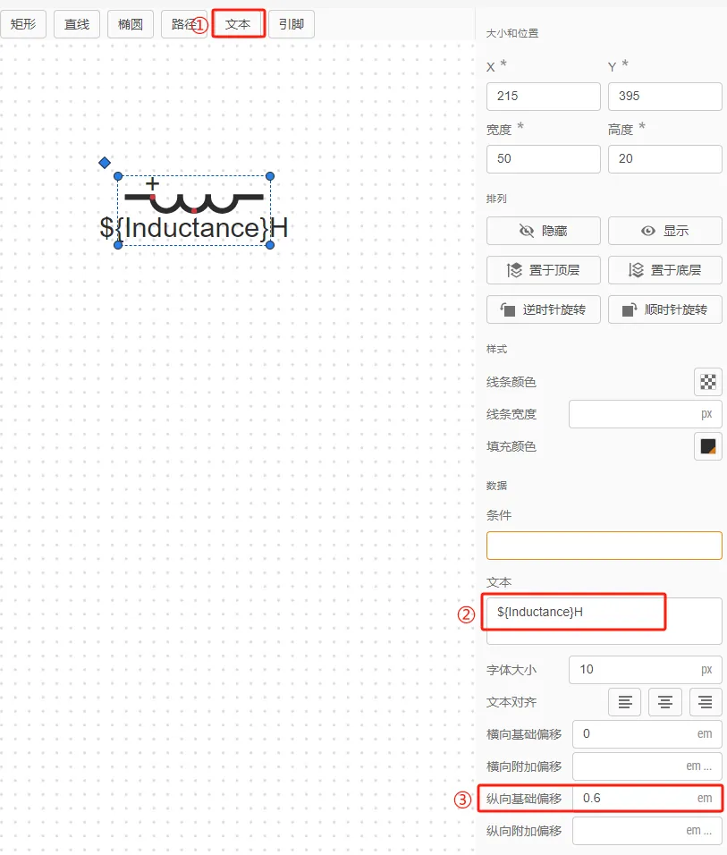
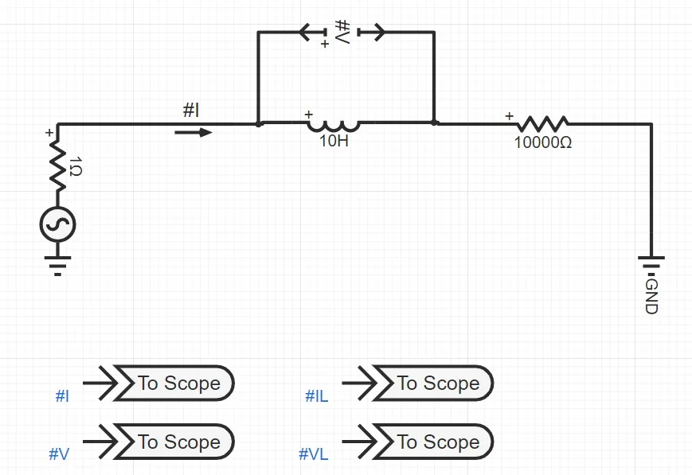
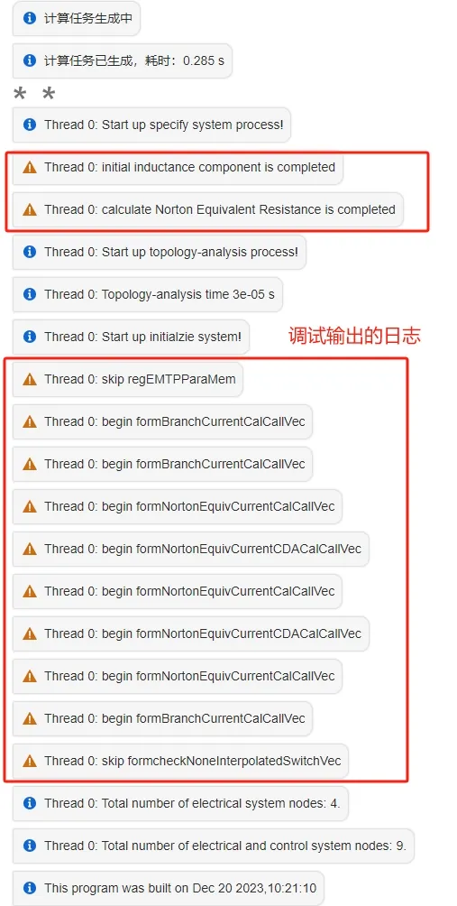
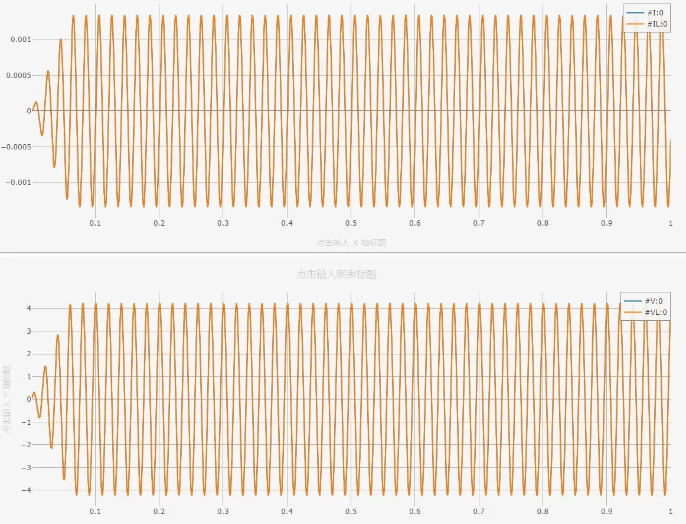
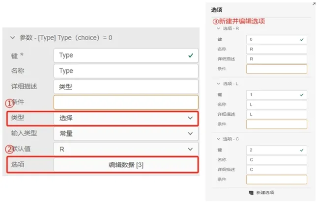
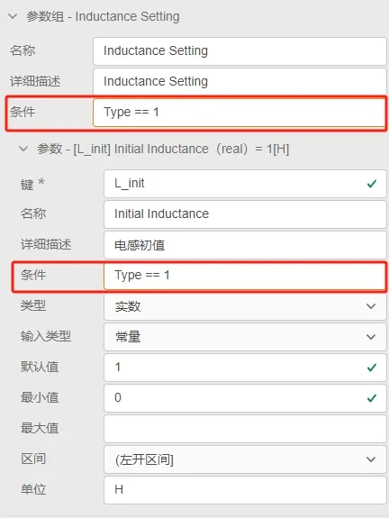

本文档介绍 C++ 元件的构建步骤，并且通过案例详细介绍元件构建方法和调试方法。

## 功能定义
使用 `EMTLab Core SDK` 构建用户自定义 C++ 电磁暂态仿真元件。

## 功能说明
### 创建元件
在 SimStudio 工作台点击**CloudPSS元件测试**。 


### 参数、引脚定义 
在**接口标签页**，分别对 C++ 元件的**参数组**，**引脚**和**元件图形**进行定义。参数组与引脚的详细说明可参考 [参数及引脚体系](../../../40-simstudio/30-modeling/10-params-variables-pins/index.md) 帮助文档。 图标设计的详细说明可参数 [元件图标绘制](../../../40-simstudio/30-modeling/40-module-packaging/30-design-module-icon/index.md)。


在**总览标签页**，填写**元件名称**，设置元件的**权限**，选择**模型类型**，填写**元件标签**。更多详细说明可参考 [总览标签页](../../../40-simstudio/20-workbench/20-function-zone/10-summary-tab/index.md) 帮助文档。


### 导入元件编译产物

在**实现标签页**，选择**电磁暂态**，将使用 `EMTLab Core SDK` 生成的 `.so` 编译产物拖放至电磁暂态实现框中。其中 `ClassName` 会根据上传的 `.so` 文件名自动生成，而 `SubType` 需要填写，表示元件的类型，大于 0 为电气元件，小于 0 为控制元件。



点击左上角**保存**按钮，填写**资源 ID**和**名称**，点击保存。


## 案例
import Tabs from '@theme/Tabs';
import TabItem from '@theme/TabItem';

<Tabs>
<TabItem value="case1" label="电感元件（C++ 电气元件）">
本案例介绍基础电气元件——电感元件的设计、编写和调试方法。

#### 元件前端设计
元件前端设计分为以下几个方面：  
- 元件参数组设计
- 元件引脚列表定义
- 元件图形设计
- 元件标签和权限设置   

以下开始详细介绍每一部分的详细操作。

1. 元件参数组设计  
在 SimStudio 工作台点击**CloudPSS元件测试**。点击**接口标签页**，开始设置元件的**参数组**。在本案例中，设置两个参数组 `Configuration` 和 `Monitoring`，`Configuration` 用于设置电感的相关参数，`Monitoring` 用于监测电感元件内部信号。参数组具体设置如下图所示：


2. 元件引脚列表定义    
在**接口标签页**，设置元件的**引脚列表**。在本案例中，电感元件含有 2 个引脚，用 `Pin +` 和 `Pin -` 表示参考方向。本案例的电感元件为单相元件，数据维数为 1 维。因为电感元件为电气元件，所以引脚的连接类型均设为电气。引脚的具体的设置如下图所示：


3. 元件图形设计  
在**接口标签页**，设置元件的**图形设计**。点击**路径**，利用 `SVG` 的 `path` 代码来构建电感电气图形，具体设置如下图：



`path` 代码如下：
```SVG  
M 0 0
H 9.9
a 5 5 180 1 0 10 0
h0.1
a 5 5 180 1 0 10 0
h0.1
a 5 5 180 1 0 10 0
H 50
```
点击**文本**，使用 **+** 符号来标识电感元件的参考方向，具体设置如下图所示：



同理，点击**文本**，使用参数组中的参数 `Inductance` 来标识电感元件的电感值，具体设置如下图所示：



点击**引脚**，将引脚拖拽至电感图形的引脚连接处，将**引脚**和引脚列表定义的键进行绑定，具体设置如下图所示：


4. 元件标签和权限设置     
点击**总览标签页**，填写**名称**为单相电感 demo，设置**权限**为私有，**元件标签**为自定义元件，具体设置如下图所示：


#### 元件后端设计
元件后端设计主要分为以下几个方面：
- `.h` 文件编写
- `.cpp` 文件编写
- 元件编译

以下开始详细介绍每一部分的详细操作。

1. `.h` 文件编写    
在本地的代码编辑器（如 `VSCode`）中打开 `EMTLab Core SDK` 所在文件夹，在文件夹下新建 `_Inductance_demo.h` 文件，在该文件中添加如下代码：

```C ++
#ifndef _INDUCTANCE_DEMO_H
#define _INDUCTANCE_DEMO_H

#include "Component.h"

class _Inductance_demo : public Component
{
public:
	_Inductance_demo(){};
	~_Inductance_demo(){};

	virtual void initialComponent(int id, string name, Json::Value &root);
	virtual void calculateNortonEquivalentResistance(double time); 
	virtual int regEMTPParaMem(EMTPMem &);
	virtual void formcheckNoneInterpolatedSwitchVec(std::vector<std::function<int(double time, double *, double *, double *, double *, std::map<string, vec> &)>> &);
	virtual void formNortonEquivCurrentCalCallVec(std::vector<std::function<int(double time, double *, double *, std::map<string, vec> &)>> &);
	virtual void formNortonEquivCurrentCDACalCallVec(std::vector<std::function<int(double time, double *, double *, std::map<string, vec> &)>> &);
	virtual void formBranchCurrentCalCallVec(std::vector<std::function<int(double time, double *, double *, std::map<string, vec> &)>> &funVec);

private:
	string IName, VName;
	int DECLAREOUTFLAG(IName), DECLAREOUTFLAG(VName);
	double inductanceValue;
};

#endif
```
代码的具体含义可参阅 [EMTLab Core SDK](../../../130-emtlab-sdk/emtlab-core-sdk/index.md) 帮助文档，本处不在赘述。

2. `.cpp` 文件编写  
在 `EMTLab Core SDK` 所在文件夹下新建 `_Inductance_demo.cpp` 文件，在该文件中添加如下代码：

```C ++
#include "_Inductance_demo.h"
#include <iostream>
using namespace std;

void _Inductance_demo::initialComponent(int id, string name, Json::Value &root) {
  type = 22;
  nElePort = 2;
  nCtrlInPort = 0;
  nCtrlOutPort = 0;
  this->id = id;
  nOrder = 1;
  mergeRequestNumber = 0;
  this->name = name;
  // define elePort
  for (int i = 0; i < nElePort; ++i) {
    char nodeName[100];
    sprintf(nodeName, "%d", i);
    EMTPNode tempNode(1, 1, root["pin"][nodeName]);
    eleNode.push_back(tempNode);
  }
  // define branchInfo
  NodeIdx from;
  from.init(0, 0);
  NodeIdx to;
  to.init(1, 0);
  branchInfo.push_back(EMTPBranchInfo(from, to)); 
  // init elementValue/matrix
  inductanceValue = atof(root["param"]["Inductance"].asCString());
  initialMatrix();
  // define monitoring var
  DECLAREOUTFLAG(IName) = setOutputVariable(IName, "I", vec(1).zeros(), root);
  DECLAREOUTFLAG(VName) = setOutputVariable(VName, "V", vec(1).zeros(), root);
  debug_logger->warn("initial inductance component is completed");
}

int _Inductance_demo::regEMTPParaMem(EMTPMem &emtpMem){
  debug_logger->warn("skip regEMTPParaMem");
  return 0;
}

void _Inductance_demo::calculateNortonEquivalentResistance(double time) {
    branchEquivalentConductance(0, 0) = deltaT / (2.0 * inductanceValue);
    debug_logger->warn("calculate Norton Equivalent Resistance is completed");
}

void _Inductance_demo::formcheckNoneInterpolatedSwitchVec(std::vector<std::function<int(double time, double *nodeMem, double *paraMem, double *nodeMemHist, double *paraMemHist, std::map<string, vec> &)>> &funVec) {
  debug_logger->warn("skip formcheckNoneInterpolatedSwitchVec");
  auto funCall = [=](double time, double *nodeMem, double *paraMem, double *nodeMemHist, double *paraMemHist, std::map<string, vec> &globalParamMap) {
    return 0;
  };
  funVec.push_back(funCall);
}

void _Inductance_demo::formNortonEquivCurrentCalCallVec(std::vector<std::function<int(double time, double *, double *, std::map<string, vec> &)>> &funVec) {
  int nBranch = getBranchInfoSize();
  if (nBranch <= 0) return;
  int branchCurrentPtr = emtpMemInfo.branchCurrentPtr[0];
  int branchVoltagePtr = emtpMemInfo.branchVoltagePtr[0];
  int branchEquivalentConductancePtr = emtpMemInfo.nortonEquivalentConductancePtr[0];
  int nortonEquivalentCurrentPtr = emtpMemInfo.nortonEquivalentCurrentPtr[0];
  debug_logger->warn("begin formNortonEquivCurrentCalCallVec");

  auto funCall = [=](double time, double *nodeMem, double *paraMem, std::map<string, vec> &globalParamMap) {
    vec branchVoltage(&nodeMem[branchVoltagePtr], nBranch, false, false);
    vec branchCurrent(&nodeMem[branchCurrentPtr], nBranch, false, false);
    vec nortonEquivalentCurrent(&nodeMem[nortonEquivalentCurrentPtr], nBranch, false, false);
    mat branchEquivalentConductance(&nodeMem[branchEquivalentConductancePtr], nBranch, nBranch, false, false);
    
    nortonEquivalentCurrent = branchCurrent + branchEquivalentConductance * branchVoltage;
    return 0;
  };
  funVec.push_back(funCall);
}

void _Inductance_demo::formNortonEquivCurrentCDACalCallVec(std::vector<std::function<int(double time, double *, double *, std::map<string, vec> &)>> &funVec) {
  int nBranch = getBranchInfoSize();
  if (nBranch <= 0) return;
  int branchCurrentPtr = emtpMemInfo.branchCurrentPtr[0]; 
  int branchVoltagePtr = emtpMemInfo.branchVoltagePtr[0];
  int nortonEquivalentCurrentPtr = emtpMemInfo.nortonEquivalentCurrentPtr[0];
  int branchEquivalentConductancePtr = emtpMemInfo.nortonEquivalentConductancePtr[0];
  debug_logger->warn("begin formNortonEquivCurrentCDACalCallVec");

  auto funCall = [=](double time, double *nodeMem, double *paraMem, std::map<string, vec> &globalParamMap) {
    vec branchCurrent(&nodeMem[branchCurrentPtr], nBranch, false, false);
    vec branchVoltage(&nodeMem[branchVoltagePtr], nBranch, false, false);
    vec nortonEquivalentCurrent(&nodeMem[nortonEquivalentCurrentPtr], nBranch, false, false);
    mat branchEquivalentConductance(&nodeMem[branchEquivalentConductancePtr], nBranch, nBranch, false, false);

    nortonEquivalentCurrent = branchCurrent;
    return 0;
  };
  funVec.push_back(funCall);
}

void _Inductance_demo::formBranchCurrentCalCallVec(std::vector<std::function<int(double time, double *, double *, std::map<string, vec> &)>> &funVec) {
  int nBranch = getBranchInfoSize();
  if (nBranch <= 0) return;
  int branchCurrentPtr = emtpMemInfo.branchCurrentPtr[0];
  int branchVoltagePtr = emtpMemInfo.branchVoltagePtr[0];
  int nortonEquivalentCurrentPtr = emtpMemInfo.nortonEquivalentCurrentPtr[0];
  int branchEquivalentConductancePtr = emtpMemInfo.nortonEquivalentConductancePtr[0];
  debug_logger->warn("begin formBranchCurrentCalCallVec");

  auto funCall = [=](double time, double *nodeMem, double *paraMem, std::map<string, vec> &globalParamMap) {
    vec branchCurrent(&nodeMem[branchCurrentPtr], nBranch, false, false);
    vec branchVoltage(&nodeMem[branchVoltagePtr], nBranch, false, false);
    vec nortonEquivalentCurrent(&nodeMem[nortonEquivalentCurrentPtr], nBranch, false, false);
    mat branchEquivalentConductance(&nodeMem[branchEquivalentConductancePtr], nBranch, nBranch, false, false);
    branchCurrent = nortonEquivalentCurrent + branchEquivalentConductance * branchVoltage;

    SETOUTVAR(VName, branchVoltage / 1e3);
    SETOUTVAR(IName, branchCurrent / 1e3);
    return 0;
  };
  funVec.push_back(funCall);
}

extern "C"
{
    Component *_Inductance_demomaker()
    {
        return new _Inductance_demo;
    }
}
```
需要说明的是，在 `_Inductance_demo.cpp` 的代码中，为了方便调试，在每个方法中均添加了 `debug_logger->warn()` 用于在仿真结果中显示相关日志。

3. 元件编译  
在 `EMTLab Core SDK` 所在文件夹的 `xmake.lua` 文件中添加以下代码：
```lua
set_targetdir("$(buildir)")
target("_Inductance_demo")
set_kind("shared")
set_languages("c99","cxx11")
add_cxflags("-fPIC")
add_files("_Inductance_demo.cpp")
set_warnings("all")
add_linkdirs("/usr/local/lib/octave/6.3.0/")
add_links("CloudPSSCore");
```
使用 `docker` 容器进行代码编译，代码 `.so` 编译产物会生成在 `build` 文件夹下，按照 [导入元件编译产物](#导入元件编译产物) 方法进行导入，并保存元件。

#### 元件调试
在 SimStudio 工作台新建仿真项目，在**实现标签页**点击**模型**，在**用户名/自定义元件**标签下选中**单相电感 demo**，拖拽至图纸中，开始构建测试算例，本案例构建的测试算例如下图所示：



其中交流单相电源的电压设置为 10kV；**单相电感 demo**的电感值设为 10H，**Monitoring** 选项下的直流电压和直流电流分别填入 `#IL` 和 `#VL`；使用电流表和支路电压表测量电感的电流和电压，与内部监测信号进行对比；电阻值设置为 10000Ω。

运行测试算例，得到的仿真结果如下图所示：





仿真结果中可以看出，通过电流表和电压表的测量值与通过元件内部信号获取的值完全一致，电流和电压曲线也符合预期。
</TabItem>
</Tabs>


## 常见问题
前端创建的 C++ 元件的参数与引脚怎么与后端程序进行绑定

:   
  `.cpp` 文件中的 `initialComponent` 函数的入参 `root` 为该元件的 `JSON` 脚本，包含了前端定义的参数和引脚信息。在 `initialComponent` 函数中，需要定义好元件的电气引脚、控制引脚、元件支路信息和内部监测信号。  
    
  以案例中的电感元件为例，代码如下。该元件有两个电气引脚（1 * 1 维），没有控制输入引脚和控制输出引脚。按照定义的电气引脚顺序，定义电气节点。电感元件只有一条支路，定义该支路的信息。前台元件参数可通过 `root` 脚本获取。内部监测信号则通过定义虚拟引脚进行初始化。

  ```C ++
  void _Inductance_demo::initialComponent(int id, string name, Json::Value &root) {
  // nElePort、nCtrlInPort、nCtrlOutPort分别代表电气引脚数量、控制输入引脚数量、控制输出引脚数量
  type = 22; // 大于0代表电气元件
  nElePort = 2;
  nCtrlInPort = 0;
  nCtrlOutPort = 0;
  this->id = id;
  nOrder = 1;
  mergeRequestNumber = 0;
  this->name = name;
  // 定义电气引脚
  for (int i = 0; i < nElePort; ++i) {
      char nodeName[100];
      sprintf(nodeName, "%d", i);
      // 定义一个tempNode为1*1维的电气引脚
      EMTPNode tempNode(1, 1, root["pin"][nodeName]);
      // eleNode为EMTPNode类型的Vector，使用push_back()在向量的末尾添加这个tempNode。
      eleNode.push_back(tempNode);
  }
  // 定义支路信息
  NodeIdx from;
  from.init(0, 0);// from.init(0, i)代表这条支路的起始点为0号节点的第i维
  NodeIdx to;
  to.init(1, 0);// to.init(1, i)代表这条支路的终止点为1号节点的第i维。
  branchInfo.push_back(EMTPBranchInfo(from, to)); 
  // 获取前台元件参数
  inductanceValue = atof(root["param"]["Inductance"].asCString());
  // 初始化支路电流、电压等矩阵，必须调用
  initialMatrix();
  // 虚拟引脚的初始化
  DECLAREOUTFLAG(IName) = setOutputVariable(IName, "I", vec(1).zeros(), root);
  DECLAREOUTFLAG(VName) = setOutputVariable(VName, "V", vec(1).zeros(), root);
  }
  ```

如何通过一个 C++ 元件实现多种功能 

:
  在 C++ 元件的参数设计时，可以添加选择类型的参数，例如元件设计为可在电阻、电感和电容之间切换，可以按下图设置元件类型，通过元件类型来判断相关的参数是否启用。同样的，在元件 C++ 程序中通过选择类型的参数进行判断，分别给出不同的元件逻辑，实现SDK元件的多种功能。

   

  

C++ 元件除了案例中介绍的调试方法，还有什么常用的调试方法

:   
  常用调试方法如下：
  - 短仿真时间调试  
  仿真时间设置为 10 个时步，比如积分步长为 50μs，设置仿真结束时间为 500μs。在后端 `.cpp` 代码中将关键的变量（支路电压、支路电流、诺顿等值电流等）都在日志中输出，通过日志查看各个变量是否与预期结果相符和。
  - 多种测试用例  
  在保证 C++ 元件可以正常使用后，用户可以根据元件的特性和功能，搭建多种符合元件使用的测试场景，对元件进行全面的测试。