本文档介绍进行潮流计算的基本要求，以及潮流计算方案的参数配置。

## 功能定义
EMTLab 提供的潮流计算方案设置功能。

## 功能说明

### 潮流计算基本要求
要使用 EMTLab 提供的潮流计算功能，需要搭建满足要求的算例。本小节介绍 EMTLab 支持潮流计算的元件和潮流计算前所需的元件设置。

#### 支持潮流计算的设备元件
目前，潮流计算功能支持的设备元件包含**静态负载**、**三相交流电压源**、**同步发电机**、**并联电容/电抗器**、**三相传输线**、**三相电阻**、**三相电感**、**三相电容**、**三相双绕组变压器**、**三相三绕组变压器**、**风机模型**和**光伏电站模型**，更多元件支持将在后续版本中逐步加入。

潮流计算功能是围绕着**三相交流母线**进行的。因此，上述设备元件中，单电气端口的元件只有当其电气端口与母线直接相连时，才会被计入；对于多电气端口的元件，则其每一个电气端口都必须与母线直接相连。特别地，电流表可以串入电路中，在潮流计算过程中将被忽略。

:::tip 潮流计算的注意事项
- 每条母线至多连接一个电源（三相交流电压源或同步发电机），未连接电源的母线将作为 PQ 节点参与计算。
- 同一个算例中可以包含多个独立的网络，但每个网络都必须包含且仅包含一个平衡节点。
- 潮流计算中暂不考虑静态负载的功率特性。
:::
#### 元件的相关设置
进行潮流计算前，需要对元件的初值和节点类型进行设置。

**单电气端口**的元件潮流计算的相关设置如下所示：

import Tabs from '@theme/Tabs';
import TabItem from '@theme/TabItem';

<Tabs>
<TabItem value="component1" label="三相交流母线">
三相交流母线需要设置的参数值如下图所示，具体的参数说明可见表格：

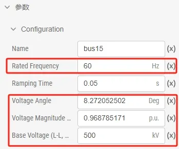

| 参数名称 | 单位 | 备注 | 说明 |
| :--- | :--- | :--- | :--- |
| Rated Frequency | Hz | 母线的额定频率 | 潮流计算要求相连的母线必须采用相同频率 |
| Voltage Angle | Deg | 母线电压相位（A 相相电压） | 用于设定潮流计算时的母线的初始相位，潮流回写时，将母线相位迭代值写回该参数 |
| Voltage Magnitude (L-L, RMS) | p.u. | 母线线电压幅值 | 线电压幅值与电压基值决定了潮流计算时的母线初始电压，潮流回写时，将母线电压迭代值写回该参数 |
| Base Voltage (L-L, RMS) | kV | 母线的电压基准值 | 用于在潮流计算过程中将参与计算的母线电压数据转换为标幺值 |
</TabItem>

<TabItem value="component2" label="静态负载">
静态负载需要设置的参数值如下图所示，具体的参数说明可见表格：

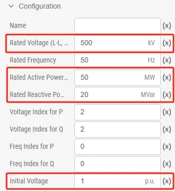

| 参数名称 | 单位 | 备注 | 说明 |
| :--- | :--- | :--- | :--- |
| Rated Voltage (L-L, RMS) | kV | 标称负载线电压有效值 | 用于在潮流计算后将初始电压幅值数据转换为标幺值 |
| Rated Active Power (3 Phase) | MW | 额定有功功率 | 潮流计算时节点消耗有功功率 |
| Rated Reactive Power (3 Phase) | MVar | 额定无功功率，感性负荷为正 | 潮流计算时节点消耗无功功率 |
| Initial Voltage | p.u. | 初始电压幅值，由潮流计算决定 | 潮流计算后迭代的节点电压有名值会换算为标幺值，潮流回写时修改该参数 |

更多静态负载的潮流相关内容，可参考 [自定义潮流元件](../40-user-defined/index.md#案例) 帮助文档。

</TabItem>
<TabItem value="component3" label="三相交流电压源">
三相交流电压源需要设置的参数值如下图所示，具体的参数说明可见表格：

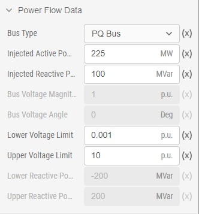

| 参数名称 | 单位 | 备注 | 说明 |
| :--- | :--- | :--- | :--- |
| Bus Type |  | 节点类型 | 潮流计算时指定电源所在母线的节点类型，可选择 **PQ Bus**，**PV Bus** 或 **Slack Bus** |
| Injected Active Power | MW | 节点注入有功功率 | 潮流计算时 **PV**、**PQ** 节点的注入有功功率 |
| Injected Reactive Power | MVar | 节点注入无功功率 |  **PQ** 节点的注入无功功率 |
| Lower Voltage Limit | p.u. | 母线电压下限 | 由节点的电压基准值转换为有名值，决定 **PQ** 节点电压下界，越界后该节点由无功约束转为电压约束 |
| Upper Voltage Limit | p.u. | 母线电压上限 | 由节点的电压基准值转换为有名值，决定 **PQ** 节点电压上界，越界后该节点由无功约束转为电压约束 |
| Bus Voltage Magnitude | p.u. | 母线电压幅值 | 由节点的电压基准值转换为有名值，决定 **PV** 节点的电压幅值 |
| Lower Reactive Power Limit| MVar | 无功功率下限 | **PV** 节点和**平衡节点**的注入无功下界，越界后该节点由电压约束转为无功约束 |
| Upper Reactive Power Limit| MVar | 无功功率上限 | **PV** 节点和**平衡节点**的注入无功上界，越界后该节点由电压约束转为无功约束 |
| Bus Voltage Angle | Deg | 母线电压相位 | **平衡节点**的相角 |
</TabItem>

<TabItem value="component4" label="同步发电机">
同步发电机需要设置的参数值如下图所示，具体的参数说明可见表格：

| 参数名称 | 单位 | 备注 | 说明 |
| :--- | :--- | :--- | :--- |
| Bus Type |  | 节点类型 | 潮流计算时指定电源所在母线的节点类型，可选择 **PQ Bus**，**PV Bus** 或 **Slack Bus** |
| Injected Active Power | MW | 节点注入有功功率 | 潮流计算时 **PV**、**PQ** 节点的注入有功功率 |
| Injected Reactive Power | MVar | 节点注入无功功率 |  **PQ** 节点的注入无功功率 |
| Lower Voltage Limit | p.u. | 母线电压下限 | 由节点的电压基准值转换为有名值，决定 **PQ** 节点电压下界，越界后该节点由无功约束转为电压约束 |
| Upper Voltage Limit | p.u. | 母线电压上限 | 由节点的电压基准值转换为有名值，决定 **PQ** 节点电压上界，越界后该节点由无功约束转为电压约束 |
| Bus Voltage Magnitude | p.u. | 母线电压幅值 | 由节点的电压基准值转换为有名值，决定 **PV** 节点的电压幅值 |
| Lower Reactive Power Limit| MVar | 无功功率下限 | **PV** 节点和**平衡节点**的注入无功下界，越界后该节点由电压约束转为无功约束 |
| Upper Reactive Power Limit| MVar | 无功功率上限 | **PV** 节点和**平衡节点**的注入无功上界，越界后该节点由电压约束转为无功约束 |
| Bus Voltage Angle | Deg | 母线电压相位 | **平衡节点**的相角 |

更多同步发电机的潮流相关内容，可参考 [自定义潮流元件](../40-user-defined/index.md#案例) 帮助文档。
</TabItem>

<TabItem value="component5" label="并联电容/电抗器">
并联电容/电抗器需要设置的参数值如下图所示，具体的参数说明可见表格：

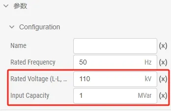

| 参数名称 | 单位 | 备注 | 说明 |
| :--- | :--- | :--- | :--- |
| Rated Voltage (L-L, RMS) | kV | 额定线电压有效值 | 与容量一起决定潮流计算时的对地电纳 |
| Input Capacity | MVar | 投入容量（电容为负，电抗为正） |  与电压一起决定潮流计算时的对地电纳|
</TabItem>

<TabItem value="component6" label="风机模型">
风机模型包括**双馈风机风电场模型_含外部控制**、**双馈风机风场等值模型**、**风场等值模型 I：PMSG 网侧变流器模型**和**直驱风机风电场模型_含外部控制**四种模型，这四种模型的潮流参数值如下图所示，具体的参数说明可见表格：

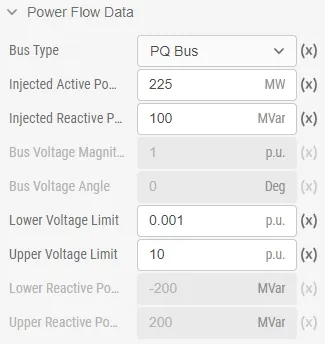

| 参数名称 | 单位 | 备注 | 说明 |
| :--- | :--- | :--- | :--- |
| Bus Type |  | 节点类型 | 潮流计算时指定电源所在母线的节点类型，可选择 **PQ Bus**，**PV Bus** 或 **Slack Bus** |
| Injected Active Power | MW | 节点注入有功功率 | 潮流计算时 **PV**、**PQ** 节点的注入有功功率 |
| Injected Reactive Power | MVar | 节点注入无功功率 |  **PQ** 节点的注入无功功率 |
| Lower Voltage Limit | p.u. | 母线电压下限 | 由节点的电压基准值转换为有名值，决定 **PQ** 节点电压下界，越界后该节点由无功约束转为电压约束 |
| Upper Voltage Limit | p.u. | 母线电压上限 | 由节点的电压基准值转换为有名值，决定 **PQ** 节点电压上界，越界后该节点由无功约束转为电压约束 |
| Bus Voltage Magnitude | p.u. | 母线电压幅值 | 由节点的电压基准值转换为有名值，决定 **PV** 节点的电压幅值 |
| Lower Reactive Power Limit| MVar | 无功功率下限 | **PV** 节点和**平衡节点**的注入无功下界，越界后该节点由电压约束转为无功约束 |
| Upper Reactive Power Limit| MVar | 无功功率上限 | **PV** 节点和**平衡节点**的注入无功上界，越界后该节点由电压约束转为无功约束 |
| Bus Voltage Angle | Deg | 母线电压相位 | **平衡节点**的相角 |
</TabItem>

<TabItem value="component7" label="光伏电站模型">
光伏电站模型包括**光伏电站模型_含外部控制**和**光伏电站模型**两种模型，这两种模型的潮流参数值如下图所示，具体的参数说明可见表格：

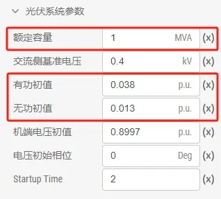

| 参数名称 | 单位 | 备注 | 说明 |
| :--- | :--- | :--- | :--- |
| 额定容量 | MVA | 光伏系统的额定容量 | 用于在潮流计算过程中将有功功率和无功功率转换为有名值 |
| 有功初值 | p.u. | 光伏系统的注入有功功率标幺值 | 用于在潮流计算中设置 **PQ** 节点的注入有功 |
| 无功初值 | p.u. | 光伏系统的注入无功功率标幺值 | 用于在潮流计算中设置 **PQ** 节点的注入无功 |
| 机端电压初值 | p.u. | 光伏系统的机端电压标幺值 | 潮流回写时，将电压迭代值写回该参数 |
| 电压初始相位 | Deg | 光伏系统的电压相位 | 潮流回写时，将电压相位迭代值写回该参数 |
</TabItem>
</Tabs>

-----------------
**多电气端口**的元件潮流计算的相关设置如下所示：

<Tabs>
<TabItem value="component1" label="三相传输线">
三相传输线需要设置的参数值如下图所示，具体的参数说明可见表格：

| 参数名称 | 单位 | 备注 | 说明 |
| :--- | :--- | :--- | :--- |
| Length of Line | km | 线路长度 | 用于计算传输线总电阻 R、总电抗 X 和总对地电纳 B |
| Parameter Format |  | 参数输入方式，可选择标幺值或有名值 | 计算传输线总电阻 R、总电抗 X 和总对地电纳 B 时，标幺值会根据额定电压和额定容量转换为有名值 |
| Has the Data Been Corrected for Long Line Effects? |  | 填入的线路参数是否已进行过长导线修正 | 如果选择 `No`，计算传输线总电阻 R、总电抗 X 和总对地电纳 B 时，会进行相应的参数修正 |
| Rated Voltage (L-L, RMS) | kV | 额定电压 | 选择参数输入方式为标幺值时启用，用于将标幺值转换为有名值 |
| Rated Power Capacity | MVA | 额定容量 | 选择参数输入方式为标幺值时启用，用于将标幺值转换为有名值 |
| +/- Seq. Resistance | p.u./km | 单位长度正序电阻 | 选择参数输入方式为标幺值时启用，用于计算传输线总电阻 R |
| +/- Seq. Inductive Reactance | p.u./km | 单位长度正序电抗 | 选择参数输入方式为标幺值时启用，用于计算传输线总电抗 X |
| +/- Seq. Capacitive Susceptance | p.u./km | 单位长度正序电纳 | 选择参数输入方式为标幺值时启用，用于计算传输线总对地电纳 B |
| +/- Seq. Resistance | Ω/km | 单位长度正序电阻 | 选择参数输入方式为有名值时启用，用于计算传输线总电阻 R |
| +/- Seq. Inductive Reactance | Ω/km | 单位长度正序感抗 | 选择参数输入方式为有名值时启用，用于计算传输线总电抗 X |
| +/- Seq. Capacitive Reactance | MΩ*km | 单位长度正序容抗 | 选择参数输入方式为有名值时启用，用于计算传输线总对地电纳 B |

更多三相传输线的潮流相关内容，可参考 [自定义潮流元件](../40-user-defined/index.md#案例) 帮助文档。
</TabItem>

<TabItem value="component2" label="三相电阻">
三相电阻需要设置的参数值如下图所示，具体的参数说明可见表格：

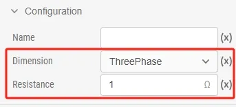

| 参数名称 | 单位 | 备注 | 说明 |
| :--- | :--- | :--- | :--- |
| Dimension |  | 单相电阻或是三相电阻 | 潮流计算仅支持三相电阻 |
| Resistance | Ω | （每相）电阻值 | 用于计算潮流中的线路电阻 |
</TabItem>

<TabItem value="component3" label="三相电感">
三相电感需要设置的参数值如下图所示，具体的参数说明可见表格：

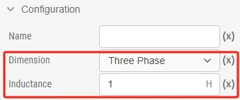

| 参数名称 | 单位 | 备注 | 说明 |
| :--- | :--- | :--- | :--- |
| Dimension |  | 单相电感或是三相电感 | 潮流计算仅支持三相电感 |
| Inductance | H | （每相）电感值 | 用于计算潮流中的线路电抗 |
</TabItem>

<TabItem value="component4" label="三相电容">
三相电容需要设置的参数值如下图所示，具体的参数说明可见表格：

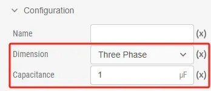

| 参数名称 | 单位 | 备注 | 说明 |
| :--- | :--- | :--- | :--- |
| Dimension |  | 单相电容或是三相电容 | 潮流计算仅支持三相电容 |
| Capacitance | μF | （每相）电容值 | 用于计算潮流中的线路电抗 |
</TabItem>

<TabItem value="component5" label="三相双绕组变压器">
三相双绕组变压器需要设置的参数值如下图所示，具体的参数说明可见表格：

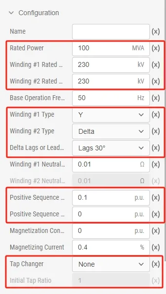

| 参数名称 | 单位 | 备注 | 说明 |
| :--- | :--- | :--- | :--- |
| Rated Power | MVA	 | 变压器每侧绕组的额定容量 | 用于标幺值转换为有名值 |
| Winding #1 Rated Voltage (L-L, RMS) | kV | 绕组 #1 额定线电压有效值 | 用于标幺值转换为有名值和计算变压器变比 |
| Winding #2 Rated Voltage (L-L, RMS) | kV | 绕组 #2 额定线电压有效值 | 用于计算变压器变比 |
| Winding #1 Type |  | 绕组 #1 连接类型为星形(Y)或三角形(Delta) | 用于计算潮流中的移相角度 |
| Winding #2 Type |  | 绕组 #2 连接类型为星形(Y)或三角形(Delta) | 用于计算潮流中的移相角度 |
| Delta Lags or Leads Y |  | Delta绕组连接方式 | 选择 Delta 连接绕组电压超前或滞后 Y 连接绕组电压 30°，仅当有绕组为三角形连接时有效，用于计算潮流中的移相角度 |
| Positive Sequence Leakage Reactance | p.u. | 正序漏电抗 | 用于计算潮流中的线路电抗 |
| Positive Sequence Leakage Resistance | p.u. | 正序漏电阻 | 用于计算潮流中的线路电阻 |
| Tap Changer |  | 选择变压器分接头位置（无 / 绕组 1 / 绕组 2）| 用于计算变压器变比 |
| Initial Tap Ratio |  | 填写变压器初始的分接头档位下的标幺值变比| 用于计算变压器变比 |
</TabItem>

<TabItem value="component6" label="三相三绕组变压器">
三相三绕组变压器需要设置的参数值如下图所示，具体的参数说明可见表格：

| 参数名称 | 单位 | 备注 | 说明 |
| :--- | :--- | :--- | :--- |
| Winding #1 Rated Power | MVA | 绕组 #1 额定容量 | 取绕组 #1、#2 和 #3 中的容量最大值求解线路电阻和线路电抗 |
| Winding #2 Rated Power | MVA | 绕组 #2 额定容量 | 取绕组 #1、#2 和 #3 中的容量最大值求解线路电阻和线路电抗 |
| Winding #3 Rated Power | MVA | 绕组 #3 额定容量 | 取绕组 #1、#2 和 #3 中的容量最大值求解线路电阻和线路电抗 |
| Base Operation Frequency | Hz | 额定频率 | 用于设置中心母线的频率 |
| Winding #1 Rated Voltage (L-L, RMS) | kV | 绕组 #1 额定线电压有效值 | 用于求解中心母线与绕组 #1 间的变比 |
| Winding #2 Rated Voltage (L-L, RMS) | kV | 绕组 #2 额定线电压有效值 | 用于求解中心母线与绕组 #2 间的变比 |
| Winding #3 Rated Voltage (L-L, RMS) | kV | 绕组 #3 额定线电压有效值 | 用于求解中心母线与绕组 #2 间的变比 |
| Winding #1 Type |  | 选择绕组 #1 的连接类型为星形(Y)或三角形(Delta) | 用于求解中心母线与绕组 #1 间的移相角度 |
| Winding #2 Type |  | 选择绕组 #2 的连接类型为星形(Y)或三角形(Delta) | 用于求解中心母线与绕组 #2 间的移相角度 |
| Winding #3 Type |  | 选择绕组 #3 的连接类型为星形(Y)或三角形(Delta) | 用于求解中心母线与绕组 #3 间的移相角度 |
| Delta Lags or Leads Y |  | 选择Delta连接绕组电压超前或滞后Y连接绕组电压30°，仅当有绕组为三角形连接时起作用 | 用于求解中心母线与绕组间的移相角度 |
| Tap Changer |  | 选择变压器分接头位置（无 / 绕组 1 / 绕组 2） | 用于计算中心母线与绕组间的变比 |
| Initial Tap Ratio |  | 填写变压器初始的分接头档位下的标幺值变比 | 用于计算中心母线与绕组间的变比 |
| Center Bus Voltage Magnitude | p.u. | 中心节点电压幅值 | 用于设置中心母线的初始电压，潮流回写时修改该参数 |
| Center Bus Voltage Angle | Deg | 中心节点电压相角 | 用于设置中心母线的初始相角，潮流回写时修改该参数 |

更多三相三绕组变压器的潮流相关内容，可参考 [自定义潮流元件](../40-user-defined/index.md#案例) 帮助文档。
</TabItem>
</Tabs>

### 潮流计算方案的参数设置
选择**运行标签页**，新建**潮流计算**计算方案，选中新建的计算方案，即可对潮流计算方案进行配置。以下对电磁潮流计算的设置参数进行说明。

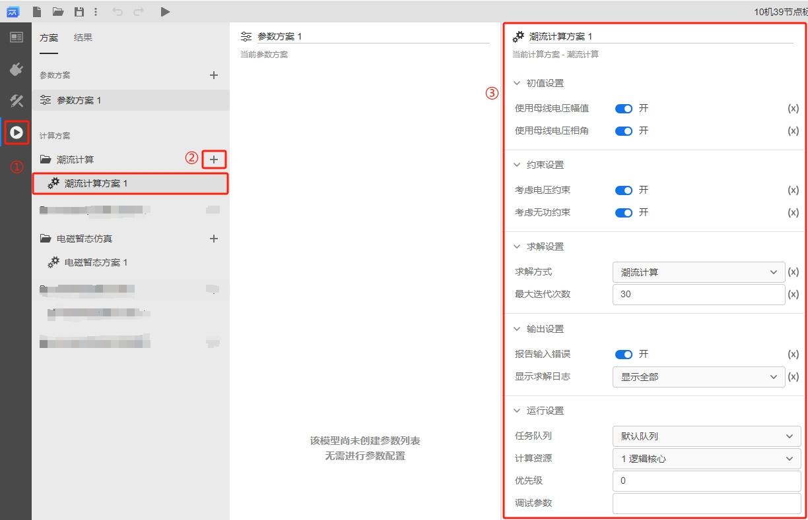

<Tabs>
<TabItem value="set1" label="初始设置">
初始设置参数说明如下：

| 参数名 | 含义 | 说明 |
| :--- | :--- | :--- | 
| 使用母线电压幅值 | 母线电压幅值的启用开关 | 开启后，使用母线电压幅值作为潮流初值；不开启时，母线电压幅值默认为 1 p.u. |
| 使用母线电压相角 | 母线电压相角的启用开关 | 开启后，使用母线电压相角作为潮流初值，不开启时，母线电压相角默认为 0 Deg |
</TabItem>

<TabItem value="set2" label="约束设置">
约束设置参数说明如下：

| 参数名 | 含义 | 说明 |
| :--- | :--- | :--- | 
| 考虑电压约束 | 电压约束的启用开关 | 开启后，在潮流计算求解过程中考虑 PQ 节点的电压约束；不开启时，不考虑电压约束 |
| 考虑无功约束 | 无功约束的启用开关 | 开启后，在潮流计算求解过程中考虑 PV 节点和平衡节点的无功约束；不开启时，不考虑无功约束 |
</TabItem>

<TabItem value="set3" label="求解设置">
求解设置参数说明如下：

| 参数名 | 含义 | 说明 |
| :--- | :--- | :--- | 
| 求解方式 | 潮流求解方式的选择 | 可选择**潮流计算**，**功率不平衡量计算**，**生成潮流文件**。选择**潮流计算**时，进行完整的潮流计算，潮流计算反复迭代直至收敛或达到最大迭代次数；**功率不平衡量计算**和**生成潮流文件**为辅助功能选项，选择**功率不平衡量计算**时，仅求解当前母线电压下，系统的功率不平衡量；选择**生成潮流文件**，生成 `IEEE Common Format` 格式潮流文件，用于进行数据交互 |
| 最大迭代次数 | 潮流计算的最大迭代次数 | 仅求解方式选择**潮流计算**时有效，设置潮流计算的最大迭代次数 |
</TabItem>

<TabItem value="set4" label="输出设置">
输出设置参数说明如下：

| 参数名 | 含义 | 说明 |
| :--- | :--- | :--- | 
| 报告输入错误 | 错误日志开关 | 检查并报告算例中可能存在的输入错误 |
| 显示求解日志 | 显示求解日志的选择 | 显示潮流求解过程中产生的日志，可选择**关**，**仅显示错误**，**显示全部** |
</TabItem>

<TabItem value="set5" label="运行设置">
运行设置参数说明如下：

| 参数名 | 含义 | 说明 |
| :--- | :--- | :--- | 
| 任务队列 | 任务运行使用的队列 | 默认设置为**默认队列** |
| 计算资源 | 任务运行使用的计算资源 | 默认设置为 **1 逻辑核心** |
| 优先级 | 任务运行的优先级 | 默认值为 0，即最低优先级 |
| 调试参数 | 任务调试时使用的调试参数 | 默认为空 |
</TabItem>
</Tabs>

## 常见问题
怎么导出 EMTLab 的潮流计算的结果

:
    潮流计算的结果页面会展示 `Buses` 和 `Branches` 两个潮流数据表格，鼠标悬浮在表格上时，表格的右上角会出现导出数据按钮，点击按钮可将表格中的数据导出为 CSV 格式。

    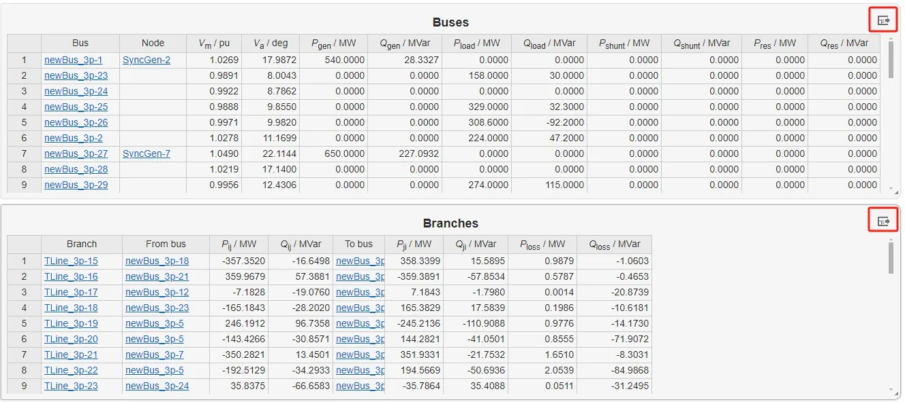

潮流计算方案的参数设置有哪些是必选项

:
    潮流计算方案的参数设置没有必选的选项，但为了潮流结果更好的收敛，建议开启初值设置和约束设置的所有选项。