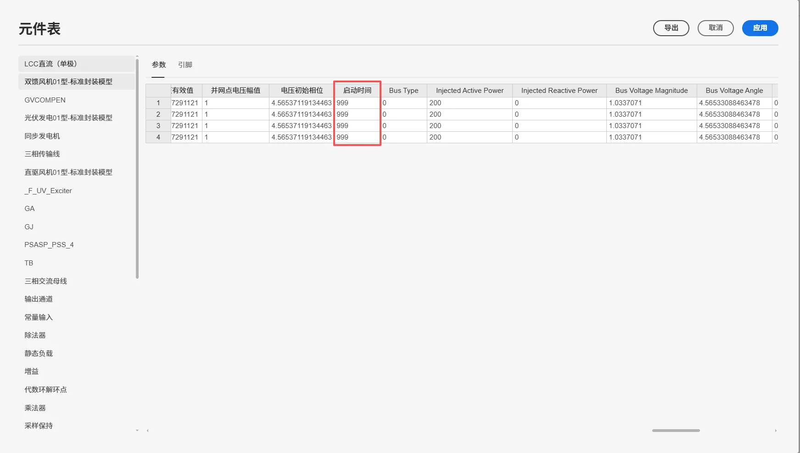
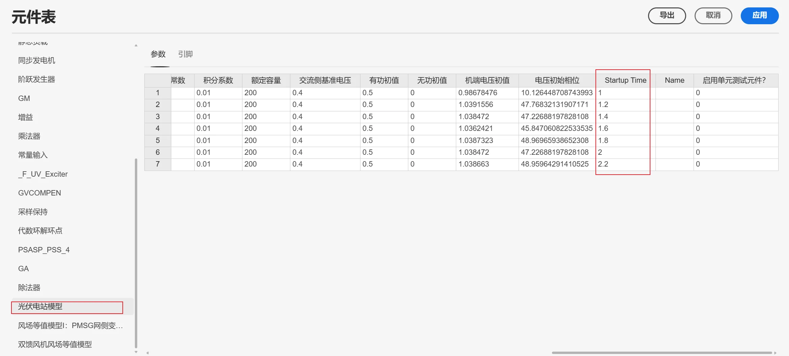
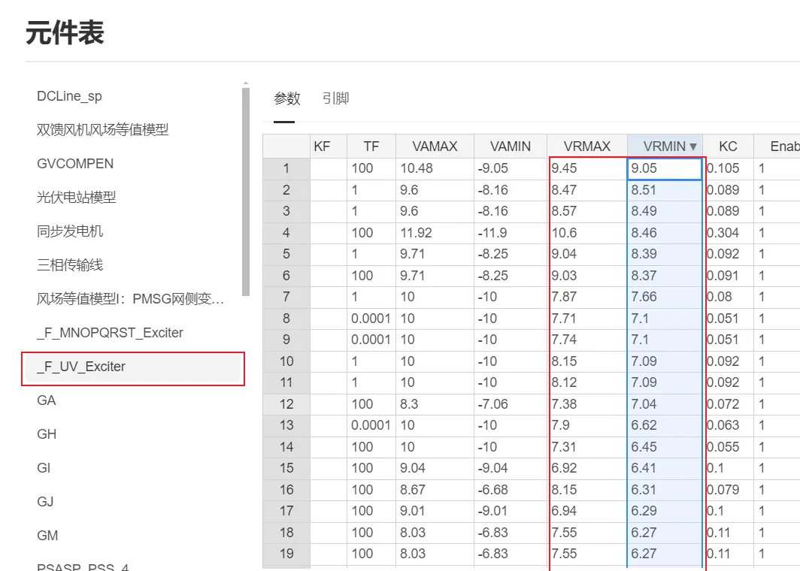
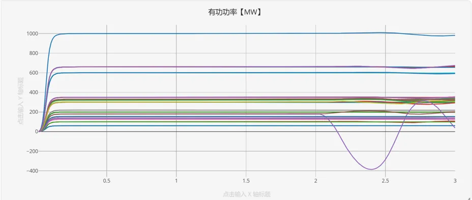
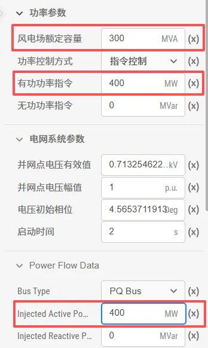
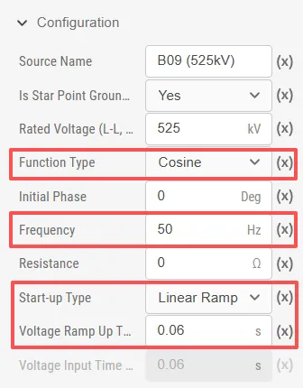

本文档介绍 EMTLab 的潮流结果写回及初始化的详细内容，以及从给定潮流断面直接启动需配置的参数。

## 功能定义
EMTLab 的潮流结果写回及初始化功能。

## 功能说明
### 潮流数据说明
运行潮流计算后，结果页面会展示 `Buses` 和 `Branches` 两个潮流数据表格，以下分别对这两个表格的参数进行说明：

import Tabs from '@theme/Tabs';
import TabItem from '@theme/TabItem';

<Tabs>
<TabItem value="case1" label="Buses">
`Buses` 表格中的参数说明如下：

| 参数名 | 单位 | 说明 |
| :--- | :--- | :--- | 
| Bus |  | 母线名，点击母线名可链接到实现标签页的母线元件 |
| Node |  | 节点，为三相交流电压源或同步发电机，点击元件名可链接到实现标签页的具体元件处 |
| $ V_m $ | p.u. | 母线的电压幅值 |
| $ V_a $ | Deg | 母线的电压相角 |
| $ P_{gen} $ | MW | 发电机注入有功功率 |
| $ Q_{gen} $ | MVar | 发电机注入无功功率 |
| $ P_{load} $ | MW | 恒功率负载消耗有功功率 |
| $ Q_{load} $ | MVar | 恒功率负载消耗无功功率 |
| $ P_{shunt} $ | MW | 恒阻抗负载消耗有功功率 |
| $ Q_{shunt} $ | MVar | 恒阻抗负载消耗无功功率 |
| $ P_{res} $ | MW | 母线上的有功功率不平衡量 |
| $ Q_{res} $ | MVar | 母线上的无功功率不平衡量 |

`Buses` 表格中的复功率计算公式如下：

$$
S_{res} = S_{gen} - S_{load} - S_{shunt} - S_{branch}
$$

其中 $S_{branch}$ 表示母线连接支路上的流出复功率。对于计算收敛的潮流解，$P_{res}$，$Q_{res}$ 均为接近 0 的值。

</TabItem>

<TabItem value="case2" label="Branches">
`Branches` 表格中的参数说明如下：

| 参数名 | 单位 | 说明 |
| :--- | :--- | :--- | 
| Branch |  | 支路名，点击支路名可链接到实现标签页的具体元件处 |
| From bus |  | 支路的起始母线，点击母线名可链接到实现标签页的母线元件 |
|  $ P_{ij} $ | MW | From bus 流出的有功功率 |
|  $ Q_{ij} $ | MVar | From bus 流出的无功功率 |
| To bus |  | 支路的终止母线，点击母线名可链接到实现标签页的母线元件 |
|  $ P_{ji} $ | MW | To bus 流出的有功功率 |
|  $ Q_{ji} $ | MVar | To bus 流出的无功功率 |
|  $ P_{loss} $ | MW | 支路上的有功功率损耗 |
|  $ Q_{loss} $ | MVar | 支路上的无功功率损耗 |

`Branches` 表格中的复功率计算公式如下：

$$
S_{loss} = S_{ij} + S_{ji}
$$

</TabItem>
</Tabs>

:::tip
结果页面元件链接支持通过鼠标中键打开内部元件。
:::

### 潮流断面写回
运行潮流计算后，点击**潮流回写数据**选项框下的**修改项目文件**按钮，弹出的确认框中点击**应用**，将潮流计算得到的结果回写到支持潮流计算的元件参数组中。元件具体写回的数据参数可参考 [计算方案配置-元件设置](../20-job-config/index.md#元件的相关设置)。

### 潮流断面启动
EMTLab 的电磁暂态仿真中电气系统的启动主要包含两种方式：**斜坡启动**与**从潮流断面直接启动**，以下分别介绍这两种启动方式。

:::tip
建议普通用户采用**斜坡启动方式**，适用范围广，设置简单。
:::

<Tabs>
<TabItem value="case1" label="斜坡启动至潮流断面 (推荐方法)">
斜坡启动是系统的电压幅值和相位从 0 线性爬升至初始值。该方法适用于全部元件（包含电机除 `from Steady-State` 以外的全部启动方式）和全部连接方式。

使用斜坡启动前，需要对**同步发电机**和**三相交流电压源**进行参数设置。

#### 同步发电机
对于同步发动机的参数设置，建议选择 `Source to Machine` 或 `Ramping Equivalent Voltage`的启动方式。以下是对这两种启动方式的说明：

- 在 `Source to Machine` 启动过程中，电机为理想电压源。启动至稳态后，通过指定 `Source to Machine Signal` 将电压源切换至电机。
- 在 `Ramping Equivalent Voltage` 启动过程中，电机为恒定的导纳矩阵和恒定频率与幅值的交流注入电流源构成，其本质是带有内阻的三相电压源。在 `Source to Machine Signal` 之前，该电压源使用的导纳矩阵为 EMTP 下电机模型的等效导纳矩阵，电流源为对应的补偿值。启动至稳态后，通过指定 `Source to Machine Signal` 将电压源切换至电机。

#### 三相交流电压源
三相交流电压源的 `Configuration` 参数组中，`Function Type` 需设置为 `Cosine`。启动时间根据交流系统的频率来确定，通常为 3 个工频周波，比如 50Hz 系统选择 0.06s，60Hz 系统选择0.05s。

</TabItem>

<TabItem value="case2" label="从给定潮流断面直接启动">
从潮流断面的启动方式则利用潮流断面数据直接从稳态启动。该方法可指定潮流断面，且启动耗时短，效率高。这种启动方式有四个使用前提要求：

:::info 稳态潮流初始化前提要求
1. 全部设备元件的端口必须与母线元件直接相连（或通过分线器与母线相连）。
2. 参与潮流计算的系统拓扑和参数应与电磁暂态仿真算例一致，以保证潮流断面可用。
3. **同步发电机**、**三相交流电压源**、**母线**的启动参数需要与潮流计算结果一致，否则仿真无法达到稳态甚至出现错误。
4. 需要在运行标签页下启用 **计算方案 - 电磁暂态方案 - 启动参数 - 预启动流程**
:::

使用从给定潮流断面直接启动功能前，需要运行一次**潮流计算**，并将**潮流数据回写**，然后对元件进行相应的配置，以下为元件的设置说明：

#### 同步发电机
同步电机的 `Initial Condition` 参数组中，`Startup Type` 需选择 `from Steady-state`。节点电压幅值（p.u.）、节点电压相位（Deg）、注入有功（MW）、注入无功（MVar）这些参数在**潮流数据回写**后自动填入。

需要说明的是，同步发电机的**相电压**基值(L-G, RMS)与所连母线的**线电压**基值(L-L, RMS)匹配正确，否则填入的节点电压幅值（p.u.）应换算到同步电机的基值电压下。

#### 三相交流电压源
三相交流电压源的 `Configuration` 参数组中，`Function Type` 需设置为 `Cosine`；`Initial Phase [Deg]`、和`Rated Voltage (L-L, RMS) [kV]`在**潮流数据回写**后自动填入；启动方式 `Start-up Type` 选择`Linear Ramp`，`Voltage Ramp Up Time [s]` 设置为 0。

#### 母线
母线的 `Configuration` 参数组中，交流系统额定频率填入`Rated Frequency [Hz]`；`Ramping Time (s)` 一项可留空；`Voltage Magnitude [p.u.]` 和 `Voltage Angle [Deg]`在**潮流数据回写**后自动填入；潮流计算所用的线电压基值填入`Bus Voltage (L-L, RMS) [kV]`。

开启启动参数和预启动流程并进行参数设置，可从给定潮流断面直接启动电磁暂态仿真。具体操作步骤如下：

    - 点击**运行标签页**，选择**电磁暂态仿真**计算方案，开启**是否配置启动参数**，在启动参数设置中开启**预启动流程**。
    - **电压爬升时间**应根据交流系统的频率来确定，通常为 3 个工频周波，用于启动系统中的非线性元件。典型值：50Hz 系统选择 0.06s，60Hz 系统选择 0.05s。填入更大的爬升时间，启动效果更稳定，但相应耗时变长。
    - **最大启动时间**应填入大于等于电压爬升时间的数值（典型值与电压爬升时间相等）。最大启动时间即启动过程中单个非线性元件的最长启动时间，该数值越大，启动效果更稳定，但相应耗时变长。

    
</TabItem>
</Tabs>

## 常见问题 
    
潮流回写后，电磁暂态仿真的稳态断面和潮流计算结果仍然不一致

:
    当电磁暂态仿真结果与潮流计算结果出现不一致时，通常是由于动态模型（如同步发电机、直流、新能源设备等）初始化不当或参数设置错误所致。以下为一套系统性的排查方法：

    **分析思路**：  
    先将所有动态元件锁定（即设置为理想电压源），建立与潮流一致的初始稳态，再逐一解锁设备模型，定位问题源。

    **调试步骤**：  
      -  将所有新能源启动时间、同步发电机的 `S2M` 和 `L2N` 触发时间、直流启动时间均设为 999 秒，使所有设备以理想电压源模式运行。仿真至稳态后，结果应与潮流基本一致。

            
     
      - 在上述基准上，逐步将同步机、新能源等设备的启动时间恢复为正常值。每解锁一批设备，观察其并网前后母线电压和功率的变化，即可定位到引入误差的特定模型。

        

    **常见问题与解决思路**
        1. **启动电机后母线电压异常（过高/过低）**  
            通常是励磁系统电压调节器的输出上下限参数设置不当。  
            解决思路：检查并确保电压参考值的上限 > 0，下限 < 0。

            

        2. **启动电机后母线电压与电机功率大幅度振荡** 
            
            
            
            一般是由于 GA、GM、GN 等电机控制器参数异常导致。不同于机电暂态仿真，在电磁暂态仿真中，直流采用详细模型，直流接入可能会产生谐波及频率测量扰动，可能触发电机调速器异常动作。可通过调节对应电机控制器的功率延迟时间等调整。 

        3. **启动新能源后功率大幅度振荡**  
           一般是由于出力设置不合理导致。  
           解决思路：检查有功出力与无功出力是否超过额定容量。修改出力后重新潮流计算并写回潮流数据。

                

    **其他易错点**
      1. 三相交流电压源相角基准：如果算例中有含有**三相交流电压源**，在潮流回写数据后，需要将三相交流电压源的 `Configuration` 参数组中的`Function Type` 设置为 `Cosine`，否则会因为相角问题导致电磁暂态仿真与潮流计算的结果不一致。还需注意的是，**三相交流电压源**的启动时间 `Tramp` 通常设置为 3 个工频周波，比如 50Hz 系统设置为 0.06s，60Hz 系统设置为 0.05s。

        

      2. 同步机零状态启动：如果同步电机的 `Initial Condition` 参数组中，`Startup Type` 选择了 `from Zero-state`，那么同步电机的启动完全依靠励磁器、调速器、原动机、电力系统稳定器的控制，并且励磁器的 `Vref0` 和 调速器的 `Cv0` 参数需要根据同步机的电压幅值、额定容量和节点注入有功功率换算为标幺值后手动设置。